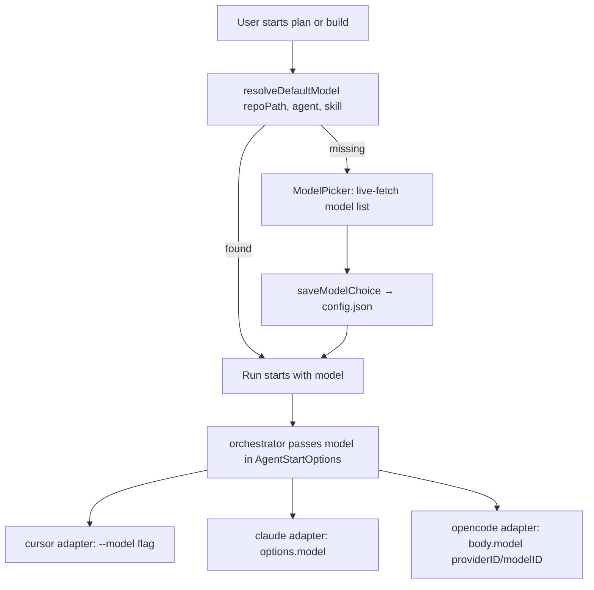

# Default Models per Skill (per Coding Agent)

## A: Plan Overview

Shipper runs two skills today — `shipper-plan` and `shipper-build` — through one of three coding agents (`claude`, `cursor`, `opencode`). Currently no model is ever specified: each agent runs on whatever its own default is.

This feature lets the user save a **default model per (agent, skill) pair**, so e.g. Cursor can use one model for planning and another for building, and Claude Code can have its own separate choices. Decisions confirmed with the user:

1. **Storage: both scopes.** Model choices are saved per-project with a fallback to global defaults, mirroring how `agent` already resolves (`projectConfig.agent ?? defaultAgent`). Config lives in `~/.config/shipper/config.json`.
2. **UI: extend the existing Settings screen.** After the user selects an agent, the settings flow continues into a model-selection step: one picker per skill for that agent.
3. **Model list: fetched live from each agent** (with a loading state in the picker). Cursor via `cursor-agent --list-models`, Claude via the Agent SDK's `supportedModels()`, opencode via the SDK's `config.providers()`.
4. **No saved model = force a pick.** When a run (plan or build) starts and no model is resolved for the (agent, skill) pair, the user must pick one before the run begins. The pick is saved so they are not asked again.

High-level flow:



## B: Related Files

| File | Role in this feature |
|------|----------------------|
| [src/core/config.ts](/Users/matt/Documents/shipper/src/core/config.ts) | Add model fields to project + defaults schemas; add resolve/save helpers |
| [src/core/skills.ts](/Users/matt/Documents/shipper/src/core/skills.ts) | Export `SkillName` type and a `SKILL_NAMES` array |
| [src/agents/types.ts](/Users/matt/Documents/shipper/src/agents/types.ts) | Add `model?: string` to `AgentStartOptions` |
| [src/agents/models.ts](/Users/matt/Documents/shipper/src/agents/models.ts) | NEW — live model listing per agent kind |
| [src/agents/cursor.ts](/Users/matt/Documents/shipper/src/agents/cursor.ts) | Pass `--model` to the CLI |
| [src/agents/claude.ts](/Users/matt/Documents/shipper/src/agents/claude.ts) | Pass `model` in `query()` options |
| [src/agents/opencode.ts](/Users/matt/Documents/shipper/src/agents/opencode.ts) | Pass `model: { providerID, modelID }` in `session.prompt` |
| [src/core/orchestrator.ts](/Users/matt/Documents/shipper/src/core/orchestrator.ts) | Accept a `model` param in `runPlanCreation` / `runBuildLoop` and forward it |
| [src/components/model-picker.tsx](/Users/matt/Documents/shipper/src/components/model-picker.tsx) | NEW — reusable picker (loading / error / select states) |
| [src/screens/settings.tsx](/Users/matt/Documents/shipper/src/screens/settings.tsx) | Add model-selection step after agent selection |
| [src/screens/new-plan.tsx](/Users/matt/Documents/shipper/src/screens/new-plan.tsx) | Resolve model before running; force pick when missing |
| [src/screens/build.tsx](/Users/matt/Documents/shipper/src/screens/build.tsx) | Resolve model before the build loop starts; force pick when missing |
| [src/app.tsx](/Users/matt/Documents/shipper/src/app.tsx) | Update `statusHints` for the new settings step |
| [src/core/core.test.ts](/Users/matt/Documents/shipper/src/core/core.test.ts) | Tests for config persistence/resolution |
| [scripts/try-adapter.ts](/Users/matt/Documents/shipper/scripts/try-adapter.ts) | Optional: accept a model argument for manual testing |

## C: Existing Code to Utilize

- **Config read/write pattern** — `getProjectConfig` / `setProjectConfig` in [src/core/config.ts](/Users/matt/Documents/shipper/src/core/config.ts) (lines 59–85) already implement the read-merge-write-atomically pattern. New helpers must follow it exactly (temp file + rename via `writeConfig`).
- **Two-scope resolution precedent** — `app.tsx` line 157: `const agent = projectConfig.agent ?? defaultAgent ?? null;`. Model resolution follows the same shape: project value, then global default, then `undefined`.
- **Detected agent binary** — `detectAgents()` in [src/agents/detect.ts](/Users/matt/Documents/shipper/src/agents/detect.ts) returns `{ kind, binary, version }` and caches results. The cursor model fetcher must use the detected `binary` (it may be `cursor-agent` or `agent`). The `CursorAdapter.resolveBinary()` pattern (cursor.ts lines 223–228) shows how.
- **`getFreePort()`** — already in `src/agents/utils.ts`, used by `OpencodeAdapter.run()` (opencode.ts line 188) to start a local opencode server. The opencode model fetcher reuses this plus `createOpencodeServer` / `createOpencodeClient`.
- **`SelectInput` from `ink-select-input`** — already a dependency, used in settings.tsx lines 69–82. Use it inside the new `ModelPicker`.
- **Module-level caching precedent** — `detect.ts` lines 6, 45–48 (`let cached ...`). Use the same pattern to cache fetched model lists per agent kind for the process lifetime.
- **execa subprocess pattern** — `probe()` in detect.ts (lines 8–34) shows timeout + `reject: false` + stdout capture; the cursor model fetcher should look the same.

## D: Codebase Conventions to Follow

- TypeScript with explicit `.ts` / `.tsx` extensions on relative imports (`import ... from "./config.ts"`).
- Zod schemas at the top of `config.ts`; exported types derived with `z.infer`.
- Ink UI: `Box` / `Text`, `dimColor` for hints, `cyan` for interactive keys, `useInput` for keyboard handling. Look at settings.tsx for tone and layout.
- Async state loads in screens use `useEffect` with a `cancelled` flag (see `app.tsx` lines 142–190).
- Errors surface as strings pushed to the UI, never thrown across screen boundaries.
- Tests use vitest (`package.json` `test: "vitest run"` — this repo intentionally uses vitest, not `bun test`) with `mkdtemp` temp dirs, colocated as `core.test.ts`.
- Run `bun run typecheck`, `bun run lint`, and `bun run test` to verify. Use `bun`, not npm/node, for all scripts.

## E: Gotchas

- **Zod v4 records with enum keys are exhaustive.** `z.record(z.enum([...]), ...)` in zod 4 requires every key to be present. Do NOT use `z.record` for the models map — use nested `z.object` with `.optional()` fields (spelled out in Phase 1) so a config with only one agent's models still parses.
- **`XDG_CONFIG_HOME` in config tests** — existing config tests write to the real config location keyed by a temp repo path. Keep the same approach: key everything by a fresh `mkdtemp` repo path so tests never collide.
- **Cursor `--model` takes a plain slug** (e.g. `gpt-5.5-high`, `claude-opus-4-8-thinking-high`). Bracket-parameterized names are not supported by the CLI. The slugs come from `cursor-agent --list-models`; verify the exact output format by running the command locally during implementation (it may include a header line or blank lines — trim and filter).
- **Claude `supportedModels()` needs a live query object.** The SDK exposes it as a method on the `Query` returned by `query()`. Create a query with an **empty streaming-input prompt** so nothing is actually sent to the model, call `supportedModels()`, then `close()` it. Check the `ModelInfo` type shape in `node_modules/@anthropic-ai/claude-agent-sdk` at implementation time (it has a model identifier and display name; do not guess field names).
- **opencode models are two-part IDs.** `session.prompt` takes `model: { providerID, modelID }`, but store the choice in config as a single string `"providerID/modelID"`. Split on the **first** `/` only — model IDs can contain slashes.
- **`detectAgents()` caches** — if the user's cursor binary is `agent` rather than `cursor-agent`, fetching models with a hardcoded `cursor-agent` string will fail. Always resolve the binary from `detectAgents()`.
- **`BuildScreen` starts its run automatically on mount** (`startedRef` guard, build.tsx lines 169–263). The force-pick step must gate that effect: do not flip into the run effect until a model is resolved. The cleanest approach is a `model` state variable that the run effect requires (like it already requires `selectedAgent` and `planFilename`).
- **`initialOnly` settings mode** (first boot, settings.tsx / app.tsx `settingsInitialOnly`) should NOT include the model step — after picking an agent on first run, go straight home as today. Runtime force-pick covers the missing model. This keeps first-boot friction low.
- **Do not validate a saved model against the live list at run time.** If a saved slug becomes invalid the agent CLI/SDK will error with a clear message; over-validating would add a model-list fetch (slow) to every run start.
- **Demo mode** (`--demo`) never runs a real agent — none of the force-pick logic should trigger there (it won't, because demo mode never calls `runPlanCreation`/`runBuildLoop`, but don't add model resolution anywhere in `demo.tsx`).

---

## Plan

## Phase 1
- Foundation: persist model choices in config and fetch live model lists from each agent.
- Outcomes: config schema supports per-project and global model maps with resolve/save helpers and tests; a new `src/agents/models.ts` module can return the available model list for any detected agent.

### Section 1.1: Skill name export
- Small prerequisite: skill names need to be importable by config and UI code.
- [x] In [src/core/skills.ts](/Users/matt/Documents/shipper/src/core/skills.ts), export the `SkillName` type (currently a private `type SkillName = keyof typeof SKILLS` on line 12) and add an exported `SKILL_NAMES` const array: `export const SKILL_NAMES = Object.keys(SKILLS) as SkillName[];`
- [x] Verify `src/core/core.test.ts` still passes (it already imports from skills.ts).

### Section 1.2: Config schema and helpers
- Extend [src/core/config.ts](/Users/matt/Documents/shipper/src/core/config.ts) with model maps in both scopes plus resolution and save helpers. Use nested optional objects, not `z.record` (see Gotchas).
- [x] Add schemas above `projectConfigSchema`:

```ts
const skillModelsSchema = z.object({
  "shipper-plan": z.string().optional(),
  "shipper-build": z.string().optional(),
});

const agentModelsSchema = z.object({
  claude: skillModelsSchema.optional(),
  cursor: skillModelsSchema.optional(),
  opencode: skillModelsSchema.optional(),
});
```

- [x] Add `models: agentModelsSchema.optional()` to both `projectConfigSchema` and the `defaults` object schema.
- [x] Export `type AgentModels = z.infer<typeof agentModelsSchema>;`
- [x] Add `resolveDefaultModel(repoPath: string, agent: AgentKind, skill: SkillName): Promise<string | undefined>` — reads config once, returns `config.projects[repoPath]?.models?.[agent]?.[skill] ?? config.defaults?.models?.[agent]?.[skill]`.
- [x] Add `saveModelChoice(repoPath: string, agent: AgentKind, skill: SkillName, model: string): Promise<void>` — read-modify-write via the existing `readConfig`/`writeConfig`: always set the project-level value; ALSO set the global `defaults.models` value for that (agent, skill) if the global slot is currently empty (backfill so other projects inherit it).
- [x] Import `SkillName` from `./skills.ts` (type-only import to avoid pulling markdown embeds at type level: `import type { SkillName } from "./skills.ts";`).
- [x] Add tests in [src/core/core.test.ts](/Users/matt/Documents/shipper/src/core/core.test.ts): saving a choice persists at project scope; `resolveDefaultModel` falls back to the global default when the project has none; project value wins over global; returns `undefined` when neither is set (use a fresh `mkdtemp` repo path per test).

### Section 1.3: Live model listing module
- Create [src/agents/models.ts](/Users/matt/Documents/shipper/src/agents/models.ts) exposing one entry point used by the UI.
- [x] Define `export type ModelOption = { id: string; label: string };` — `id` is what gets saved to config and passed to adapters; `label` is what the picker displays.
- [x] Implement `export async function listModels(kind: AgentKind): Promise<ModelOption[]>` dispatching to a per-agent fetcher, with a module-level `Map<AgentKind, ModelOption[]>` cache (pattern from `detect.ts`). Export a `clearModelListCache()` for tests.
- [x] Cursor fetcher: resolve the binary via `detectAgents()` (fall back to `"cursor-agent"`), then `execa(binary, ["--list-models"], { timeout: 15_000, reject: false })`. Parse stdout into one slug per line: trim, drop empty lines, and drop any non-slug header lines (verify real output by running `cursor-agent --list-models` locally; adjust parsing to match). `id` and `label` are both the slug.
- [x] Claude fetcher: import `query` from `@anthropic-ai/claude-agent-sdk`; create a query with an empty streaming prompt so no turn is consumed, e.g. `const q = query({ prompt: (async function* () {})(), options: {} });`, then `const models = await q.supportedModels();` and `q.close()` in a `finally`. Map each `ModelInfo` to `{ id, label }` after checking the real field names in the SDK's type declarations.
- [x] opencode fetcher: `getFreePort()` + `createOpencodeServer({ hostname: "127.0.0.1", port, timeout: 30_000 })` + `createOpencodeClient({ baseUrl: server.url })`; call `client.config.providers()`; for every provider and every model in it, produce `{ id: "<providerID>/<modelID>", label: "<provider name> — <model name>" }`; `server.close()` in a `finally`.
- [x] Every fetcher throws an `Error` with a readable message on failure (non-zero exit, empty list, SDK error) — the picker UI displays it.
- [x] Add a unit test for the cursor stdout parsing (extract the line-parsing into a pure exported function, e.g. `parseCursorModelList(stdout: string): ModelOption[]`, and test it with a fixture string). Do not test the live fetchers.

### Completion Notes (Phase 1)

- `SkillName` and `SKILL_NAMES` are exported from `skills.ts`; config imports `SkillName` as a type-only import.
- Model maps use nested `z.object` with optional agent/skill keys — not `z.record` — so partial configs parse cleanly.
- `saveModelChoice` always writes the project-level value and backfills `defaults.models` only when that (agent, skill) slot is empty.
- Cursor `--list-models` output is `slug - Display Name` with an `Available models` header; `parseCursorModelList` extracts the slug and uses it for both `id` and `label`.
- Claude `ModelInfo` fields are `value` (id) and `displayName` (label).
- opencode model ids are stored as `"providerID/modelID"` (split on first `/` in Phase 2).
- Live fetchers are not unit-tested; only `parseCursorModelList` has fixture-based tests in `models.test.ts`. Use `clearModelListCache()` in UI retry flows (Phase 3).

## Phase 2
- Thread the chosen model from the orchestrator down into each agent adapter.
- Outcomes: `AgentStartOptions` carries an optional model; all three adapters honor it; `runPlanCreation` and `runBuildLoop` accept and forward it.

### Section 2.1: Types and adapters
- [x] In [src/agents/types.ts](/Users/matt/Documents/shipper/src/agents/types.ts), add `model?: string;` to `AgentStartOptions` (lines 40–44).
- [x] Cursor ([src/agents/cursor.ts](/Users/matt/Documents/shipper/src/agents/cursor.ts)): pass the model through `run()` into `spawnProcess()` and append `"--model", model` to the args array (lines 126–134) when set. Include it on resume spawns too (every `spawnProcess` call in the question loop).
- [x] Claude ([src/agents/claude.ts](/Users/matt/Documents/shipper/src/agents/claude.ts)): in `run()`, spread `...(opts.model ? { model: opts.model } : {})` into the `query()` options object (lines 82–108).
- [x] opencode ([src/agents/opencode.ts](/Users/matt/Documents/shipper/src/agents/opencode.ts)): in `run()`, when `opts.model` is set, split on the FIRST `/` into `providerID` and `modelID` (`const idx = opts.model.indexOf("/")`) and add `model: { providerID, modelID }` to the `session.prompt` body (lines 236–242). Apply to every prompt call in the question loop, not just the first.

### Section 2.2: Orchestrator plumbing
- [x] In [src/core/orchestrator.ts](/Users/matt/Documents/shipper/src/core/orchestrator.ts), add an optional `model?: string` parameter to `runPlanCreation` (line 163) and `runBuildLoop` (line 204). Place it after the existing required params to keep call sites readable, e.g. `runPlanCreation(repoPath, agent, featureDescription, handlers, model?)`.
- [x] Forward it into both `consumeAgentRun` call sites: `{ cwd: repoPath, prompt, ...(model ? { model } : {}) }` (lines 177–181 and 291–295). In the build loop the same model is used for every session.
- [x] Optional: update [scripts/try-adapter.ts](/Users/matt/Documents/shipper/scripts/try-adapter.ts) to accept an optional third CLI arg as the model and pass it in start options, for manual verification (`bun scripts/try-adapter.ts cursor "hi" gpt-5.5-high`).
- [x] Run `bun run typecheck` — no callers break because the new param is optional.

### Completion Notes (Phase 2)

- `AgentStartOptions.model` is an optional plain string slug; adapters interpret it per agent kind.
- Cursor passes `--model <slug>` on every spawn (initial and resume-after-question).
- Claude spreads `model` into the SDK `query()` options object.
- opencode uses `parseOpencodeModel()` to split on the first `/` into `{ providerID, modelID }` for every `session.prompt` call in the question loop.
- `runPlanCreation` and `runBuildLoop` accept an optional trailing `model` param; existing call sites are unchanged until Phase 3 wires resolution.
- Manual test: `bun scripts/try-adapter.ts cursor "hi" gpt-5.5-high`.

## Phase 3
- UI: reusable model picker, settings-screen model step, and forced pick before runs.
- Outcomes: users can set default models per skill from Settings; plan and build runs resolve the model and force a pick when missing; all checks pass.

### Section 3.1: ModelPicker component
- Create [src/components/model-picker.tsx](/Users/matt/Documents/shipper/src/components/model-picker.tsx), reused by settings and both run screens.
- [x] Props: `{ agent: AgentKind; skill: SkillName; currentModel?: string; onSelect: (model: string) => void; onCancel?: () => void; allowSkip?: boolean; }`
- [x] On mount, call `listModels(agent)` inside a `useEffect` with a `cancelled` flag. Three render states: loading (`<Text dimColor>Fetching models…</Text>` with the agent label), error (red text + hint `q` to go back, and a retry key `r` that clears the module cache and refetches), and loaded (a `SelectInput`).
- [x] Loaded state: title line `Default model for <skill> — <agent label>`. Items are `label`/`value` pairs from `ModelOption[]`. When `allowSkip` is true, prepend an item `label: currentModel ? \`Keep current (${currentModel})\` : "Skip for now"` with a sentinel value; selecting it calls `onCancel`.
- [x] `initialIndex` should point at `currentModel` when present in the list (same `findIndex` + `Math.max(0, …)` pattern as settings.tsx lines 71–74).
- [x] Define the agent-label map locally or extract the existing `AGENT_LABELS` from settings.tsx into a shared location (e.g. `src/agents/labels.ts`) and import it in both places — prefer the extraction so labels stay in sync.

### Section 3.2: Settings screen model step
- Extend [src/screens/settings.tsx](/Users/matt/Documents/shipper/src/screens/settings.tsx) into a two-step flow.
- [x] Add local state `step: "agent" | "models"` plus `skillIndex: number` (which skill is being configured) and `configuredAgent: AgentKind | null`.
- [x] In the agent `onSelect` handler (lines 75–81): after `setSelectedAgent(item.value)` resolves — when `initialOnly` is true keep today's behavior (return home immediately); otherwise set `configuredAgent`, reset `skillIndex` to 0, and switch to the `"models"` step instead of going home.
- [x] `"models"` step renders `ModelPicker` for `SKILL_NAMES[skillIndex]` with `allowSkip` enabled. Load the current saved value for `currentModel` via `resolveDefaultModel(repoPath, configuredAgent, skill)` (get `repoPath` from `useAppContext()`).
- [x] On select: `await saveModelChoice(repoPath, configuredAgent, skill, model)`, then advance `skillIndex`; after the last skill, `setScreen("home")`. On skip/cancel: advance without saving.
- [x] Keep `q` working: in the `"models"` step, `q` returns to the `"agent"` step rather than home, so users can reconfigure without leaving.
- [x] Update `statusHints` in [src/app.tsx](/Users/matt/Documents/shipper/src/app.tsx) (case `"settings"`, line 43–44) to something step-agnostic like `"↑↓ select · enter confirm · q back"`.

### Section 3.3: Force pick before plan and build runs
- Both run screens must resolve the model before starting and block on a picker when it is missing. The picked value is saved via `saveModelChoice` so the user is only asked once.
- [x] [src/screens/new-plan.tsx](/Users/matt/Documents/shipper/src/screens/new-plan.tsx): add a `"select-model"` value to the `Step` union and a `model: string | null` state. In the `confirm` step's Enter handler (lines 155–164), instead of jumping straight to `"running"`, call `resolveDefaultModel(repoPath, selectedAgent, "shipper-plan")`: if it returns a value, store it in state and go to `"running"`; if not, go to `"select-model"`. The `"select-model"` step renders `ModelPicker` (no skip); `onSelect` saves via `saveModelChoice`, sets the model state, clears feed events, and moves to `"running"`. `onCancel`/`q` returns to `"confirm"`. Note the resolution is async — do it in a fire-and-forget `void (async () => { ... })()` from the input handler, not inline.
- [x] Pass the model into the run: `runPlanCreation(repoPath, selectedAgent, description.trim(), {...}, model ?? undefined)` (line 72). Add `model` to the effect's dependency array and to the effect's early-return guard (`if (step !== "running" || !selectedAgent || !model) return;`).
- [x] Show the chosen model in the `confirm` and `running` views next to the agent label (e.g. `Model: <cyan>{model}</cyan>` — on confirm it may still be unresolved; render it only when known).
- [x] [src/screens/build.tsx](/Users/matt/Documents/shipper/src/screens/build.tsx): add `model: string | null` state and a `resolvingModel` boolean. Add a `useEffect` that runs once on mount (before the run effect can start): call `resolveDefaultModel(repoPath, selectedAgent, "shipper-build")`; if found set `model`, else set a flag that renders `ModelPicker` (no skip; `onCancel` goes `setScreen("home")`). On pick: `saveModelChoice(...)` then set `model`.
- [x] Gate the existing run effect (lines 169–263) on the model: extend the guard to `if (!selectedAgent || !planFilename || !model || startedRef.current) return;` and add `model` to the dependency array. Pass it to `runBuildLoop(repoPath, selectedAgent, planFilename, {...}, model)`.
- [x] While the model is being resolved or picked, render the picker / a brief loading line instead of the phase tracker (place this branch after the `!selectedAgent` guard around line 316).

### Section 3.4: Verification
- [x] `bun run typecheck` passes.
- [x] `bun run lint` passes.
- [x] `bun run test` passes (config resolution tests, cursor parse test, existing suites).
- [ ] Manual smoke test with at least one installed agent: delete any `models` entries from `~/.config/shipper/config.json`, run `bun run dev`, start a new plan → verify the forced model picker appears, lists live models, and the choice lands in both `projects.<repo>.models` and `defaults.models` in config.json. Re-run → no picker. Open Settings → verify the model step appears after agent selection and shows the saved model preselected.

### Completion Notes (Phase 3)

- `AGENT_LABELS` extracted to `src/agents/labels.ts`; shared by settings and `ModelPicker`.
- `ModelPicker` handles loading/error/loaded states; `r` clears cache and retries; skip uses a `__skip__` sentinel when `allowSkip` is true.
- Settings is a two-step flow (`agent` → `models` per skill); `initialOnly` skips the model step (first-boot unchanged).
- `new-plan` resolves model on confirm Enter; missing model shows forced picker before run starts.
- `build` resolves model on mount; run effect gated on `model` so auto-start cannot race ahead of the picker.
- Automated checks pass; manual smoke test left for the user.
