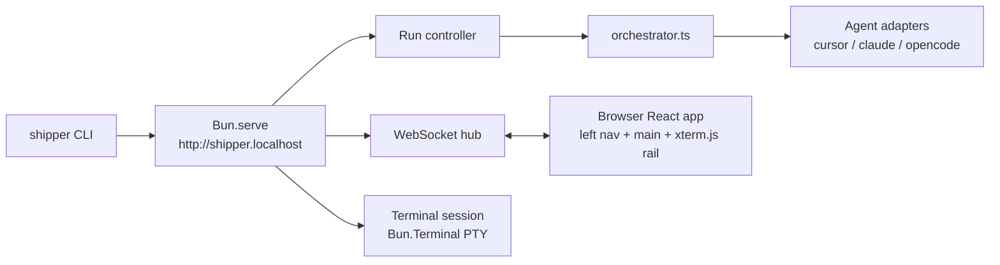

# Interactive Workspace Web UI

## A: Plan Overview

Replace Shipper's Ink terminal UI with a local web application. The `shipper` CLI becomes a server launcher: it starts a `Bun.serve()` HTTP + WebSocket server bound to loopback, prints the URL, and opens the browser at **`http://shipper.localhost`** (binding port 80, which macOS allows without sudo; falling back to `http://shipper.localhost:8712` if 80 is taken). Browsers resolve any `*.localhost` name to the local machine with zero configuration, so no hosts-file or DNS setup is needed. We deliberately do NOT use `shipper.local` — `.local` is reserved for Bonjour/mDNS and behaves unreliably.

The browser UI is a three-section workspace, mouse-first with keyboard shortcuts as fallbacks:

1. **Left nav** — all plans from `.shipper/open/` and `.shipper/done/`, live-updating, with a "New plan" button. Clicking a plan shows it in the main window.
2. **Main window** — the selected plan (title, phase tracker, checklist progress), a running chat of the current agent, inline answering of agent questions, a Stop button, a follow-up message input, and a skill indicator showing what is running (plan / build / ship — ship is display-only until that skill is wired up).
3. **Right rail** — a full passthrough terminal: a real PTY on the server (Bun's native `Bun.Terminal` API, available since Bun 1.3.5) rendered with xterm.js in the browser. Interactive programs (vim, git add -p, htop) work. The rail is collapsible so the main window can take the full width.

Architecture: the server is the single source of truth. All agent-run state (chat log, run status, pending questions, terminal scrollback) lives in server memory; browsers are views that receive a full snapshot on connect and incremental messages afterward, so a page refresh or a second tab never loses a running build. The existing agent adapters, orchestrator, plan store, config, and skills modules are reused unchanged — only the presentation layer is replaced. The Ink TUI is deleted at the end (Phase 5), once the web UI covers everything.

Follow-up messages to agents work as previously agreed: mid-run messages queue and inject into the next agent session's prompt; after a run finishes, Cursor follow-ups resume the same session via `--resume`; Claude/OpenCode follow-ups start a fresh contextual run.

## B: Related Files

Files to create — server:

- [src/server/http.ts](/Users/matt/Documents/shipper/src/server/http.ts) — `Bun.serve` setup, port 80 with 8712 fallback, HTML-import route, WS upgrade, loopback-only binding
- [src/server/ws-hub.ts](/Users/matt/Documents/shipper/src/server/ws-hub.ts) — connection registry, broadcast, snapshot-on-connect, client message dispatch
- [src/server/run-controller.ts](/Users/matt/Documents/shipper/src/server/run-controller.ts) — agent run lifecycle (wraps orchestrator), chat log, question routing, follow-up queue
- [src/server/terminal-session.ts](/Users/matt/Documents/shipper/src/server/terminal-session.ts) — PTY via `Bun.Terminal`, raw-byte scrollback ring buffer, resize
- [src/server/plans-watcher.ts](/Users/matt/Documents/shipper/src/server/plans-watcher.ts) — `listPlans` + `watchPlans` → broadcast plan updates

Files to create — shared:

- [src/shared/protocol.ts](/Users/matt/Documents/shipper/src/shared/protocol.ts) — every WebSocket message type (client→server and server→client), `ChatEntry`, `RunState`, `PlanSummary` DTOs. Plain types only, zero runtime imports from `src/core` or `src/agents`

Files to create — frontend (bundled via Bun HTML imports):

- [src/web/index.html](/Users/matt/Documents/shipper/src/web/index.html), [src/web/frontend.tsx](/Users/matt/Documents/shipper/src/web/frontend.tsx), [src/web/styles.css](/Users/matt/Documents/shipper/src/web/styles.css)
- [src/web/app.tsx](/Users/matt/Documents/shipper/src/web/app.tsx) — three-pane layout, keyboard shortcuts, connection status
- [src/web/hooks/use-socket.ts](/Users/matt/Documents/shipper/src/web/hooks/use-socket.ts) — WS client, auto-reconnect, snapshot handling
- [src/web/components/](/Users/matt/Documents/shipper/src/web/components/) — `left-nav.tsx`, `main-pane.tsx`, `plan-view.tsx`, `chat-log.tsx`, `question-card.tsx`, `chat-input.tsx`, `model-picker.tsx`, `settings-modal.tsx`, `terminal-pane.tsx`

Files to modify:

- [src/index.ts](/Users/matt/Documents/shipper/src/index.ts) — start server instead of Ink render; open browser; keep `--dir`, `--version`, `--demo`
- [src/agents/types.ts](/Users/matt/Documents/shipper/src/agents/types.ts), [src/agents/cursor.ts](/Users/matt/Documents/shipper/src/agents/cursor.ts), [src/agents/claude.ts](/Users/matt/Documents/shipper/src/agents/claude.ts), [src/agents/opencode.ts](/Users/matt/Documents/shipper/src/agents/opencode.ts) — `resumeSessionId` option + `sessionId` accessor (Phase 3)
- [src/core/orchestrator.ts](/Users/matt/Documents/shipper/src/core/orchestrator.ts) — expose session id, pending-message injection, `runFollowUp` (Phase 3)
- [src/core/prompts.ts](/Users/matt/Documents/shipper/src/core/prompts.ts) — `buildFollowUpPrompt`, user-message block injection (Phase 3)
- [tsconfig.json](/Users/matt/Documents/shipper/tsconfig.json) — add `"DOM"`, `"DOM.Iterable"` to `lib`
- [package.json](/Users/matt/Documents/shipper/package.json) — add `@xterm/xterm`, `@xterm/addon-fit`, `react-dom`, `react-markdown`; remove Ink deps in Phase 5

Files to delete (Phase 5): [src/app.tsx](/Users/matt/Documents/shipper/src/app.tsx), all of [src/screens/](/Users/matt/Documents/shipper/src/screens/), the Ink components in [src/components/](/Users/matt/Documents/shipper/src/components/) (keep pure helpers by moving them first), [src/state/](/Users/matt/Documents/shipper/src/state/).

New dependencies (add with `bun add`): `react-dom`, `@xterm/xterm`, `@xterm/addon-fit`, `react-markdown`. No node-pty (Bun.Terminal is native), no express/ws/vite (Bun built-ins).

## C: Existing Code to Utilize

- **Plan store** — [src/core/plan-store.ts](/Users/matt/Documents/shipper/src/core/plan-store.ts): `listPlans`, `findPlanByFilename`, `watchPlans` (chokidar, 200ms debounce), `parsePlan`, `isPhaseComplete`, `getPlanProgress`. `PlanFile` is plain serializable data — the server can send it to the browser nearly as-is (map to a `PlanSummary` DTO in `src/shared/protocol.ts`).
- **Orchestrator** — [src/core/orchestrator.ts](/Users/matt/Documents/shipper/src/core/orchestrator.ts): `runPlanCreation`, `runBuildLoop`, `consumeAgentRun`, and the `BuildLoopHandlers` shape (`onEvent`, `onQuestion`, `onPhaseStart`, `onPlanUpdate`, `onSessionLog`, `signal`). The server run controller wraps these exactly the way [src/screens/build.tsx](/Users/matt/Documents/shipper/src/screens/build.tsx) lines 216-246 and [src/screens/new-plan.tsx](/Users/matt/Documents/shipper/src/screens/new-plan.tsx) lines 71-117 do today — the resolver-ref question pattern and `AbortController` usage transfer one-to-one from those screens.
- **Delta merging** — `appendFeedEvents` in [src/app.tsx](/Users/matt/Documents/shipper/src/app.tsx) lines 202-222 shows the exact text-delta merge rule (merge a `delta: true` text event into a trailing text event). Reimplement this in the server run controller's chat log.
- **Feed line rendering rules** — `eventsToLines` in [src/components/activity-feed.tsx](/Users/matt/Documents/shipper/src/components/activity-feed.tsx) lines 21-82: tool-start/tool-end pairing by `callId`, text splitting, turn/done/error lines. Port this logic to the web `chat-log.tsx` (render tool calls as compact rows with status icons).
- **Question payloads** — `AgentQuestion` / `AgentQuestionItem` / `AgentQuestionOption` in [src/agents/types.ts](/Users/matt/Documents/shipper/src/agents/types.ts) and the multi-question + multi-select + "Other" free-text semantics implemented in [src/components/question-modal.tsx](/Users/matt/Documents/shipper/src/components/question-modal.tsx). The web `question-card.tsx` renders the same payload as clickable options; answers stay keyed by question prompt string (see `formatAnswers` in [src/agents/question-protocol.ts](/Users/matt/Documents/shipper/src/agents/question-protocol.ts)).
- **Models and agents** — [src/agents/detect.ts](/Users/matt/Documents/shipper/src/agents/detect.ts) `detectAgents`; [src/agents/models.ts](/Users/matt/Documents/shipper/src/agents/models.ts) `listModels`; [src/agents/model-variants.ts](/Users/matt/Documents/shipper/src/agents/model-variants.ts) `groupModelFamilies` etc. (drives the web model picker); [src/core/config.ts](/Users/matt/Documents/shipper/src/core/config.ts) `resolveDefaultModel`, `saveModelChoice`, `getProjectConfig`, `setProjectConfig`, `getDefaultAgent`.
- **Run logging** — [src/core/run-logger.ts](/Users/matt/Documents/shipper/src/core/run-logger.ts) `RunLogger.create(agent)`; keep passing it exactly as today.
- **Cursor resume mechanics** — [src/agents/cursor.ts](/Users/matt/Documents/shipper/src/agents/cursor.ts): `chatId` captured from the stream parser (lines 208-210) and `--resume` args (lines 145-147) are the template for user follow-up resume.
- **Demo script** — [src/demo/script.ts](/Users/matt/Documents/shipper/src/demo/script.ts) `runDemoScript`, `DEMO_SCRIPT`: reuse for `--demo` mode by feeding it through the server run controller.
- **Progress formatting** — `progressBar`/`formatProgress` in [src/components/plan-list.tsx](/Users/matt/Documents/shipper/src/components/plan-list.tsx) define what progress display means (checked/total, current phase); the web version renders real `<progress>`-style bars but the math is the same via `getPlanProgress`.

## D: Codebase Conventions to Follow

- **Bun-first**: `Bun.serve()` with the `routes` option and HTML imports for the frontend — no vite, express, or ws. `Bun.spawn` with the `terminal` option for the PTY. Dev loop is `bun --hot src/index.ts` with `development: { hmr: true }` so frontend edits hot-reload.
- **File naming**: kebab-case files, PascalCase components, camelCase functions, explicit `.ts`/`.tsx` extensions on relative imports.
- **Layout**: non-UI logic in `src/core/` and `src/server/`, shared wire types in `src/shared/`, browser code only in `src/web/`. Nothing under `src/web/` may import from `src/core/`, `src/server/`, or `src/agents/` except with `import type` (type-only imports are erased and keep node built-ins out of the browser bundle).
- **State**: React function components + hooks; no state library. Server-side state lives in plain classes/modules with explicit subscription callbacks (see `AgentEventBus` in [src/agents/event-bus.ts](/Users/matt/Documents/shipper/src/agents/event-bus.ts) for the house style).
- **Tests**: Vitest, colocated `*.test.ts`, run with `bun run test` (`vitest run` — the project runner is Vitest even though the workspace rule mentions `bun test`; follow the project). Test pure logic (protocol handling, chat-log merging, controller transitions, terminal ring buffer) — no browser E2E framework in this plan.
- **Types**: `strict` and `noUncheckedIndexedAccess` are on; index access returns `T | undefined`.
- **Verification loop**: `bun run typecheck && bun run lint && bun run test` at the end of each phase, plus the manual checks listed per phase.
- **Styling**: hand-written CSS in `src/web/styles.css` (imported from `frontend.tsx`; Bun bundles it). Use CSS custom properties, a dark theme, system font stack. No Tailwind (avoids bunfig plugin config in the compiled binary).

## E: Gotchas

- **Server owns all state; browser is a view.** Never keep authoritative run state in React. Every client message is a request; the server applies it and broadcasts the result. On WS connect the server sends one full snapshot (plans, run state, chat log, terminal scrollback, agent/config info); the client replaces local state with it. This is what makes refresh-during-build and multiple tabs work.
- **Do not abort runs on disconnect.** The TUI aborted runs when screens unmounted. The web equivalent (kill the run when the socket closes) is wrong — the user may just be refreshing. Runs stop only via the Stop button or server shutdown.
- **Delta-merge on the server, patch on the wire.** Merge `delta: true` text events into the trailing agent text entry (rule from [src/app.tsx](/Users/matt/Documents/shipper/src/app.tsx) lines 202-222) in the server chat log, then broadcast either `chat-append` (new entry) or `chat-replace-last` (merged entry grew). Never merge an agent delta into a user message or notice. Cap the log at 500 entries like `ACTIVITY_FEED_MAX_EVENTS`.
- **Question lifecycle across sockets.** `onQuestion` returns a promise the orchestrator awaits ([src/core/orchestrator.ts](/Users/matt/Documents/shipper/src/core/orchestrator.ts) lines 116-126). Store the resolver on the server keyed by question id; any connected client may answer; broadcast question-cleared to all tabs after the first answer; include the pending question in snapshots so a refreshed tab can still answer it.
- **One adapter instance per session.** `CursorAdapter.run` errors with "Adapter already running" on reuse ([src/agents/cursor.ts](/Users/matt/Documents/shipper/src/agents/cursor.ts) line 64). Follow-up resume must create a NEW adapter and pass the previous session id via options.
- **`runBuildLoop` spawns a fresh agent session per phase**, so "a running build" spans multiple adapter sessions. Stop = abort the loop's `AbortSignal`; the skill indicator and Stop button are driven by the controller's run state, not by any single adapter.
- **PTY output is raw bytes — do not parse or strip it.** xterm.js consumes the escape sequences directly. Forward `Uint8Array` chunks over the WS as binary frames (Bun WS supports binary), and keep a byte ring buffer (~200 KB) server-side to replay on connect. Text-frame JSON is for control messages only.
- **PTY lifecycle**: create the shell (`process.env.SHELL ?? "/bin/sh"`, login shell args, cwd = repoPath) lazily on first terminal use; keep it alive across socket disconnects; on server exit close the terminal (SIGHUP kills the shell). `Bun.Terminal` requires Bun ≥ 1.3.5 (repo has 1.3.13; [install.sh](/Users/matt/Documents/shipper/install.sh) users may be older — guard with a runtime check and degrade to a "terminal requires Bun 1.3.5+" notice; irrelevant for the compiled binary, which embeds its own runtime).
- **Port 80 will sometimes fail** (EADDRINUSE from another dev tool; EACCES on Linux where <1024 needs privileges). Try 80, fall back to 8712, and print/open whichever URL results. Always bind `hostname: "127.0.0.1"` — never `0.0.0.0`; this server executes shell commands, so it must not be reachable from the network.
- **`*.localhost` resolves in browsers, not necessarily in the OS resolver** — `curl http://shipper.localhost` may fail while the browser works. Health checks and tests should hit `127.0.0.1:<port>` directly.
- **WS backpressure**: a build streams many small events and a `find /` in the terminal streams megabytes. Batch chat broadcasts per tick (coalesce with a ~30ms flush) and let the PTY ring buffer bound terminal replay. Check `ws.send()` return codes if output stalls.
- **Frontend/server import wall**: one accidental value-import from `src/web/` into `src/core/` will drag `node:fs`/`chokidar` into the browser bundle and fail at runtime, not compile time. Keep `src/shared/protocol.ts` dependency-free and review imports in every frontend PR.
- **`bun build --compile` supports HTML imports** — the frontend is bundled into `dist/shipper` automatically when `src/index.ts` (transitively) imports `src/web/index.html`. Keep the existing `--define __SHIPPER_VERSION__` flag in the build script.
- **Ship skill is display-only.** [src/core/skills.ts](/Users/matt/Documents/shipper/src/core/skills.ts) embeds only plan and build. The indicator type is `"plan" | "build" | "ship"` but nothing may attempt to run ship yet.
- **Graceful shutdown**: Ctrl+C on the CLI must abort any active run (so agent subprocesses die), close the PTY, and stop the server. Wire `process.on("SIGINT"/"SIGTERM")` in `src/index.ts`.

## Plan

## Phase 1: Server foundation and workspace shell

- Stand up the Bun server, the WebSocket protocol, and the three-pane browser shell with a live plan list. The Ink TUI remains untouched and functional during Phases 1-4.
- Outcomes: `bun run dev` serves the React app at `http://shipper.localhost` (or `:8712`); the left nav lists plans live from `.shipper/`; clicking a plan renders it in the main window; the right rail placeholder collapses/expands; refresh restores everything.

### Section 1.1: Server entry and HTTP

- [x] Create [src/server/http.ts](/Users/matt/Documents/shipper/src/server/http.ts): `startServer(repoPath, opts)` that calls `Bun.serve` with `hostname: "127.0.0.1"`, `routes: { "/": indexHtml, "/ws": upgrade-handler }`, `development: { hmr: true }` when not compiled; try `port: 80` inside try/catch, fall back to `8712`; return `{ url, stop }` where url is `http://shipper.localhost[:port]`
- [x] Rewrite [src/index.ts](/Users/matt/Documents/shipper/src/index.ts): keep commander flags (`--dir`, `--version`, `--demo`, add `--port <n>` override and `--no-open`), keep `ensureShipperDirs`, start the server, print the URL, open the browser (`open` on darwin / `xdg-open` on linux via `Bun.spawn`), install SIGINT/SIGTERM handlers for graceful shutdown
- [x] Create minimal [src/web/index.html](/Users/matt/Documents/shipper/src/web/index.html) + [src/web/frontend.tsx](/Users/matt/Documents/shipper/src/web/frontend.tsx) (React 19 `createRoot`) + [src/web/styles.css](/Users/matt/Documents/shipper/src/web/styles.css); add `react-dom` with `bun add`; add `"DOM"`, `"DOM.Iterable"` to tsconfig `lib`
- [x] Verify `bun build --compile src/index.ts --outfile dist/shipper` still succeeds with the HTML import and that the binary serves the page

### Section 1.2: WebSocket protocol and hub

- [x] Create [src/shared/protocol.ts](/Users/matt/Documents/shipper/src/shared/protocol.ts) with discriminated unions: `ServerMessage` (`snapshot`, `plans-updated`, `chat-append`, `chat-replace-last`, `run-state`, `question-pending`, `question-cleared`, `terminal-data` marker for binary frames, `terminal-state`, `notice`, `config-info`) and `ClientMessage` (`start-build`, `start-plan`, `stop-run`, `answer-question`, `send-message`, `select-model`, `set-agent`, `terminal-input`, `terminal-resize`, `terminal-open`); plus DTOs `PlanSummary` (filename, folder, title, progress, phases with per-phase counts/titles/completion, raw markdown), `ChatEntry`, `RunState`
- [x] Create [src/server/ws-hub.ts](/Users/matt/Documents/shipper/src/server/ws-hub.ts): track open sockets, `broadcast(msg)`, `sendSnapshot(ws)`, parse/validate incoming JSON with zod (already a dependency), route to handler callbacks registered by the server modules
- [x] Create [src/server/plans-watcher.ts](/Users/matt/Documents/shipper/src/server/plans-watcher.ts): on start, `listPlans(repoPath)`; on `watchPlans` change, re-list and `broadcast({ type: "plans-updated", ... })`; expose current plans for snapshots; map `PlanFile` → `PlanSummary` including raw markdown content for the plan view
- [x] Unit-test protocol validation and the PlanFile→PlanSummary mapping

### Section 1.3: Browser shell and left nav

- [x] [src/web/hooks/use-socket.ts](/Users/matt/Documents/shipper/src/web/hooks/use-socket.ts): connect to `/ws`, exponential-backoff reconnect, dispatch `ServerMessage`s into React state, expose `send(msg)`; a visible "reconnecting…" banner state when the socket drops
- [x] [src/web/app.tsx](/Users/matt/Documents/shipper/src/web/app.tsx): CSS-grid three-column layout (nav ~280px | main 1fr | terminal ~420px collapsible), top bar with repo path + agent badge + settings gear + connection dot; dark theme in [src/web/styles.css](/Users/matt/Documents/shipper/src/web/styles.css)
- [x] [src/web/components/left-nav.tsx](/Users/matt/Documents/shipper/src/web/components/left-nav.tsx): "New plan" button on top; Open and Done sections; each plan row shows title, filename, progress bar, phase count (math per `getPlanProgress` fields on the DTO); click selects; selected row highlighted; done plans selectable for viewing
- [x] [src/web/components/plan-view.tsx](/Users/matt/Documents/shipper/src/web/components/plan-view.tsx) inside [src/web/components/main-pane.tsx](/Users/matt/Documents/shipper/src/web/components/main-pane.tsx): phase tracker (done/in-progress/pending markers mirroring `phaseState` logic from [src/screens/build.tsx](/Users/matt/Documents/shipper/src/screens/build.tsx) lines 20-53), per-phase checklist counts, and a tabbed raw view rendering the plan markdown with `react-markdown` (`bun add react-markdown`)
- [x] Right rail placeholder: collapsible panel (chevron button + `Ctrl+\`` shortcut, VS Code muscle memory) with "Terminal" header; persist collapsed state in `localStorage`
- [x] Verify: `bun run dev`, open `http://shipper.localhost` (or `:8712`), see plans, click through open/done plans, watch the list update live when a plan file is edited on disk, refresh mid-session, second tab stays in sync

### Completion Notes

- Default CLI path now starts the web server; `--demo` still launches the Ink TUI until Phase 5 repoints it.
- Port 80 is attempted first; this environment fell back to `:8712` when 80 was unavailable. Health checks should use `127.0.0.1:<port>`, not `shipper.localhost` (OS resolver may not resolve `*.localhost`).
- WebSocket `/ws` is upgraded via the `fetch` handler (not a static route) because Bun route handlers do not receive the `server` instance needed for `server.upgrade()`.
- Run state, chat, questions, and terminal are stubbed in snapshots (idle run, empty chat, placeholder terminal message). Phase 2 wires the run controller; Phase 4 adds the PTY.
- Settings gear and "New plan" button are visible but inert until Phase 2.
- Added `src/types/imports.d.ts` entries for `*.html`, `*.css`, and `react-dom/client` so strict typecheck passes for the browser bundle.

## Phase 2: Run controller, chat, and new-plan flow

- Agent runs execute on the server and stream into the main-window chat; questions are answered inline; Stop works; the skill indicator reflects plan/build; new plans are created from the browser; settings (agent + models) get a web home.
- Outcomes: full plan→build loop usable from the browser, including model picking and question answering, surviving page refreshes.

### Section 2.1: Server run controller

- [x] Create [src/server/run-controller.ts](/Users/matt/Documents/shipper/src/server/run-controller.ts): singleton per server holding `runState: { status: "idle" | "running" | "waiting-answer" | "stopping"; skill: "plan" | "build" | "ship" | null; planFilename: string | null; activePhaseNumber: number | null; logPath: string | null }`, `chatEntries: ChatEntry[]` (cap 500), a pending-question slot, and an `onChange` subscription the ws-hub uses to broadcast
- [x] `startBuild(planFilename)`: reject with a `notice` if a run is active; resolve model via `resolveDefaultModel(repoPath, agent, "shipper-build")`, and if unset broadcast a `needs-model-pick` state instead of starting (see Section 2.3); then wrap `runBuildLoop` with handlers cloned from [src/screens/build.tsx](/Users/matt/Documents/shipper/src/screens/build.tsx) lines 216-246: `onEvent` → append chat entry with delta-merge, `onQuestion` → store resolver + broadcast `question-pending` + status `waiting-answer`, `onPhaseStart`/`onPlanUpdate` → broadcast fresh plan summaries, `onSessionLog` → store log path; on completion append a success/error/cancelled notice with the `BuildLoopResult` details (mirroring the old SuccessPanel content, build.tsx lines 81-114)
- [x] `startPlan(description)`: same wrapper around `runPlanCreation` with skill `plan`; on success broadcast the created plan's filename so the client can auto-select it
- [x] `stop()`: abort the `AbortController`, status `stopping` until the loop returns; `answerQuestion(id, answers)`: resolve the stored resolver, clear the pending question, broadcast `question-cleared`
- [x] Include chat log, run state, and pending question in the ws-hub snapshot
- [x] Unit-test in `src/server/run-controller.test.ts` with a fake orchestrator injected via constructor param: state transitions, delta-merge rules (agent delta after a user message must NOT merge), question resolve flow, reject-second-run

### Section 2.2: Chat UI in the main window

- [x] [src/web/components/chat-log.tsx](/Users/matt/Documents/shipper/src/web/components/chat-log.tsx): render `ChatEntry[]` — agent text as markdown-lite paragraphs, tool calls as compact rows (spinner while pending, then check/cross + name + summary + result summary, logic ported from `eventsToLines` in [src/components/activity-feed.tsx](/Users/matt/Documents/shipper/src/components/activity-feed.tsx) lines 21-82), user messages as right-aligned bubbles, notices as centered dim rows; auto-scroll pinned to bottom unless the user has scrolled up (show a "jump to latest" chip)
- [x] Main-pane header: plan title + folder badge, skill indicator pill (`plan` blue / `build` green / `ship` purple, "idle" dim), phase progress line during builds, Stop button (visible while running; confirm dialog; sends `stop-run`)
- [x] Build button on the plan view (enabled when idle and the plan is in `open/`) sending `start-build`
- [x] [src/web/components/question-card.tsx](/Users/matt/Documents/shipper/src/web/components/question-card.tsx): renders the pending `AgentQuestion` inline at the bottom of the chat — one step per question item, clickable option rows, checkboxes for multi-select, an "Other" free-text field, then a confirm step; submits `answer-question` keyed by question prompt string exactly like [src/components/question-modal.tsx](/Users/matt/Documents/shipper/src/components/question-modal.tsx) does; chat input disabled while a question is pending
- [x] Wire `run-state` / `chat-append` / `chat-replace-last` / `question-pending` / `question-cleared` messages through `use-socket` into the components

### Section 2.3: New plan, model picker, settings

- [x] "New plan" button swaps the main window to a compose view: textarea for the feature description, agent + model summary line, Start and Cancel buttons; Start sends `start-plan`; the description appears in chat as a user message when the run starts
- [x] [src/web/components/model-picker.tsx](/Users/matt/Documents/shipper/src/web/components/model-picker.tsx): when the server reports `needs-model-pick`, show a modal listing model families → variants driven by data the server sends (server calls `listModels` + `groupModelFamilies` from [src/agents/models.ts](/Users/matt/Documents/shipper/src/agents/models.ts) / [src/agents/model-variants.ts](/Users/matt/Documents/shipper/src/agents/model-variants.ts) and ships plain option lists); selection sends `select-model` (skill + model id), server persists via `saveModelChoice` and continues the pending start
- [x] [src/web/components/settings-modal.tsx](/Users/matt/Documents/shipper/src/web/components/settings-modal.tsx): gear icon opens it; pick agent among detected ones (server sends `detectAgents` results in `config-info`), change per-skill default models; server persists via `setProjectConfig`/`saveModelChoice`; show a "no agents detected" empty state with install hints (content from [src/screens/no-agents.tsx](/Users/matt/Documents/shipper/src/screens/no-agents.tsx)) and a Rescan button
- [x] On plan-creation success: auto-select the new plan in the nav and show a "Build it now" action in the chat notice
- [ ] Verify end-to-end with a real agent: create a plan from the browser, build it, answer at least one question by clicking options, stop a run mid-way, refresh during a build and confirm the chat and question state restore

### Completion Notes

- `RunController` is the single source of truth for chat, run state, pending questions, and model-pick deferrals; `ws-hub` snapshots include all four plus `modelPickRequest`.
- Delta-merge for agent text happens in `applyAgentEvent` on the server; the wire uses `chat-append` vs `chat-replace-last` for efficiency.
- Model picker modal dismisses when a run starts (`run-state` → `running` clears `modelPickRequest` client-side). Server-side `modelPickRequest` clears on `select-model`.
- Chat input (`send-message`) is intentionally unwired — Phase 3 adds follow-up messages.
- Ship skill remains display-only in the UI; `start-ship` exists in protocol from parallel work but is not wired in the run controller yet.
- Settings modal shows saved plan/build models from `enrichConfigInfo`; changing models per-skill in settings UI is deferred (picker runs on first missing default).
- Manual E2E verification with a live agent is left to the maintainer (checkbox above).

## Phase 3: Follow-up messages and session resume

- Chat input sends messages to the agent: queued mid-run, resumed via Cursor `--resume` after a run, fresh contextual run for other agents.
- Outcomes: the chat input is always available (except while a question is pending); queued messages are acknowledged and injected; Cursor follow-ups resume with full session context.

### Section 3.1: Adapter and orchestrator support

- [x] [src/agents/types.ts](/Users/matt/Documents/shipper/src/agents/types.ts): add `resumeSessionId?: string` to `AgentStartOptions` and `readonly sessionId: string | null` to `AgentAdapter`
- [x] [src/agents/cursor.ts](/Users/matt/Documents/shipper/src/agents/cursor.ts): seed `this.chatId` from `opts.resumeSessionId` (making the first spawn use `--resume`), expose `get sessionId()`; extend [src/agents/cursor.test.ts](/Users/matt/Documents/shipper/src/agents/cursor.test.ts) for both behaviors
- [x] [src/agents/claude.ts](/Users/matt/Documents/shipper/src/agents/claude.ts) / [src/agents/opencode.ts](/Users/matt/Documents/shipper/src/agents/opencode.ts): `sessionId` returns `null`; `resumeSessionId` ignored
- [x] [src/core/orchestrator.ts](/Users/matt/Documents/shipper/src/core/orchestrator.ts): thread `adapter.sessionId` into results (`lastSessionId` on `BuildLoopResult`/`PlanCreationResult`); add `pendingUserMessages?: () => string[]` to `BuildLoopHandlers`, drained before each session and injected via a new prompt block in [src/core/prompts.ts](/Users/matt/Documents/shipper/src/core/prompts.ts) ("Messages from the user since the last session:")
- [x] Add `runFollowUp(repoPath, agent, message, resumeSessionId, handlers, model?)` in the orchestrator + `buildFollowUpPrompt` in prompts.ts (message + question-protocol preamble; when not resuming, prepend the plan path and a note that this continues previous work); unit-test the prompt builders and message injection

### Section 3.2: Chat input wiring

- [x] [src/web/components/chat-input.tsx](/Users/matt/Documents/shipper/src/web/components/chat-input.tsx): footer input with Send button (Enter submits, Shift+Enter newline), disabled with a hint while a question is pending
- [x] Run controller `sendMessage(text)`: append a user-message chat entry, then — running → push to the follow-up queue + notice "queued for the next agent session"; idle with `lastSessionId` → `runFollowUp` with resume (indicator keeps the last skill); idle without resume support → `runFollowUp` fresh with plan context
- [x] Snapshot includes any queued messages so a refreshed tab shows them
- [ ] Verify with Cursor: finish a small run, send a follow-up, confirm `--resume <id>` appears in the RunLogger raw log; verify a mid-run message lands in the next session's prompt

### Completion Notes

- `AgentAdapter.sessionId` is the Cursor chat id after a run; Claude/OpenCode always return `null`. Follow-up resume is Cursor-only (`--resume` seeded via `resumeSessionId`).
- `runFollowUp` uses `buildFollowUpPrompt`: plan path context is prepended only when not resuming; build-loop mid-run messages are injected via `appendPendingUserMessages` drained through `pendingUserMessages`.
- Run controller keeps `lastSessionId`, `lastSkill`, and `lastPlanFilename` across idle periods so follow-ups preserve skill indicator and Cursor session context. Queued messages broadcast via `queued-messages` and are included in WS snapshots.
- Manual Cursor E2E verification (resume flag in RunLogger, mid-run queue injection) is left to the maintainer (checkbox above).

## Phase 4: Passthrough terminal rail

- A real PTY on the server rendered with xterm.js in the browser; collapsible; survives refresh.
- Outcomes: run vim, `git add -p`, `bun run test` with colors inside Shipper; scrollback and the running shell persist across page reloads.

### Section 4.1: Server terminal session

- [x] Create [src/server/terminal-session.ts](/Users/matt/Documents/shipper/src/server/terminal-session.ts): lazily on first `terminal-open`, spawn the user's shell with `Bun.spawn([shell, "-il"], { cwd: repoPath, terminal: { cols, rows, data: (t, bytes) => ... } })` where `shell = process.env.SHELL ?? "/bin/sh"`; guard with a `typeof Bun.Terminal !== "undefined"` runtime check and broadcast a "requires Bun 1.3.5+" notice when absent
- [x] Maintain a ~200 KB byte ring buffer of output; on each `data` callback, append to the buffer and broadcast the chunk to sockets as a binary WS frame (tag binary frames as terminal data; JSON text frames remain control messages)
- [x] Handle `terminal-input` (write bytes to the PTY), `terminal-resize` (call `terminal.resize(cols, rows)`), shell exit (broadcast `terminal-state: exited`, allow respawn on next open); close the PTY on server shutdown
- [x] Unit-test the ring buffer independently (append/overflow/replay ordering)

### Section 4.2: Browser terminal pane

- [x] `bun add @xterm/xterm @xterm/addon-fit`; [src/web/components/terminal-pane.tsx](/Users/matt/Documents/shipper/src/web/components/terminal-pane.tsx): mount an xterm.js `Terminal` with the fit addon; on socket connect, request `terminal-open`, write the replayed ring buffer, then stream live binary frames into `term.write`
- [x] Forward `term.onData` → `terminal-input`; on pane resize/collapse-toggle run fit and send `terminal-resize`; import xterm's CSS into the bundle
- [x] Collapse/expand: chevron + `Ctrl+\``; collapsed state in `localStorage`; xterm instance stays mounted (hidden) so scrollback isn't lost client-side
- [ ] Verify: `ls` with colors, `vim` open/edit/quit, `git add -p`, a long `bun run test` stream, refresh mid-command and confirm the shell session and recent scrollback are still there, resize the window and confirm reflow

### Completion Notes

- `ByteRingBuffer` lives in `src/server/byte-ring-buffer.ts` (200 KB cap); `terminal-session.ts` owns PTY lifecycle. All server→client terminal output uses binary WebSocket frames; JSON remains control-only.
- On reconnect the client clears xterm and re-sends `terminal-open` to replay server scrollback — avoids duplicate output while keeping the shell alive server-side across refreshes.
- `ws-hub` gained `broadcastBinary` / `sendBinary`; replay goes only to the requesting socket, live output broadcasts to all tabs.
- Manual interactive verification (vim, git add -p, colors, resize) is left to the maintainer (checkbox above).

## Phase 5: Retire the TUI, demo mode, polish

- Delete the Ink layer, keep `--demo` working in the browser, finish keyboard shortcuts and docs, full verification.
- Outcomes: one UI (web), smaller dependency tree, accurate docs, keyboard fallbacks for everything.

### Section 5.1: Remove the Ink layer

- [x] Repoint `--demo`: feed `DEMO_SCRIPT` / `runDemoScript` from [src/demo/script.ts](/Users/matt/Documents/shipper/src/demo/script.ts) through the server run controller so the browser chat and question card render the scripted flow
- [x] Delete [src/app.tsx](/Users/matt/Documents/shipper/src/app.tsx), [src/screens/](/Users/matt/Documents/shipper/src/screens/), [src/state/](/Users/matt/Documents/shipper/src/state/), and the Ink components in [src/components/](/Users/matt/Documents/shipper/src/components/) — first move still-used pure helpers (`eventsToLines` port already lives in web; check `feed-utils.ts`, `model-picker` logic, plan-list math) into `src/server/` or `src/shared/`; grep for stale imports
- [x] `bun remove ink ink-select-input ink-text-input react-devtools-core`; confirm `react` stays (web) and tests still pass
- [x] Update [package.json](/Users/matt/Documents/shipper/package.json) scripts if needed and confirm `bun run build` produces a working compiled binary (serves UI, runs a build, terminal works)

### Section 5.2: Keyboard fallbacks, docs, final pass

- [x] Keyboard shortcuts with an in-app help sheet (`?` key): `n` new plan, `↑/↓` + `Enter` plan selection when nav is focused, `b` build selected plan, `Esc` cancel dialogs, `Ctrl+\`` toggle terminal, `/` focus chat input; ensure every mouse action has a keyboard path and visible focus rings for tab navigation
- [x] Empty states and error toasts: no plans yet, agent not detected, server-side errors surfaced as notices
- [x] Update [README.md](/Users/matt/Documents/shipper/README.md): new architecture, the `shipper` command now opens `http://shipper.localhost`, flags (`--port`, `--no-open`, `--dir`, `--demo`), note on why `.localhost` and not `.local`
- [x] Update [THOUGHTS.md](/Users/matt/Documents/shipper/THOUGHTS.md) items 7 and 8 if the maintainer tracks them there
- [ ] Full verification: `bun run typecheck && bun run lint && bun run test`; manual pass — create plan, build, answer a question, follow-up message, terminal vim session, collapse/expand rail, refresh mid-build, second tab, compiled binary run, `--demo`

### Completion Notes

- Ink TUI fully removed; `shipper` and `shipper --demo` both start the web server. Demo auto-starts via `RunController.startDemo()` on server boot when `--demo` is passed.
- Deleted `src/app.tsx`, `src/screens/`, `src/state/`, and `src/components/` (helpers were already ported to web/server in earlier phases). Removed `ink`, `ink-select-input`, `ink-text-input`, `react-devtools-core`.
- Keyboard shortcuts live in `src/web/app.tsx` with a `?` help modal (`keyboard-help.tsx`). Plan nav arrow keys work when the left nav has focus.
- Agent-not-detected banner, empty plan states, and focus-visible rings added. README and THOUGHTS items 7–8 updated.
- Automated checks pass (`typecheck`, `lint`, `test`, `bun run build`). Manual E2E verification left to maintainer (checkbox above).
