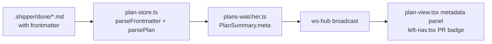

# Plan Completion Metadata (Frontmatter)

## A: Plan Overview

When a Shipper plan finishes its build and gets a PR, we currently lose that context — the done plan file is just markdown with checked boxes. This plan adds YAML frontmatter to plan files that captures completion metadata, parses it server-side, ships it over the WebSocket protocol, and surfaces it in the web UI.

Key decisions already made with the user:

- **Skill-only writing.** No orchestrator/code writes frontmatter. The `shipper-build` and `shipper-ship` skill instructions are updated so the agent writes the metadata itself at the right moments. The app only *reads* frontmatter.
- **Fields:** PR URL + PR number, started/completed timestamps (duration derived in the UI), and git branch name. Commit SHAs and build stats were considered and explicitly excluded.
- **UI scope:** metadata panel on the plan detail view AND a small PR badge on done rows in the left nav.
- **Parsing:** add the `yaml` package as a dependency (user chose this over a custom parser).
- **Out of scope:** wiring `shipper-ship` into the app (skills.ts / run-controller). It stays a manually-run skill; we only update its SKILL.md text.

The frontmatter contract (agents write this, the app reads it):

```yaml
---
branch: shipper/plan-completion-metadata
started_at: "2026-07-04T22:15:00-05:00"
completed_at: "2026-07-05T01:40:00-05:00"
pr_url: https://github.com/owner/repo/pull/123
pr_number: 123
---
# Plan Title
...
```

- `branch` + `started_at`: written by the build agent when it starts the first phase (if not already present).
- `completed_at`: written by the build agent when it completes the final phase, right before moving the file to `done/`.
- `pr_url` + `pr_number`: written by the ship agent after creating the PR (the plan file is in `done/` by then).
- All fields are optional at read time — old plans have no frontmatter and must keep working exactly as today.

Data flow after this plan:



## B: Related Files

- [skills/shipper-build/SKILL.md](/Users/matt/Documents/shipper/skills/shipper-build/SKILL.md) — build skill (this copy is embedded into the binary and vendored into target repos)
- [skills/shipper-ship/SKILL.md](/Users/matt/Documents/shipper/skills/shipper-ship/SKILL.md) — ship/PR skill (manual use only, not vendored)
- [.cursor/skills/shipper-build/SKILL.md](/Users/matt/Documents/shipper/.cursor/skills/shipper-build/SKILL.md) — local mirror used when developing Shipper with Shipper; keep in sync
- [src/core/plan-store.ts](/Users/matt/Documents/shipper/src/core/plan-store.ts) — plan parsing, `PlanFile`, `listPlans`, `readPlanFile`
- [src/core/plan-store.test.ts](/Users/matt/Documents/shipper/src/core/plan-store.test.ts) — existing parser tests
- [src/shared/protocol.ts](/Users/matt/Documents/shipper/src/shared/protocol.ts) — `PlanSummary` DTO and WebSocket message types
- [src/server/plans-watcher.ts](/Users/matt/Documents/shipper/src/server/plans-watcher.ts) — `planFileToSummary` maps `PlanFile` to `PlanSummary`
- [src/server/plans-watcher.test.ts](/Users/matt/Documents/shipper/src/server/plans-watcher.test.ts) — DTO mapping tests
- [src/web/components/plan-view.tsx](/Users/matt/Documents/shipper/src/web/components/plan-view.tsx) — plan detail overview (progress, phase tracker, markdown preview)
- [src/web/components/left-nav.tsx](/Users/matt/Documents/shipper/src/web/components/left-nav.tsx) — plan list with `PlanRow`
- [src/web/styles.css](/Users/matt/Documents/shipper/src/web/styles.css) — all styling lives in this one hand-written CSS file
- [package.json](/Users/matt/Documents/shipper/package.json) — needs the `yaml` dependency

## C: Existing Code to Utilize

- `parsePlan()` in [src/core/plan-store.ts](/Users/matt/Documents/shipper/src/core/plan-store.ts) (lines 102–235) — do NOT rewrite it. Frontmatter keys like `pr_url: ...` cannot match its regexes (`^# `, `^## Phase `, `^### `, `^- [ ] `), so `parsePlan` can keep receiving the full markdown untouched. Frontmatter extraction is a separate, additive function.
- `readPlanFile()` in plan-store.ts (lines 276–292) — the single place every plan file is read and turned into a `PlanFile`; this is where the new `meta` field gets populated.
- `planFileToSummary()` in [src/server/plans-watcher.ts](/Users/matt/Documents/shipper/src/server/plans-watcher.ts) (lines 16–30) — the single place `PlanFile` becomes the `PlanSummary` DTO; add the `meta` passthrough here.
- The existing badge/pill patterns in the UI: `folder-badge folder-${folder}` in [src/web/components/main-pane.tsx](/Users/matt/Documents/shipper/src/web/components/main-pane.tsx) (line 117) and `plan-row-meta` in left-nav.tsx (line 55) — reuse these visual conventions for the PR badge and metadata panel.
- Test fixtures pattern in [src/core/plan-store.test.ts](/Users/matt/Documents/shipper/src/core/plan-store.test.ts) — it already tests `parsePlan` against inline markdown strings and the `.shipper/done/shipper-cli-foundation.md` fixture; follow the same style for frontmatter tests.

## D: Codebase Conventions to Follow

- Bun everywhere: `bun install` to add the dependency, `bun run test` for tests, `bun run lint` / `bun run typecheck` if present in package.json scripts.
- `src/shared/protocol.ts` must stay dependency-light — it is imported by the browser bundle. Plain `type` declarations only; do NOT import `yaml` there.
- Server-side types live next to their logic (`PlanFile` in plan-store.ts); wire DTOs (`PlanSummary`) live in protocol.ts and are mapped explicitly in plans-watcher.ts. Keep that separation: a `PlanMeta` type in plan-store.ts and a `PlanMetaDto` in protocol.ts, even if they look identical.
- All parsing in plan-store.ts is defensive: `parsePlan` wraps everything in try/catch and returns a safe fallback, `listPlans` skips unreadable files. Frontmatter parsing must follow suit — malformed YAML returns an empty meta object, never throws.
- React components are function components with explicit prop `type`s, no CSS-in-JS; all styles go in styles.css using the existing custom-property palette (`var(--accent)` etc.).
- No emojis in skill files or UI strings (existing files use plain text and unicode markers like ✓).

## E: Gotchas

1. **Do not strip frontmatter before calling `parsePlan`.** `ChecklistItem.line` stores absolute 1-based line numbers into the real file (plan-store.ts lines 135, 198). Stripping frontmatter first would shift every line number. Since frontmatter lines cannot match any of the plan regexes, pass the full markdown through unchanged and extract frontmatter separately.
2. **The markdown preview needs stripping, though.** `PlanView` renders `plan.rawMarkdown` through `ReactMarkdown` (plan-view.tsx line 96). Raw frontmatter renders as an `<hr>` plus stray paragraph text. Strip the frontmatter block client-side before rendering the preview. The "Raw markdown" tab in main-pane.tsx should keep showing the full file including frontmatter — that tab's job is to show the real file.
3. **`PlanRow` is a `<button>`** (left-nav.tsx line 42). You cannot nest an `<a>` inside it — invalid HTML and React will warn. Render the PR badge as a `<span>` with its own `onClick` that calls `event.stopPropagation()` and `window.open(prUrl, "_blank", "noopener")`.
4. **The `yaml` package's default schema (YAML 1.2 core)** parses `pr_number: 123` as a number but leaves ISO timestamps as strings only when they are quoted or when the schema lacks timestamp support — the core schema does not auto-convert timestamps, but instruct agents (in the skills) to quote timestamps anyway so behavior is unambiguous. Validate types after parsing: coerce/ignore anything that is not the expected primitive type rather than trusting the YAML blindly.
5. **plans-watcher reads each file twice** — `listPlans` reads it inside `readPlanFile`, then `loadPlanSummary` reads it again for `rawMarkdown` (plans-watcher.ts lines 47–56). Put `meta` on `PlanFile` so the DTO mapping uses the already-parsed value; do not parse YAML a second time in plans-watcher.
6. **Two copies of shipper-build's SKILL.md exist and they intentionally differ.** `skills/shipper-build/SKILL.md` includes git branching instructions; `.cursor/skills/shipper-build/SKILL.md` omits them. Add the frontmatter instructions to both, preserving their existing differences. Only the `skills/` copy is embedded via `import ... with { type: "text" }` in [src/core/skills.ts](/Users/matt/Documents/shipper/src/core/skills.ts) and auto-vendored to target repos by `writeSkillIfChanged` — no code change needed there.
7. **Skill SKILL.md files have their own YAML frontmatter** (`name`, `description`). When adding the plan-frontmatter example to skill text, put the example inside a fenced code block so nothing mistakes it for the skill's own frontmatter.
8. **Old plans have no frontmatter.** Every field on `PlanMeta` is nullable/optional; the UI renders nothing (no empty panel, no badge) when no metadata exists. All five files in `.shipper/done/` are frontmatter-free and are used as test fixtures — they must keep parsing identically.
9. **`started_at` idempotence.** shipper-build runs once per phase, so phases 2..N will see frontmatter already present. The skill text must say: only add `branch`/`started_at` if not already set; never overwrite existing values.

## Plan

## Phase 1: Skill instruction updates

- Teach the agents to write the frontmatter. This phase is pure markdown editing — no app code.
- Outcomes: shipper-build writes `branch`/`started_at` at build start and `completed_at` at plan completion; shipper-ship writes `pr_url`/`pr_number` after PR creation; local `.cursor` mirror stays in sync.

### Section 1: shipper-build skill

- [x] In [skills/shipper-build/SKILL.md](/Users/matt/Documents/shipper/skills/shipper-build/SKILL.md), after the existing git-branch paragraph, add instructions: when starting a phase, ensure the plan file has a YAML frontmatter block; if `branch` or `started_at` are missing, add them (`branch` = current git branch, `started_at` = current ISO 8601 timestamp, quoted). Never overwrite values that already exist.
- [x] In the same file, extend the final paragraph (the one about moving the plan from open to done): before moving the file, set `completed_at` in the frontmatter to the current ISO 8601 timestamp (quoted).
- [x] Include a fenced ```yaml example of the complete frontmatter block in the skill text showing all five keys (`branch`, `started_at`, `completed_at`, `pr_url`, `pr_number`) with a note that `pr_url`/`pr_number` are added later by shipper-ship.
- [x] Apply the same frontmatter instructions to [.cursor/skills/shipper-build/SKILL.md](/Users/matt/Documents/shipper/.cursor/skills/shipper-build/SKILL.md), preserving that copy's existing wording differences (it has no git-branch paragraph — for that copy, instruct `branch` to be set only if a git repo is present).

### Section 2: shipper-ship skill

- [x] In [skills/shipper-ship/SKILL.md](/Users/matt/Documents/shipper/skills/shipper-ship/SKILL.md), after the final paragraph about creating the PR via the command line, add: once the PR is created, update the YAML frontmatter of the associated plan file in `.shipper/done/` with `pr_url` (full GitHub URL) and `pr_number` (integer). If the frontmatter block does not exist yet, create it.
- [x] Note in the skill text that these fields power the Shipper UI's PR link, so they must be the canonical PR URL (not a comparison/branch URL).

Completion criteria: both build copies and the ship skill contain the new instructions; `bun run test` still passes (skills are embedded as text, so no code breaks, but the skills.ts import content changes).

### Completion Notes (Phase 1)

- Frontmatter instructions added to `skills/shipper-build/SKILL.md`, `.cursor/skills/shipper-build/SKILL.md`, and `skills/shipper-ship/SKILL.md`. The two build copies differ as before: the `skills/` copy references the git-branch convention; the `.cursor/` copy sets `branch` only when a git repo is present.
- The fenced YAML example in both build skills shows all five keys with a note that `pr_url`/`pr_number` come from shipper-ship.
- Plan file now has `branch`/`started_at` frontmatter from this phase's start. No app code changed — Phase 2 can add `yaml` and `parseFrontmatter` without worrying about skill text.

## Phase 2: Frontmatter parsing in plan-store

- Add the `yaml` dependency and parse frontmatter into a typed `meta` on `PlanFile`.
- Outcomes: `readPlanFile` returns `meta`; malformed or absent frontmatter degrades to an empty meta; existing parsing behavior is byte-for-byte unchanged.

### Section 1: Dependency and types

- [x] Run `bun install yaml` (adds to `dependencies` in [package.json](/Users/matt/Documents/shipper/package.json)).
- [x] In [src/core/plan-store.ts](/Users/matt/Documents/shipper/src/core/plan-store.ts), define and export `PlanMeta`: `{ branch: string | null; startedAt: string | null; completedAt: string | null; prUrl: string | null; prNumber: number | null }`.
- [x] Define and export `emptyPlanMeta(): PlanMeta` returning all-null values.

### Section 2: parseFrontmatter

- [x] Implement and export `parseFrontmatter(markdown: string): PlanMeta` in plan-store.ts. Detect a frontmatter block only when the very first line is exactly `---` and a closing `---` line exists; otherwise return `emptyPlanMeta()`.
- [x] Parse the block with the `yaml` package inside try/catch; on any parse error or non-object result, return `emptyPlanMeta()`.
- [x] Map snake_case YAML keys to camelCase fields (`pr_url` → `prUrl`, `started_at` → `startedAt`, etc.). Type-check each value: strings must be strings, `prNumber` must be a finite number (accept a numeric string by coercing); anything else becomes null.
- [x] Wire into `readPlanFile` (plan-store.ts lines 276–292): add `meta: parseFrontmatter(markdown)` to the returned `PlanFile`, and add `meta: PlanMeta` to the `PlanFile` type. Do NOT modify `parsePlan` or what gets passed to it (see Gotcha 1).

### Section 3: Tests

- [x] In [src/core/plan-store.test.ts](/Users/matt/Documents/shipper/src/core/plan-store.test.ts), add `parseFrontmatter` tests: full frontmatter parses all five fields; missing frontmatter returns empty meta; malformed YAML returns empty meta; wrong-typed values (e.g. `pr_number: "abc"`, `branch: 42`) become null; frontmatter not on line 1 is ignored.
- [x] Add a test proving `parsePlan` on a document WITH frontmatter still finds the title, phases, and checklist items, and that `ChecklistItem.line` numbers still point at the correct absolute lines of the full file.
- [x] Run `bun run test` and confirm the existing fixture tests against `.shipper/done/*.md` (no frontmatter) still pass.

### Completion Notes (Phase 2)

- Added `yaml@2.9.0` dependency. `PlanMeta`, `emptyPlanMeta()`, and `parseFrontmatter()` live in `plan-store.ts`; `readPlanFile` now populates `PlanFile.meta`.
- `parsePlan` is unchanged and still receives full markdown (frontmatter lines are ignored by its regexes). Type coercion: `pr_number` accepts finite numbers and numeric strings; all other fields require strings.
- `plans-watcher.test.ts` `PlanFile` literal updated with `meta: emptyPlanMeta()` so typecheck passes — Phase 3 still needs to wire `meta` through `PlanSummary` DTO.

## Phase 3: Protocol and server DTO

- Carry `meta` from the server to the browser over the existing snapshot/plans-updated messages.
- Outcomes: `PlanSummary.meta` is populated for every plan in every `PlansSnapshot`.

### Section 1: Protocol type

- [x] In [src/shared/protocol.ts](/Users/matt/Documents/shipper/src/shared/protocol.ts), add `PlanMetaDto` with the same shape as `PlanMeta` (plain type declaration, no imports — see conventions) and add `meta: PlanMetaDto` to `PlanSummary` (lines 25–32).

### Section 2: Mapping

- [x] In [src/server/plans-watcher.ts](/Users/matt/Documents/shipper/src/server/plans-watcher.ts), pass `plan.meta` through in `planFileToSummary` (lines 16–30). Do not re-read or re-parse the file (see Gotcha 5).
- [x] Update [src/server/plans-watcher.test.ts](/Users/matt/Documents/shipper/src/server/plans-watcher.test.ts): assert `meta` appears on the DTO for a plan with frontmatter and is all-null for a plan without it.
- [x] Run `bun run test` and the typechecker; fix any places that construct `PlanFile` or `PlanSummary` literals in tests (they will now need the `meta` field).

### Completion Notes (Phase 3)

- `PlanMetaDto` added to `protocol.ts` with the same five nullable fields as `PlanMeta`; `PlanSummary` now includes `meta`. No yaml import in the shared bundle.
- `planFileToSummary` passes `plan.meta` through directly — YAML is parsed once in `readPlanFile`, not re-parsed in plans-watcher.
- Tests cover both empty meta (no frontmatter) and full frontmatter passthrough. All 83 tests pass; typecheck clean. Phase 4 can consume `plan.meta` in `plan-view.tsx` and `left-nav.tsx`.

## Phase 4: UI display

- Show the metadata where it is useful: a panel on the plan detail view and a PR badge on done rows in the left nav.
- Outcomes: done plans with metadata show PR link, branch, dates, and duration; plans without metadata look exactly as they do today.

### Section 1: Plan detail metadata panel

- [x] In [src/web/components/plan-view.tsx](/Users/matt/Documents/shipper/src/web/components/plan-view.tsx), add a metadata panel between the progress summary and the phase tracker, rendered only when at least one meta field is non-null.
- [x] Panel contents (each row only when present): PR link as an `<a href={prUrl} target="_blank" rel="noreferrer">` labeled `PR #{prNumber}` (fall back to "View PR" when `prNumber` is null); branch in a `<code>` element; started and completed rendered as human-readable local date-times via `new Date(...).toLocaleString()` guarded against invalid dates; duration derived from `completedAt - startedAt` formatted as e.g. `2h 14m` (minutes-only under an hour), only when both timestamps parse.
- [x] Strip the frontmatter block from `plan.rawMarkdown` before passing it to `ReactMarkdown` (Gotcha 2). Implement a tiny pure `stripFrontmatter(markdown: string): string` helper — put it in a new `src/shared/markdown.ts` (regex/line-slice only, no yaml import) so it stays browser-safe; leave the Raw markdown tab in main-pane.tsx untouched.

### Section 2: Left nav PR badge

- [x] In [src/web/components/left-nav.tsx](/Users/matt/Documents/shipper/src/web/components/left-nav.tsx), inside `PlanRow`, render a `PR #N` badge span when `plan.meta.prUrl` is set. On click: `event.stopPropagation()` then `window.open(plan.meta.prUrl, "_blank", "noopener")` (Gotcha 3 — no anchor inside the button).
- [x] Place the badge on the `plan-row-meta` line so row height stays consistent.

### Section 3: Styles

- [x] In [src/web/styles.css](/Users/matt/Documents/shipper/src/web/styles.css), add styles for the metadata panel (`plan-meta-panel` with label/value rows following the existing muted-label pattern) and the PR badge (`pr-badge`, visually consistent with `folder-badge`, using the existing `var(--accent)` palette, with a hover state since it is clickable).
- [x] Manually verify: run the app (`bun run dev` or the CLI entry) against this repo, hand-add frontmatter to one file in `.shipper/done/`, and confirm the panel and badge render; remove it and confirm the UI matches today's appearance. Also confirm chokidar picks up the frontmatter edit live.

### Completion Notes (Phase 4)

- `stripFrontmatter()` lives in `src/shared/markdown.ts` (line-slice only, browser-safe). Used in `plan-document-view.tsx` for the Preview tab; the Markdown tab still shows the full file including frontmatter.
- `PlanMetaPanel` in `plan-view.tsx` renders between the progress summary and phase tracker when any meta field is set. Duration formats as `Nm` under one hour, `Nh` or `Nh Mm` otherwise.
- `left-nav.tsx` PR badge is a clickable `<span>` with `stopPropagation` (not a nested anchor). Verified parsing end-to-end with temporary frontmatter on a done fixture; dev server hot-reloads CSS changes.
