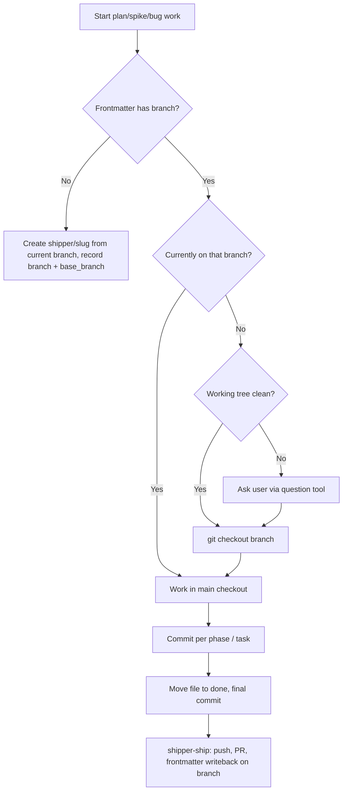

# Remove Worktrees from the Shipper Workflow

## A: Plan Overview

Shipper's skills currently offer to run each track of work (plan, spike, bug fix) inside a git worktree at `.shipper/worktrees/<slug>`. In practice this has hurt usability more than it has helped concurrency:

- Worktrees are never provisioned (no `node_modules`, no gitignored env files), so a dev environment started normally always points at the main checkout, not the worktree being worked on.
- The plan/bug file has to be moved into the worktree and symlinked back into the main checkout, which creates churn, stale symlinks, and confusion about where the source of truth lives.
- Cleanup is manual and error-prone, and managing the worktree directories alongside the main checkout adds cognitive overhead.

The decision (confirmed with the user) is to **drop worktrees entirely**:

1. Skills always work on a `shipper/<slug>` feature branch **in the main checkout**. Concurrent tracks are serialized: you switch branches to test one track at a time.
2. The console's worktree plumbing (plan aggregation from worktrees, symlink syncing, worktree-aware session cwd, `worktree` frontmatter/DTO fields) is removed.

Because branch switching in a shared checkout is the new model, the skills gain one new piece of guidance: before switching branches, check for uncommitted changes and ask the user how to proceed rather than clobbering or carrying dirty state across branches.

Outcomes:

- No skill ever creates, asks about, or removes a worktree.
- Plan/spike/bug files always live in the main checkout's `.shipper/` tree (no moves, no symlinks).
- `src/core/plan-store.ts` is significantly simpler: no `origin`, no dedupe, no symlink sync, no worktree scanning.
- One small migration remains: dangling `.md` symlinks left in `.shipper/open|done` by the old flow are cleaned up on plan load.

## B: Related Files

Skills (all worktree behavior lives in markdown prose):

- [skills/shipper-build/GIT.md](/Users/matt/Documents/shipper/skills/shipper-build/GIT.md) — "Worktree (phase 1 only)" section, worktree cleanup in "Completion and cleanup", `worktree` in frontmatter reference
- [skills/shipper-build/SKILL.md](/Users/matt/Documents/shipper/skills/shipper-build/SKILL.md) — mentions worktrees in the GIT.md pointer and the frontmatter key list
- [skills/shipper-spike/GIT.md](/Users/matt/Documents/shipper/skills/shipper-spike/GIT.md) — "Worktree (PLAN step)" section, cleanup section, frontmatter reference
- [skills/shipper-spike/PLAN.md](/Users/matt/Documents/shipper/skills/shipper-spike/PLAN.md) — steps 2 and 4 ask the worktree question and choose the spike file location
- [skills/shipper-spike/BUILD.md](/Users/matt/Documents/shipper/skills/shipper-spike/BUILD.md) — steps 3–5 reference worktree cwd and cleanup
- [skills/shipper-bug/GIT.md](/Users/matt/Documents/shipper/skills/shipper-bug/GIT.md) — "Worktree (Stage 4)" section, cleanup, frontmatter reference
- [skills/shipper-bug/FIX.md](/Users/matt/Documents/shipper/skills/shipper-bug/FIX.md) — Stage 4 and Stage 6 worktree mentions
- [skills/shipper-bug/CATALOG.md](/Users/matt/Documents/shipper/skills/shipper-bug/CATALOG.md) — lists `worktree` among later-added frontmatter keys
- [skills/shipper-ship/GIT.md](/Users/matt/Documents/shipper/skills/shipper-ship/GIT.md) — entire "Locating the branch" flow is worktree-centric, including temporary worktree recreation
- [skills/shipper-ship/SKILL.md](/Users/matt/Documents/shipper/skills/shipper-ship/SKILL.md) — one sentence referencing worktree recreation/cleanup

Console code:

- [src/core/plan-store.ts](/Users/matt/Documents/shipper/src/core/plan-store.ts) — `PlanMeta.worktree`, `PlanFile.origin`, `resolvePlanSessionCwd`, `planCursorTagPath`, `ensurePlanSymlink`, `removeStaleWorktreeSymlinks`, `removeLegacyPlansFolderSymlinks`, `syncWorktreePlanSymlinks`, `dedupePlansByFilename`, `listWorktreePlans`, worktree globs in `watchPlans`
- [src/core/orchestrator.ts](/Users/matt/Documents/shipper/src/core/orchestrator.ts) — two `resolvePlanSessionCwd` call sites (lines ~398 and ~495)
- [src/shared/protocol.ts](/Users/matt/Documents/shipper/src/shared/protocol.ts) — `PlanMetaDto.worktree`
- [src/web/components/plan-view.tsx](/Users/matt/Documents/shipper/src/web/components/plan-view.tsx) — `hasMeta()` check and the "Worktree" meta row
- [src/core/plan-store.test.ts](/Users/matt/Documents/shipper/src/core/plan-store.test.ts) — ~86 worktree references; several whole describe blocks
- [src/core/orchestrator.test.ts](/Users/matt/Documents/shipper/src/core/orchestrator.test.ts) — two worktree-cwd tests (lines ~371 and ~437)
- [src/server/plans-watcher.test.ts](/Users/matt/Documents/shipper/src/server/plans-watcher.test.ts) — `worktree: null` in a meta expectation; a `savePlanMarkdown` test that builds a worktree path
- [.gitignore](/Users/matt/Documents/shipper/.gitignore) — line 3: `.shipper/worktrees/`

## C: Existing Code to Utilize

- `readFolderPlans` / `listPlans` in [src/core/plan-store.ts](/Users/matt/Documents/shipper/src/core/plan-store.ts) — the main-checkout reading path stays; strip the worktree merge/dedupe around it.
- `isSymlink` helper in plan-store — reuse it for the one retained migration (removing leftover `.md` symlinks, see Gotchas).
- `planRelativePath` in [src/core/orchestrator.ts](/Users/matt/Documents/shipper/src/core/orchestrator.ts) — unchanged; prompts already reference plans by repo-relative path.
- The existing branching sections of each GIT.md ("Branching", "Commit per phase", "Completion and cleanup") are sound; the rewrite removes worktree material and adds branch-switching guidance rather than restructuring these docs.

## D: Codebase Conventions to Follow

- Skills are the single authority for git behavior; the console never runs git commands. Keep it that way — do not add git invocations to `src/`.
- Each skill's GIT.md is "the authoritative git workflow" and other files in the skill link to it with relative markdown links (e.g. `[./GIT.md](./GIT.md)`). Keep cross-references intact after editing.
- Frontmatter keys are snake_case in markdown (`base_branch`) and camelCase in TypeScript (`baseBranch`).
- `parseFrontmatter` ignores unknown YAML keys, so removing `worktree` from `PlanMeta` is safe against old plan files that still contain the key.
- Tests use Vitest (`bun run test` → `vitest run`), temp dirs via `mkdtemp(join(tmpdir(), ...))`. Follow existing test patterns in `plan-store.test.ts`.
- Run `bun run typecheck`, `bun run lint`, and `bun run test` before committing each phase.

## E: Gotchas

- **Skills are embedded and installed globally.** `src/core/skills.ts` imports the skill markdown at build time and `installSkillsGlobally()` writes copies to `~/.claude/skills/`, `~/.cursor/skills/`, etc. Editing `skills/*.md` in the repo does not update the installed copies until the console runs again (it reinstalls before each agent run) or `shipper skills` is re-run. When testing manually, reinstall first.
- **Old plan files keep `worktree:` frontmatter.** Files in `.shipper/done/` (e.g. `modules-marketplace.md`) have `worktree:` keys. Do not migrate or edit them; the parser must simply ignore the key (it already does for unknown keys once `worktree` is dropped from `PlanMeta`).
- **Leftover symlinks in user repos.** The old flow created symlinks in `.shipper/open|done` pointing into gitignored `.shipper/worktrees/`, and an even older experiment used `.shipper/plans/`. After removal these would be dangling. Keep one small cleanup pass in `listPlans` that unlinks any `.md` symlink in `.shipper/open`, `.shipper/done`, and `.shipper/plans` (symlinks there were only ever created by Shipper). This replaces `removeStaleWorktreeSymlinks` + `removeLegacyPlansFolderSymlinks` + `syncWorktreePlanSymlinks` with a single unconditional unlink of symlinks; real plan files are never symlinks so this is safe.
- **Keep `.shipper/worktrees/` in `.gitignore`.** Other repos using Shipper may still have in-flight worktrees when they pick up the updated skills; removing the ignore line would surface those as thousands of untracked files. The line is inert otherwise. (In-flight worktree tracks should be finished with the old skills or manually consolidated before switching.)
- **`shipper-ship` must handle a checkout that is not on the feature branch.** Today ship recreates a worktree to write `pr_url` back without touching the user's checkout. Without worktrees, ship needs to `git checkout <branch>` in the main checkout. If the working tree is dirty with unrelated changes, it must stop and ask rather than stashing silently. After the writeback commit and push, it should return to the branch the user was on if it switched.
- **Branch switching with dirty state is the new failure mode.** Every skill that starts work on a recorded `branch` must verify `git status` is clean (or dirty only with expected in-track files) before `git checkout`. If unrelated uncommitted changes exist, ask the user via the question tool. This guidance replaces the old "avoid conflicts with a worktree" mechanism.
- **`plan-store.test.ts` has whole describe blocks to delete, not adapt.** Tests covering symlink syncing, worktree plan aggregation, dedupe precedence, and `resolvePlanSessionCwd` are removed with the features. Keep (and adapt) any test that covers symlink *cleanup*, pointing it at the new single cleanup pass.
- **`origin` field removal ripples into `plans-watcher.test.ts`** where `PlanFile` literals are constructed (`origin: "main"`). TypeScript will catch these; update the literals.
- **Do not delete `planCursorTagPath` blindly** — it is exported. Verify (it is currently only used in `plan-store.test.ts`) and remove it together with its tests; with symlinks gone, the tag path is just `plan.path`.

## Plan

### New git flow after this plan

## Phase 1: Rewrite skill git workflows to branch-only

- Remove every worktree question, creation step, file move, symlink instruction, and cleanup step from the four skills.
- Add uniform branch-switching guidance (clean-tree check + question tool on dirty state).
- Outcomes: no skill mentions worktrees; `worktree` is gone from all frontmatter references; ship works via checkout in the main repo.

### Section 1: shipper-build

- [x] In [skills/shipper-build/GIT.md](/Users/matt/Documents/shipper/skills/shipper-build/GIT.md): delete the entire "## Worktree (phase 1 only)" section.
- [x] In the "## Branching" section, add later-phase guidance: if the checkout is currently on a different branch than frontmatter `branch`, verify the working tree is clean before `git checkout <branch>`; if there are unrelated uncommitted changes, ask the user via the question tool (options like commit them, stash them, or abort) instead of proceeding.
- [x] In "## Completion and cleanup": remove the worktree-removal instructions and the symlink-removal note (steps after the final commit).
- [x] In "## Frontmatter reference": remove `worktree` from the YAML example and from the key descriptions.
- [x] In [skills/shipper-build/SKILL.md](/Users/matt/Documents/shipper/skills/shipper-build/SKILL.md): remove "worktrees" from the GIT.md pointer sentence, remove `worktree` from the frontmatter key list, and remove "worktree cleanup" from the final-phase sentence.

### Section 2: shipper-spike

- [x] In [skills/shipper-spike/GIT.md](/Users/matt/Documents/shipper/skills/shipper-spike/GIT.md): delete "## Worktree (PLAN step)"; add the same branch-switching guidance to "## Branching"; remove worktree cleanup from "## Completion and cleanup"; remove `worktree` from the frontmatter reference.
- [x] In [skills/shipper-spike/PLAN.md](/Users/matt/Documents/shipper/skills/shipper-spike/PLAN.md) step 2: remove the instruction to ask about a separate worktree (keep the auto-PR question).
- [x] In [skills/shipper-spike/PLAN.md](/Users/matt/Documents/shipper/skills/shipper-spike/PLAN.md) step 4: the spike file is always created in the main checkout's `.shipper/open/`; remove the worktree conditional and the `worktree` frontmatter mention.
- [x] In [skills/shipper-spike/BUILD.md](/Users/matt/Documents/shipper/skills/shipper-spike/BUILD.md): remove "worktree cwd" from the intro sentence, delete step 5 (worktree removal), renumber, and drop the worktree-cleanup clause from steps 4 and the closing shipper-ship sentence.

### Section 3: shipper-bug

- [x] In [skills/shipper-bug/GIT.md](/Users/matt/Documents/shipper/skills/shipper-bug/GIT.md): delete "## Worktree (Stage 4)"; add branch-switching guidance to "## Branching"; remove worktree cleanup from "## Completion and cleanup"; remove `worktree` from the frontmatter reference.
- [x] In [skills/shipper-bug/FIX.md](/Users/matt/Documents/shipper/skills/shipper-bug/FIX.md): Stage 4 sentence — drop "the worktree question"; Stage 6 — drop "worktree cleanup as the last action".
- [x] In [skills/shipper-bug/CATALOG.md](/Users/matt/Documents/shipper/skills/shipper-bug/CATALOG.md): remove `worktree` from the list of later-added frontmatter keys.

### Section 4: shipper-ship

- [x] Rewrite "## Locating the branch" in [skills/shipper-ship/GIT.md](/Users/matt/Documents/shipper/skills/shipper-ship/GIT.md): read `branch` from the plan/spike frontmatter in `.shipper/done/`; if the checkout is not on that branch, verify the working tree is clean (ask the user via the question tool if not), record the current branch, and `git checkout <branch>`. Delete all worktree-recreation content.
- [x] Update "## Push and PR": unchanged mechanics, but performed in the main checkout; after the frontmatter writeback commit and push, check out the previously recorded branch if ship switched branches.
- [x] Replace "## Cleanup" (worktree removal) with the branch-restore step above; keep "Never delete the feature branch during ship."
- [x] In [skills/shipper-ship/SKILL.md](/Users/matt/Documents/shipper/skills/shipper-ship/SKILL.md): update the sentence referencing GIT.md so it no longer mentions worktree recreation or worktree cleanup.

### Completion Notes

- All four skills (`shipper-build`, `shipper-spike`, `shipper-bug`, `shipper-ship`) now use branch-only git workflows. Grep of `skills/` returns zero `worktree` hits.
- Branch-switching guidance is uniform: clean-tree check before `git checkout`, question tool on dirty state (commit, stash, or abort).
- `shipper-ship` records the user's branch before switching, performs PR work on the feature branch in the main checkout, then restores the original branch.
- Console code (`src/core/plan-store.ts`, etc.) still has worktree plumbing — Phase 2 removes it. Installed global skills won't reflect these edits until `bun run dev` or `bun run src/index.ts skills` (Phase 3).

## Phase 2: Remove console worktree plumbing

- Strip worktree support from plan storage, orchestration, the wire protocol, and the UI, and replace the symlink machinery with a single leftover-symlink cleanup.
- Outcomes: `PlanFile` has no `origin`, `PlanMeta`/`PlanMetaDto` have no `worktree`, agent sessions always run in `repoPath`, and stale symlinks from the old flow are removed on plan load.

### Section 1: plan-store.ts

- [x] Remove `worktree` from `PlanMeta`, `emptyPlanMeta()`, and `parseFrontmatter()` in [src/core/plan-store.ts](/Users/matt/Documents/shipper/src/core/plan-store.ts).
- [x] Remove `resolvePlanSessionCwd()` entirely.
- [x] Remove the `origin` field from `PlanFile`, `readPlanFileAt`, and `readFolderPlans` signatures.
- [x] Delete `listWorktreePlans`, `dedupePlansByFilename`, `syncWorktreePlanSymlinks`, `ensurePlanSymlink`, `removeStaleWorktreeSymlinks`, `removeLegacyPlansFolderSymlinks`, and `planCursorTagPath`.
- [x] Add one cleanup function (e.g. `removeLeftoverPlanSymlinks(repoPath)`) that iterates `.shipper/open`, `.shipper/done`, and `.shipper/plans`, and unlinks any `.md` entry that `isSymlink` reports true for. Call it from `listPlans` before reading folders. Keep the existing `isSymlink` helper.
- [x] Simplify `listPlans` to read main-checkout `open`/`done` only, sorted as today. Keep skipping symlinks inside `readFolderPlans` as a guard (the cleanup runs first, so this is belt-and-braces during the same scan).
- [x] In `watchPlans`, drop the two `worktrees` glob patterns.

### Section 2: orchestrator, protocol, UI

- [x] In [src/core/orchestrator.ts](/Users/matt/Documents/shipper/src/core/orchestrator.ts): remove the `resolvePlanSessionCwd` import and both call sites; use `repoPath` directly as the session cwd (the `sessionCwd` variable in the follow-up path collapses to `repoPath`).
- [x] In [src/shared/protocol.ts](/Users/matt/Documents/shipper/src/shared/protocol.ts): remove `worktree` from `PlanMetaDto`.
- [x] In [src/web/components/plan-view.tsx](/Users/matt/Documents/shipper/src/web/components/plan-view.tsx): remove `meta.worktree !== null` from `hasMeta()` and delete the "Worktree" meta row block.
- [x] Check [src/server/plans-watcher.ts](/Users/matt/Documents/shipper/src/server/plans-watcher.ts) `planFileToSummary` — `meta: plan.meta` passes through unchanged; no edit expected, but confirm the DTO types still line up after the `PlanMeta` change.

### Section 3: tests

- [x] [src/core/plan-store.test.ts](/Users/matt/Documents/shipper/src/core/plan-store.test.ts): delete describe blocks/tests covering worktree aggregation, dedupe precedence, symlink syncing, `resolvePlanSessionCwd`, and `planCursorTagPath`. Update `parseFrontmatter` expectations that assert a `worktree` field. Add a test for the new leftover-symlink cleanup: seed a dangling symlink in `.shipper/open/`, call `listPlans`, assert the symlink is gone and the plan list is unaffected.
- [x] [src/core/orchestrator.test.ts](/Users/matt/Documents/shipper/src/core/orchestrator.test.ts): delete the two tests asserting worktree session cwd (lines ~371–401 and ~437–474). Confirm remaining tests assert `sessionCwd === repoPath` where relevant.
- [x] [src/server/plans-watcher.test.ts](/Users/matt/Documents/shipper/src/server/plans-watcher.test.ts): remove `worktree: null` from meta expectations and `origin: "main"` from `PlanFile` literals; rewrite the `savePlanMarkdown` worktree-path test to use a normal `.shipper/open/` path (the behavior under test — writing to `plan.path` from the snapshot — is still worth covering).
- [x] Run `bun run typecheck`, `bun run lint`, and `bun run test`; fix any fallout.

### Completion Notes

- `PlanMeta`, `PlanMetaDto`, and `PlanFile` no longer carry `worktree` or `origin`. `parseFrontmatter` ignores legacy `worktree:` keys in old plan files.
- Agent sessions always run with `cwd: repoPath`; `resolvePlanSessionCwd` and `planCursorTagPath` are removed.
- `listPlans` calls `removeLeftoverPlanSymlinks` before reading folders — unlinks any `.md` symlink in `.shipper/open`, `.shipper/done`, or `.shipper/plans`.
- `watchPlans` only watches main-checkout `open`/`done` globs.
- `plans-watcher.ts` required no code changes; `planFileToSummary` passes `meta` through as-is.
- All 121 tests pass after removing ~10 worktree-specific tests and adding 3 simpler listPlans tests plus a symlink-cleanup test.

## Phase 3: Repo hygiene and verification

- Final sweep to make sure nothing else references the removed workflow, and the updated skills actually reach the agents.
- Outcomes: a clean grep for worktree in `src/` and `skills/`, green checks, and refreshed globally installed skills.

### Section 1: Sweep and verify

- [x] Grep `src/` and `skills/` for `worktree` (case-insensitive); the only acceptable remaining hits are historical documents under `.shipper/done/` and `.shipper/bugs/done/` (leave those untouched) and the `.gitignore` line.
- [x] Leave `.shipper/worktrees/` in [.gitignore](/Users/matt/Documents/shipper/.gitignore) with no change (see Gotchas for rationale).
- [x] Run the full check suite one more time: `bun run typecheck`, `bun run lint`, `bun run test`.
- [x] Refresh installed skills so the new workflow is live for agents: run `bun run dev` once (the console reinstalls skills before agent runs) or `bun run src/index.ts skills`. Verify `~/.claude/skills/shipper-build/GIT.md` no longer contains a Worktree section.

### Completion Notes

- `skills/` has zero `worktree` hits. `src/` retains only intentional references: a cleanup comment in `plan-store.ts`, a legacy-frontmatter parse test, and symlink-cleanup fixtures that use old `../worktrees/` paths.
- `.gitignore` still ignores `.shipper/worktrees/` for repos with in-flight worktrees.
- Full check suite passes (121 tests).
- Ran `bun run src/index.ts skills`; verified `~/.claude/skills/shipper-build/GIT.md` and `~/.cursor/skills/shipper-build/GIT.md` no longer contain a Worktree section.
