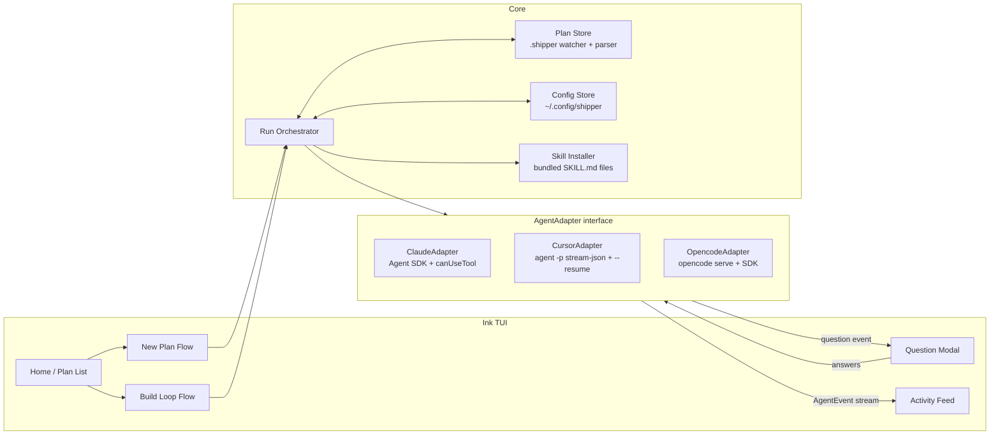

# Shipper CLI Foundation

## A: Plan Overview

This repository (currently empty) will become **Shipper**: a CLI tool distributed as a standalone compiled binary (a global `shipper` command) with a full-screen, desktop-app-style terminal UI (TUI) built with TypeScript + Ink. Shipper orchestrates the two Shipper skills from [shipper-is/skills](https://github.com/shipper-is/skills) against any target repository:

1. **Create a plan** — run the `shipper-plan` skill through one of the user's installed coding agents (Claude Code, Cursor CLI, or opencode) to produce a plan markdown file in `<target-repo>/.shipper/open/`.
2. **Build a plan** — loop the `shipper-build` skill over an existing plan, one agent session per phase, automatically continuing to the next phase until the plan is complete (the skill moves the finished plan file to `.shipper/done/`).

The core technical challenge is **question interception**: all three coding agents periodically stop to ask the user multiple-choice clarifying questions (both skills explicitly instruct the agent to use an "AskQuestion" tool). Shipper must detect these questions in headless agent runs, render them in the TUI, collect the user's answers, and feed the answers back so the agent continues. Each agent requires a different mechanism (detailed in Section E and Phase 2).

Key architectural decisions already made with the user:

- **Stack**: TypeScript + Ink (React-style TUI). The Claude Agent SDK and opencode SDK are both TypeScript, so this maximizes native integration.
- **UX**: Full-screen TUI — plan list, live agent activity feed, modal question prompts, progress indicators.
- **Skills delivery**: The two skills are **embedded inside the compiled binary** (vendored copies of `SKILL.md` files imported as text at build time) and installed into the target repo's agent-specific skill directories at run time.
- **Config split**: Plans live in the target repo's `.shipper/` folder (committed to git). User-specific preferences (e.g. which coding agent to use) live on the user's machine in `~/.config/shipper/`, keyed per project, because different users in the same codebase may use different agents.
- **Build loop**: Fresh agent session per phase, auto-continue to the next phase without pausing (only questions interrupt).
- **Distribution**: standalone compiled binaries (via `bun build --compile`) published to GitHub Releases, installed as a global `shipper` command through a curl install script (and optionally a Homebrew tap). Not distributed via npm — the `shipper` npm name is unavailable, and a binary avoids requiring Node on the user's machine.

## B: Related Files

The repository is empty, so every file will be created by this plan. The authoritative external references are:

- [skills/shipper-plan/SKILL.md (shipper-is/skills, dev branch)](https://github.com/shipper-is/skills/blob/dev/skills/shipper-plan/SKILL.md) — the planning skill. Defines the `.shipper/open` + `.shipper/done` folder convention and the plan markdown structure (sections A–E plus a "Plan" section with `## Phase N` headings, `### Section N` headings, and `- [ ]` checklists).
- [skills/shipper-build/SKILL.md (shipper-is/skills, dev branch)](https://github.com/shipper-is/skills/blob/dev/skills/shipper-build/SKILL.md) — the execution skill. Executes exactly one phase per invocation, leaves "Completion Notes" at the end of each finished phase, and moves the plan file from `open/` to `done/` when the final phase completes.
- [Claude Agent SDK: Handle approvals and user input](https://code.claude.com/docs/en/agent-sdk/user-input.md) — documents the `canUseTool` callback and the `AskUserQuestion` input/answers shape.
- [Cursor headless CLI docs](https://cursor.com/docs/cli/headless) and [output format reference](https://cursor.com/docs/cli/reference/output-format) — `agent -p --output-format stream-json` NDJSON event schema, `--resume [chatId]`.
- [opencode SDK docs](https://opencode.ai/docs/sdk/) — `createOpencodeClient`, `session.prompt`, server event stream.

Planned repository layout (all new):

- `package.json`, `tsconfig.json`, `README.md`
- `src/index.ts` — CLI entry (bin)
- `src/app.tsx` — Ink root component and screen router
- `src/screens/` — `home.tsx`, `new-plan.tsx`, `build.tsx`, `settings.tsx`
- `src/components/` — `plan-list.tsx`, `activity-feed.tsx`, `question-modal.tsx`, `status-bar.tsx`
- `src/core/orchestrator.ts` — drives plan-creation and build-loop runs
- `src/core/plan-store.ts` — `.shipper` folder watcher + plan markdown parser
- `src/core/config.ts` — global + per-project user config
- `src/core/skills.ts` — bundled skill installer
- `src/core/prompts.ts` — prompt assembly (skill invocation + question protocol preamble)
- `src/agents/types.ts` — `AgentAdapter` interface and `AgentEvent` union
- `src/agents/detect.ts` — installed-agent detection
- `src/agents/claude.ts`, `src/agents/cursor.ts`, `src/agents/opencode.ts`
- `src/agents/question-protocol.ts` — fenced-block question parsing shared by Cursor/opencode adapters
- `skills/shipper-plan/SKILL.md`, `skills/shipper-build/SKILL.md` — vendored skill copies embedded into the binary at build time
- `install.sh` — curl-able install script that downloads the right binary from GitHub Releases into the user's PATH
- `.github/workflows/release.yml` — CI workflow that compiles per-platform binaries and attaches them to a GitHub Release

## C: Existing Code to Utilize

There is no existing code in this repo. Lean on these external packages instead of writing things from scratch:

- `ink` (v5+) and `react` — TUI rendering. Use `ink-text-input` and a select-list component (`ink-select-input` or hand-rolled) for menus and question options.
- `@anthropic-ai/claude-agent-sdk` — drives Claude Code programmatically. Its `query()` function with the `canUseTool` callback is the entire question-interception mechanism for Claude; do not shell out to the `claude` binary manually.
- `@opencode-ai/sdk` — `createOpencodeServer` / `createOpencodeClient` for the opencode adapter.
- `execa` — spawning `cursor-agent` and reading its NDJSON stdout.
- `zod` — parse/validate NDJSON events and question-protocol JSON blocks; tolerate unknown fields.
- `commander` (or minimal hand-rolled arg parsing) — `shipper` launches the TUI in the current directory; support `shipper --dir <path>` and non-TUI escape hatches later if needed.
- `chokidar` — watch `.shipper/**/*.md` so the plan list and progress bars update live while an agent edits plan files.

## D: Codebase Conventions to Follow

Since this is greenfield, this plan establishes the conventions:

- **ESM only, Bun toolchain.** Ink 5 is ESM-only. Set `"type": "module"` in `package.json`. Use Bun as the dev runtime (`bun run src/index.ts`), dependency manager, and compiler (`bun build --compile` produces the distributable binaries). Keep `tsc --noEmit` as the typecheck step — Bun does not typecheck.
- **Adapters are the only place that knows about a specific agent.** Everything above `src/agents/` speaks only `AgentAdapter` / `AgentEvent`. No agent-specific branching in screens or orchestrator.
- **All agent runs are headless.** Shipper owns the terminal (Ink fullscreen); agents must never get an interactive TTY. Every adapter runs its agent in print/serve mode.
- **Events over callbacks.** Adapters expose an async iterable (or typed EventEmitter) of `AgentEvent`s: `text`, `tool`, `question`, `turn-complete`, `error`, `done`. The TUI subscribes; the orchestrator reduces.
- **Never crash the TUI on malformed agent output.** Wrap all NDJSON/JSON parsing in safe parsers that degrade to a raw-text event.
- **Plans are the source of truth for progress.** The build loop decides "what phase is next" and "is the plan done" by re-parsing the plan markdown from disk after every agent session, never from in-memory state.

## E: Gotchas

1. **Cursor headless fabricates question answers.** When `cursor-agent` runs with `-p --output-format stream-json`, its native `AskQuestion` tool returns a synthetic result — "Questions skipped by the user, continue with the information you already have" — in ~0 ms, and the model treats that as real consent (see [hapi PR #801](https://github.com/tiann/hapi/pull/801)). You cannot rely on Cursor's native question tool headlessly. The Cursor adapter must (a) instruct the agent via the prompt preamble to use the Shipper question protocol (fenced block, end turn) instead of AskQuestion, and (b) defensively detect AskQuestion tool-call events in the stream anyway — if one appears, capture its payload as a question, and after the turn ends, resume the session with the real answers.
2. **opencode's `question` tool hangs under the SDK.** There is no SDK API to answer the built-in `question` tool ([issue #19702](https://github.com/anomalyco/opencode/issues/19702)); a session that triggers it stalls forever. The opencode adapter must also use the prompt-level question protocol, and should set a per-run inactivity timeout so a stalled session surfaces as an error instead of hanging the TUI.
3. **Claude is the only agent with real native interception.** `canUseTool` fires for `AskUserQuestion` with `{ questions: [{ question, header, options, multiSelect }] }`; you answer by returning `{ behavior: "allow", updatedInput: { ...input, answers } }` where answers map each question to the chosen option label(s). Do not use the question protocol preamble for Claude — let it use its native tool.
4. **The skills say "AskQuestion tool available in Cursor."** The bundled SKILL.md files reference an AskQuestion tool by name. Under Claude the tool is `AskUserQuestion`; under the question-protocol agents there is no such tool at all. The prompt preamble each adapter prepends must explicitly tell the agent how to ask questions in its environment, overriding the skill's tool naming. Do not edit the vendored skill files per-agent; keep the override in `src/core/prompts.ts`.
5. **The shipper-plan skill is read-only except the plan file; shipper-build writes code.** Run planning sessions with the narrowest permissions each agent supports, but note both Cursor (`--force`) and opencode (non-interactive auto-approves) headless modes have full write access. Do not attempt fine-grained permission gating in v1 — just document it.
6. **`agent` vs `cursor-agent` binary names.** Both exist on some machines (both are present on the author's machine); prefer `cursor-agent` and fall back to `agent`, verifying via `--version` output that it is actually Cursor's CLI and not something else named `agent`.
7. **Session resume is load-bearing for Cursor.** The chat/session id arrives in the `system`/`init` NDJSON event. Persist it for the life of the logical run so answers can be delivered with `cursor-agent -p --resume <chatId> --force --output-format stream-json "<answers>"`. A logical "run" therefore spans multiple OS processes.
8. **Build-loop stall detection.** Auto-continuing phases can loop forever if the agent never checks boxes or never moves the file to `done/`. After each phase session, re-parse the plan; if the checked-box count did not increase and the phase's Completion Notes did not appear, count it as a no-progress iteration. Two consecutive no-progress iterations stop the loop with an error shown in the TUI.
9. **Ink fullscreen + child process output.** Never let a child process inherit stdio — it will corrupt the Ink render. All adapter subprocesses must use piped stdio, and anything worth showing gets re-emitted as an `AgentEvent`.
10. **Compiled binaries cannot read package files from disk.** Once compiled with `bun build --compile`, there is no `node_modules` or package folder at run time, so the vendored SKILL.md files must be embedded in the binary — import them as text (`import planSkill from "../skills/shipper-plan/SKILL.md" with { type: "text" }`) rather than resolving paths via `import.meta.url`. Anything that assumes an on-disk package layout will silently break only in the compiled build, so always smoke-test the compiled binary, not just `bun run` dev mode.
11. **Cross-platform builds and macOS Gatekeeper.** Build per-target binaries (`bun build --compile --target=bun-darwin-arm64|bun-darwin-x64|bun-linux-x64|bun-linux-arm64`) in CI — cross-compilation from one runner is supported by Bun. Unsigned macOS binaries downloaded via a browser get quarantined by Gatekeeper; installing via `curl | sh` avoids the quarantine attribute, so the install script is the primary path. Code signing/notarization is out of scope for v1 but should be noted in the README.
12. **`.shipper` may not exist in the target repo.** Create `.shipper/open` and `.shipper/done` idempotently on startup. Never delete or rewrite plan files from the CLI itself — only agents modify plans.

## Plan

## Phase 1: Project scaffolding and core plumbing

- Establish the Bun + TypeScript/ESM toolchain, vendored skills, config storage, and the plan store that everything else builds on.
- Outcomes: `bun run src/index.ts` launches a minimal Ink app in any directory and `bun run build` produces a working compiled `shipper` binary for the local platform; `.shipper` folders are ensured; plans on disk are parsed into typed models with live reload; user config persists across runs.

### Section 1.1: Package and toolchain setup

- [x] Initialize the project with Bun (`bun init`): `package.json` with `"type": "module"` and scripts: `dev` (`bun run src/index.ts`), `build` (`bun build --compile src/index.ts --outfile dist/shipper`), `typecheck` (`tsc --noEmit`), `lint`, `test` (`bun test` or vitest, decided in Section 1.4).
- [x] Add dependencies: `ink`, `react`, `ink-text-input`, `ink-select-input`, `execa`, `zod`, `chokidar`, `commander`, `@anthropic-ai/claude-agent-sdk`, `@opencode-ai/sdk`. Dev deps: `typescript`, `@types/react`, `@types/node`, `@types/bun`, eslint + prettier of choice.
- [x] Create `tsconfig.json` (ESM, `jsx: react-jsx`, `moduleResolution: bundler`, `noEmit: true` — Bun compiles, tsc only typechecks).
- [x] Create `src/index.ts` entry: parse `--dir <path>` (default `process.cwd()`), verify the directory exists, then render the Ink app. Add a `--version` flag (version injected at build time via `bun build --define`, falling back to package.json in dev).
- [x] Create a minimal `src/app.tsx` that renders a placeholder fullscreen layout (title bar + body + status bar) to prove the toolchain works.
- [x] Verify the compiled binary path early: run `bun run build` and confirm `./dist/shipper` launches the Ink placeholder correctly in a directory outside the repo (per Gotcha 10, compiled behavior can diverge from dev mode — catch that now, not in Phase 6).
- [x] Add `.gitignore` (node_modules, dist) and a brief `README.md` describing what Shipper is and how to run it in dev.

### Section 1.2: Vendored skills and installer

- [x] Create `skills/shipper-plan/SKILL.md` and `skills/shipper-build/SKILL.md` in this repo as exact copies from the dev branch of shipper-is/skills.
- [x] Embed the skill files as text imports (`import planSkill from "../../skills/shipper-plan/SKILL.md" with { type: "text" }`) in `src/core/skills.ts` so they are compiled into the binary (Gotcha 10). Do not read them from disk at run time.
- [x] Implement `src/core/skills.ts` with `installSkills(targetRepo: string, agent: AgentKind): Promise<void>` that idempotently writes the embedded skill contents into the agent-appropriate project directory: `.claude/skills/<name>/SKILL.md` for Claude, `.cursor/skills/<name>/SKILL.md` for Cursor, `.opencode/skill/<name>/SKILL.md` for opencode. Overwrite only when content differs.

### Section 1.3: Config store

- [x] Implement `src/core/config.ts` storing JSON at `~/.config/shipper/config.json` (respect `XDG_CONFIG_HOME` if set). Schema: `{ projects: { [absoluteRepoPath]: { agent?: "claude" | "cursor" | "opencode", lastPlan?: string } }, defaults?: { agent?: AgentKind } }`.
- [x] Provide `getProjectConfig(repoPath)`, `setProjectConfig(repoPath, patch)` with atomic writes (write temp file, rename) and schema validation via zod, falling back to an empty config on parse failure.
- [x] Do NOT store any user preferences inside the target repo's `.shipper` folder — plans only, per the user's requirement that plans are committed but agent choice is per-user.

### Section 1.4: Plan store (parser + watcher)

- [x] Implement `src/core/plan-store.ts`. `ensureShipperDirs(repoPath)` creates `.shipper/open` and `.shipper/done`.
- [x] Implement `parsePlan(markdown: string): ParsedPlan` extracting: title (first `# ` heading), phases (each `## Phase N` heading with its intro bullets), sections within each phase (`### ` headings), checklist items (`- [ ]` / `- [x]`) grouped by section, per-phase and total checked/unchecked counts, and whether a phase has a "Completion Notes" heading beneath it. The parser must tolerate deviations (missing sections, extra headings, nested lists) — never throw on weird markdown; degrade to counting checkboxes per phase.
- [x] Implement `listPlans(repoPath): { open: PlanFile[], done: PlanFile[] }` reading both folders, returning filename, title, and progress summary per plan.
- [x] Implement `watchPlans(repoPath, onChange)` using chokidar on `.shipper/**/*.md` with debounce (~200ms), so the TUI re-renders as agents edit plan files.
- [x] Write unit tests for `parsePlan` against a fixture that mirrors the real plan structure produced by the shipper-plan skill (use this plan file itself as a fixture baseline). Add `vitest` as the test runner and a `test` script.

### Completion Notes

- **Ink 7 + compile**: `bun build --compile` fails unless `react-devtools-core` is installed (Ink 7 pulls it in via `devtools.js`). Added as a direct dependency; revisit when upgrading Ink or if a production-only bundle flag becomes available.
- **Vitest + `.md` imports**: Vitest cannot parse Bun's `import x from ".md" with { type: "text" }` natively. `vitest.config.ts` includes a small plugin that stringifies `.md` files for tests only — the compiled binary uses Bun's native text import.
- **`AgentKind` stub**: `src/agents/types.ts` exports only `AgentKind` today; Phase 2 expands this file with `AgentEvent`, `AgentQuestion`, and `AgentAdapter`.
- **Placeholder TUI**: `src/app.tsx` is a static shell (title bar + welcome message + status bar). Phase 3 replaces it with screen routing, plan list, and keyboard navigation.
- **Version injection**: Build script passes `--define __SHIPPER_VERSION__='"0.1.0"'`; bump this string alongside `package.json` version until Phase 6 automates release builds.
- **Verified compiled binary**: `./dist/shipper --version` returns `0.1.0`; launching against `/tmp/shipper-test-repo` renders the Ink placeholder and creates `.shipper/open` + `.shipper/done`.

## Phase 2: Agent adapter layer

- Build the unified interface to all three coding agents, including installed-agent detection and the question-interception machinery. This phase is pure library code (no TUI) and each adapter should be manually verifiable with a tiny script that runs a trivial prompt and prints events.
- Outcomes: `AgentAdapter` implementations for Claude, Cursor, and opencode that stream typed events, surface questions, accept answers, and resume; a shared question protocol; agent auto-detection.

### Section 2.1: Types and question protocol

- [x] Define in `src/agents/types.ts`: `AgentKind = "claude" | "cursor" | "opencode"`; `AgentQuestion = { id: string, questions: Array<{ prompt: string, header?: string, multiSelect?: boolean, options: Array<{ label: string, description?: string }> }> }` (mirrors Claude's AskUserQuestion shape: 1–4 questions, 2–4 options each, since both skills and Claude native both fit it); `AgentEvent` union: `{ type: "text", text }`, `{ type: "tool", name, summary }`, `{ type: "question", question: AgentQuestion }`, `{ type: "turn-complete" }`, `{ type: "error", message }`, `{ type: "done", result?: string }`.
- [x] Define the `AgentAdapter` interface: `start(opts: { cwd: string, prompt: string }): AsyncIterable<AgentEvent>` plus `answer(questionId: string, answers: Record<string, string | string[]>): void` and `stop(): Promise<void>`. Internally an adapter may span multiple OS processes (Cursor resume); the consumer sees one continuous event stream per logical run.
- [x] Implement `src/agents/question-protocol.ts`: the prompt preamble text instructing an agent to ask questions by emitting a fenced code block tagged `shipper-question` containing JSON matching `AgentQuestion.questions`, then ending its turn and waiting; plus `extractQuestionBlocks(text)` that finds and zod-parses such blocks from assistant output, and `formatAnswers(question, answers)` that renders the user's selections into a plain-text reply message (question prompt followed by the chosen label(s), one per line).
- [x] Implement `src/core/prompts.ts`: `buildPlanPrompt(userFeatureDescription, agentKind)` and `buildBuildPrompt(planRelativePath, phaseNumber, agentKind)`. Each composes: (1) an instruction to read and follow the installed skill file at its agent-specific path, (2) the task-specific input (feature description, or plan path + "implement Phase N"), and (3) for Cursor/opencode only, the question-protocol preamble including an explicit instruction NOT to use any built-in question/AskQuestion tool because no UI exists to answer it. For Claude, instead state that it should use its AskUserQuestion tool for clarifications.

### Section 2.2: Agent detection

- [x] Implement `src/agents/detect.ts`: `detectAgents(): Promise<DetectedAgent[]>` probing, in order: `claude --version`; `cursor-agent --version` then fallback `agent --version` (verify output mentions Cursor before accepting the `agent` binary, per Gotcha 6); `opencode --version`. Each probe has a short timeout (~3s) and returns the binary path and version string.
- [x] Cache detection results for the lifetime of the process only (no disk cache — installs change).

### Section 2.3: Claude adapter

- [x] Implement `src/agents/claude.ts` using `@anthropic-ai/claude-agent-sdk`'s `query()` with `cwd` set to the target repo, `permissionMode: "acceptEdits"` (build) / default (plan), and a `canUseTool` callback.
- [x] In `canUseTool`: when `toolName === "AskUserQuestion"`, convert the input's `questions` array to an `AgentQuestion`, emit a `question` event, and block (await a promise) until `answer()` is called; then return `{ behavior: "allow", updatedInput: { ...input, answers } }` with answers shaped per the [user-input docs](https://code.claude.com/docs/en/agent-sdk/user-input.md). For all other tools return allow (Shipper is not a permission gate in v1).
- [x] Map SDK stream messages to `AgentEvent`s: assistant text chunks to `text`, tool use to `tool` (name + one-line summary of key args like file path), final result to `done`.
- [x] Handle SDK errors and non-zero exits as `error` events; ensure `stop()` aborts the query cleanly.

### Section 2.4: Cursor adapter

- [x] Implement `src/agents/cursor.ts` spawning `cursor-agent -p --force --output-format stream-json --workspace <cwd> "<prompt>"` via execa with fully piped stdio (Gotcha 9). Parse NDJSON lines with a zod schema that ignores unknown fields.
- [x] Capture the session/chat id from the `system`/`init` event and retain it on the adapter instance.
- [x] Map events: `assistant` message events to `text`; `tool_call` started events to `tool`; the terminal `result` event ends the OS process but NOT necessarily the logical run.
- [x] Question handling, two layers: (a) primary — on each assistant text and on the final result text, run `extractQuestionBlocks`; if a question block is found, emit `question` and hold the stream open awaiting `answer()`; (b) defensive — if a `tool_call` event for an AskQuestion-like tool appears, capture its args as an `AgentQuestion`, and treat the synthetic "Questions skipped by the user" result as if the turn ended with a pending question (see [hapi PR #801](https://github.com/tiann/hapi/pull/801)).
- [x] On `answer()`: spawn `cursor-agent -p --force --output-format stream-json --resume <chatId> "<formatted answers>"` and continue feeding its events into the same async iterable. Repeat as many times as questions occur.
- [x] If the process exits with no question and no result event, emit `error`. Implement `stop()` as SIGTERM with a kill timeout.

### Section 2.5: opencode adapter

- [x] Implement `src/agents/opencode.ts` using `@opencode-ai/sdk`: start a server bound to `127.0.0.1` on an ephemeral port with the target repo as the project directory, create a session, and send the prompt via `session.prompt`.
- [x] Subscribe to the server event stream and map message part events to `text`/`tool` events. On each completed assistant message, run `extractQuestionBlocks`; emit `question` when found and hold the run open.
- [x] On `answer()`: send `formatAnswers` output as the next `session.prompt` on the same session (native session continuity — no resume flag needed).
- [x] Add an inactivity timeout (default 10 minutes, resettable on any event): if the session produces no events past the timeout, emit `error` noting a possible stall from opencode's built-in `question` tool (Gotcha 2), and abort the session via `session.abort`.
- [x] Ensure `stop()` aborts the session and shuts the server down; never leave orphaned `opencode serve` processes.

### Section 2.6: Adapter verification harness

- [x] Add `scripts/try-adapter.ts` (dev-only, never compiled into the binary): `bun scripts/try-adapter.ts <agent> "<prompt>"` runs an adapter in a scratch directory and prints every `AgentEvent` as JSON lines, answering any question interactively via basic readline. Use this to manually verify each adapter end-to-end, including at least one prompt engineered to force a clarifying question (e.g. "Ask me which of two names to use for a file before creating it").

### Completion Notes

- **Shared infrastructure**: `src/agents/event-bus.ts` provides `AgentEventBus` (async-iterable queue) and `QuestionGate` (promise-based answer routing) used by all three adapters. `createAdapter(kind)` in `src/agents/index.ts` is the factory Phase 3+ should import.
- **Claude `permissionMode`**: v1 uses `acceptEdits` for all runs (plan and build) since both flows need file writes and the plan defers fine-grained gating. Revisit if planning sessions need tighter defaults.
- **Cursor resume loop**: a logical run spans multiple `cursor-agent` processes. After a question, only the formatted answers are sent via `--resume <chatId>` (not the original prompt). Defensive AskQuestion capture still fires if the model ignores the preamble.
- **opencode directory**: pass `directory: cwd` to `createOpencodeClient` (sets `x-opencode-directory` header) in addition to `query.directory` on session calls. Server is started on an ephemeral port via `getFreePort()`.
- **Manual verification**: run `bun scripts/try-adapter.ts cursor "Ask me which of two names to use for a file before creating it, using the shipper-question protocol"` (Cursor/opencode need the protocol preamble — the script prepends it automatically). Requires a configured agent and network credentials.
- **Tests**: `src/agents/question-protocol.test.ts` covers fenced-block parsing and answer formatting. Plan-store fixture tests were updated to reflect Phase 1 completion notes in this plan file.

## Phase 3: TUI shell

- Build the fullscreen Ink application: navigation, plan list, activity feed, and the question modal. After this phase the app is fully navigable with live plan data, with agent runs stubbed.
- Outcomes: launching `shipper` in a repo shows its plans with progress; keyboard navigation works; the question modal and activity feed components are done and testable with fake events.

### Section 3.1: App shell and navigation

- [x] Build `src/app.tsx` as a screen router with app-level state (current repo path, detected agents, selected agent, active screen, active run). Screens: `home`, `new-plan`, `build`, `settings`.
- [x] Fullscreen layout: title bar (Shipper name + target repo path + selected agent), body (screen content), status bar (contextual key hints, e.g. "↑↓ select · enter open · n new plan · b build · q quit").
- [x] Enter Ink fullscreen (alternate screen buffer) on mount and restore the terminal on exit, including on Ctrl+C and on crashes (wrap render in try/finally; register a process exit handler).
- [x] On startup: `ensureShipperDirs`, `detectAgents`, load project config. If the configured agent is missing or unset, route to `settings` first.

### Section 3.2: Settings screen (agent selection)

- [x] `src/screens/settings.tsx`: list detected agents with version strings; grey out undetected ones with an install hint. Selecting one persists it via `setProjectConfig` (per-project, on the user's machine — never in the repo).
- [x] Accessible any time via a keyboard shortcut shown in the status bar.

### Section 3.3: Home screen (plan list)

- [x] `src/screens/home.tsx` + `src/components/plan-list.tsx`: two groups, Open and Done, fed by `listPlans` and kept live via `watchPlans`. Each row: plan title, filename, progress (`checked/total` boxes and current phase, e.g. "Phase 2/4 · 13/41 tasks") rendered as a compact bar.
- [x] Actions: `n` starts the new-plan flow; `enter`/`b` on an open plan starts the build flow for it; `q` quits. Done plans are display-only.
- [x] Empty state when no plans exist explaining the `n` shortcut.

### Section 3.4: Activity feed and question modal

- [x] `src/components/activity-feed.tsx`: scrolling feed of `AgentEvent`s — text events as dim wrapped prose (collapse long output, keep the tail visible), tool events as single icon+summary lines, errors highlighted. Auto-follows the tail; keeps a bounded buffer (~500 entries).
- [x] `src/components/question-modal.tsx`: renders an `AgentQuestion` centered over a dimmed backdrop. For each of the 1–4 questions: the prompt, selectable options with descriptions, single-select via radio behavior or multi-select via checkboxes when `multiSelect`, plus a free-text "Other" option (the skills expect users to be able to give custom answers — AskQuestion in Cursor always offers Other). Multi-question payloads advance question-by-question, then confirm and submit all answers.
- [x] While a question modal is open, the activity feed pauses visually (status bar shows "waiting for your answer") but buffered events are retained.
- [x] Storybook-style dev harness not required; instead add a hidden dev flag (`shipper --demo`) that drives the feed and modal with scripted fake events for manual verification.

### Completion Notes

- **App state**: `src/state/app-context.tsx` + `src/state/types.ts` hold shared TUI state (screen, agent, plans, feed, questions). Phase 4/5 orchestrator should consume this context rather than duplicating state.
- **Ink 7 layout**: `Text` no longer accepts `marginTop`/`marginBottom` — wrap in `Box` for spacing. Fullscreen uses `render(..., { alternateScreen: true })` in `index.ts`.
- **Settings gate**: On startup, if the configured agent is missing or unset, the app routes to `settings` with `initialOnly` until the user picks a detected agent. Undetected agents render as static install hints, not selectable rows.
- **Stub screens**: `new-plan` and `build` are navigable placeholders; build shows the activity feed shell. Agent runs remain unwired until Phases 4–5.
- **Demo mode**: `shipper --demo` plays `src/demo/script.ts` — scripted text/tool events plus a two-question modal round-trip. Use for manual feed/modal verification without a live agent.
- **Question modal**: Answers keyed by question `prompt` (matches `formatAnswers`). Always appends an "Other" option; multi-question flows advance per question then show a confirm step.

## Phase 4: Plan creation flow

- Wire the "Create a new plan" mechanism end to end: prompt for a feature description, run the shipper-plan skill through the selected agent, answer questions via the modal, and land on the new plan in the home list.
- Outcomes: a user can enter a repo, type a feature description, answer the agent's clarifying questions in the TUI, and end with a new plan file in `.shipper/open/`.

### Section 4.1: New-plan screen

- [x] `src/screens/new-plan.tsx`: multi-line text input for the feature/task description (submit with a distinct key, e.g. Esc-then-enter or ctrl+d, since enter inserts newlines) with brief guidance text, then a confirm step showing which agent will run.
- [x] On confirm: `installSkills(repo, agent)`, build the prompt via `buildPlanPrompt`, start the adapter, and switch the body to the activity feed.

### Section 4.2: Run orchestration for planning

- [x] Implement the planning path in `src/core/orchestrator.ts`: consume the adapter's event stream; forward events to the feed; on `question` events surface the modal and route submitted answers to `adapter.answer()`; on `done`, diff `listPlans` before/after to identify the newly created plan file.
- [x] Success state: show the created plan's filename and title with actions "view in list" (back to home, new plan highlighted) and "start build now" (jump into Phase 5 flow for that plan).
- [x] Failure states: adapter `error` events or `done` with no new plan file both render an error panel with the last ~20 feed lines and a "back to home" action. Never leave the app wedged.
- [x] Persist `lastPlan` in project config when a plan is created.

### Completion Notes

- **`consumeAgentRun`**: Shared helper in `src/core/orchestrator.ts` drives any adapter session (plan or build). Phase 5 should call it from `runBuildLoop` rather than duplicating event/question routing.
- **New-plan steps**: `input` → `confirm` → `running` → `success` | `error`. Multi-line description uses hand-rolled `useInput` (Enter = newline, Ctrl+D = submit). Question modal is rendered inside `new-plan` during runs (same pattern as `build`/`demo`), not the app-level overlay.
- **Plan detection**: `runPlanCreation` snapshots open-plan filenames before the run and picks the newest filename not in that set after the adapter finishes. Multiple simultaneous new files would pick the last sorted name — unlikely in practice.
- **`highlightPlanFilename`**: App context field lets success flow jump home with the new plan pre-selected via `indexForPlanFilename` in `plan-list.tsx`.
- **Build handoff**: "Start build now" (`b`) sets `selectedPlan` and routes to the build screen placeholder; Phase 5 wires the actual loop.

## Phase 5: Build loop flow

- Wire the "Build an existing plan" mechanism: loop the shipper-build skill phase-by-phase with fresh sessions until the plan is done, auto-continuing between phases, pausing only for questions, with stall protection.
- Outcomes: selecting an open plan and pressing build runs phases sequentially to completion, moving the plan to Done, with live progress in the TUI.

### Section 5.1: Build screen

- [x] `src/screens/build.tsx`: header shows the plan title and a phase tracker (each phase with state: done / in progress / pending, derived from the parsed plan — a phase is done when all its checkboxes are checked or it has Completion Notes). Body is the activity feed; the question modal overlays when needed.
- [x] Show a per-phase progress line (checked/total for the current phase) that live-updates via `watchPlans` while the agent edits the plan file.
- [x] Support cancel (`ctrl+c` once = graceful: `adapter.stop()`, then confirm exit; twice = force quit).

### Section 5.2: Build loop orchestration

- [x] Implement the build loop in `src/core/orchestrator.ts`: (1) re-read and parse the plan from disk; (2) if the file has moved to `done/` or every checkbox is checked, finish; (3) select the first phase that is not done; (4) `installSkills`, build the prompt via `buildBuildPrompt(planPath, phaseNumber, agent)` — explicitly naming the phase so the skill never has to ask "which phase?"; (5) run a fresh adapter session to completion, routing questions to the modal; (6) loop.
- [x] Stall detection per Gotcha 8: snapshot `(checkedCount, hasCompletionNotes)` for the target phase before each session; if unchanged after the session, count a no-progress strike; two consecutive strikes for the same phase aborts the loop with an explanatory error panel (include the suggestion to inspect the plan file and re-run).
- [x] Hard cap the loop at `phases * 2 + 2` sessions as a final safety net.
- [x] If the skill finished the last phase but did not move the file to `done/` (skill non-compliance), detect the all-boxes-checked state and show success anyway, noting the file was left in `open/` (do not move it — the CLI never modifies plans, per Gotcha 12).
- [x] Completion state: celebratory summary panel (phases run, sessions used, plan location) with "back to home".

### Section 5.3: End-to-end verification

- [ ] Manually verify with each installed agent against a scratch repo: create a small plan via the new-plan flow (e.g. "add a hello-world script with a README"), then build it to completion. Verify: questions from the planner appear in the modal and answers flow back; each build phase runs in a fresh session; the plan ends in `.shipper/done/`.
- [ ] Verify Cursor specifically triggers at least one question round-trip via the question protocol (its native AskQuestion is unusable headlessly — this is the riskiest path in the project).

### Completion Notes

- **`runBuildLoop`**: Lives in `src/core/orchestrator.ts`; reuses `consumeAgentRun` for each phase session. Exposes `onPhaseStart`, `onPhaseComplete`, and `onPlanUpdate` callbacks for the TUI. Returns `BuildLoopResult` with `success` | `error` | `cancelled`.
- **Plan helpers**: `isPhaseComplete`, `getFirstIncompletePhase`, and `findPlanByFilename` exported from `src/core/plan-store.ts`. Phase completion matches `getPlanProgress` logic (all boxes checked or Completion Notes present).
- **Build screen steps**: Auto-starts the loop on mount (`startedRef` prevents double-start within one mount). States: `running` → `success` | `error` | `cancel-confirm`. Live plan data via `watchPlans` + `findPlanByFilename`.
- **Cancel flow**: First Ctrl+C aborts the loop and shows confirm panel; second Ctrl+C force-quits. App-level Ctrl+C handler is disabled while `activeRun.kind === "build"`.
- **Stall + cap**: Two consecutive no-progress sessions on the same phase abort; hard cap is `phases.length * 2 + 2`. Unit tests in `src/core/orchestrator.test.ts` cover stall, cap, done-folder detection, and left-in-open success.
- **Manual E2E (Section 5.3)**: Not run in this session — requires live agent credentials. Run against a scratch repo with `bun run src/index.ts --dir /tmp/scratch` before release.

## Phase 6: Packaging and polish

- Make the tool distributable and pleasant: compiled binary releases with a one-line installer, session logs for debugging, and README.
- Outcomes: `curl -fsSL <install-url> | sh` installs a working global `shipper` command on a clean machine with at least one agent installed; failures are diagnosable from a log file.

### Section 6.1: Binary builds and install script

- [x] Add a release build script that runs `bun build --compile` for each target — `bun-darwin-arm64`, `bun-darwin-x64`, `bun-linux-x64`, `bun-linux-arm64` — producing `shipper-<os>-<arch>` artifacts, with the version injected via `--define` (Gotcha 11).
- [x] Smoke-test the local-platform compiled binary against a scratch repo: launch the TUI, confirm the embedded skills install correctly (Gotcha 10), and run at least one adapter round-trip.
- [x] Create `.github/workflows/release.yml`: on pushing a `v*` tag, build all four targets and attach them to a GitHub Release with checksums.
- [x] Write `install.sh` at the repo root: detect OS/arch via `uname`, download the matching binary from the latest GitHub Release, verify its checksum, install to `/usr/local/bin/shipper` (falling back to `~/.local/bin` without sudo, warning if that is not on PATH), and `chmod +x`. Support `SHIPPER_VERSION` env override for pinning.
- [x] Add a `shipper update` hint path: on startup, at most once per day, compare the running version against the latest GitHub Release tag (fail silently offline) and show a one-line upgrade notice in the status bar. No self-update mechanism in v1 — the notice just points at the install command.

### Section 6.2: Diagnostics and resilience

- [x] Write per-run NDJSON logs of all `AgentEvent`s plus raw adapter I/O to `~/.config/shipper/logs/<timestamp>-<agent>.ndjson`; cap retained logs at the 20 most recent. Show the log path in every error panel.
- [x] Audit every adapter and orchestrator failure path renders an error panel rather than throwing through Ink (test by killing agent processes mid-run and by running with no network).
- [x] Handle "no agents detected" at startup with a friendly screen listing install commands for all three agents.

### Section 6.3: README

- [x] Write the README: what Shipper is, the `curl | sh` install instructions (and a note that macOS binaries are unsigned for now, per Gotcha 11), the two flows with a short demo transcript, supported agents and their per-agent question mechanisms (one paragraph, linking the Cursor and opencode caveats), where plans live vs where user config lives, and log locations for debugging.

### Completion Notes

- **Release artifacts**: `bun run build:release` (via `scripts/build-release.ts`) builds all four targets into `dist/shipper-<os>-<arch>`. Version is read from `package.json` and injected with `--define`; bump `package.json` and the `build` script define string together until CI owns both from the tag.
- **GitHub repo constant**: `src/constants.ts` sets `GITHUB_REPO = "shipper-is/shipper"` for install script, update checks, and README — change here if the release repo differs.
- **Session logs**: `RunLogger` in `src/core/run-logger.ts` writes NDJSON to `~/.config/shipper/logs/`; orchestrator creates one log per agent session (build loop calls `onSessionLog` so error panels show the latest path). Events are stored as `{ kind: "event", event }` to avoid key collisions with `AgentEvent.type`.
- **Update check**: `checkForUpdate()` in `src/core/update-check.ts` hits GitHub Releases API at most once per day; result cached in `config.defaults.lastUpdateCheckAt` / `latestKnownVersion`. Shown in `StatusBar` right side.
- **No agents screen**: `no-agents` route when `detectAgents()` returns empty; `r` rescans, `s` opens settings. Distinct from settings-only agent-missing flow when some agents exist but none configured.
- **Smoke test**: `./dist/shipper --version` and embedded skill install verified against `/tmp/shipper-phase6-test`; full adapter round-trip still requires live credentials (same as Phase 5.3).
