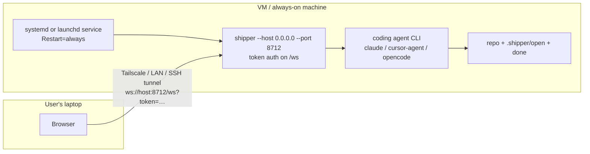

# Always-On Shipper Host — permanent VM setup with remote console access

## A: Plan Overview

Make it possible to run Shipper permanently on a machine (a dedicated VM or the user's own computer) so the web console is always up: progress is visible at any time and new plans/spikes/builds can be started from any browser that can reach the machine. Deliver the setup as an agent skill — the user runs one command (`shipper skills`, then invokes `/shipper-host` in Claude Code / Cursor CLI / opencode), and their coding agent provisions everything on the target machine.

This splits into two workstreams:

1. **Server changes to make remote access possible and safe.** Today `Bun.serve` binds hard-coded to `127.0.0.1` ([src/server/http.ts](src/server/http.ts) line 58), prints `http://shipper.localhost` URLs that only resolve on the machine itself, and has zero authentication — critical because the right-rail terminal is a full PTY shell (remote code execution for anyone who can reach the port). This plan adds a `--host` bind flag, mandatory token auth for non-loopback binds (enforced at the WebSocket layer, where every sensitive action flows), correct URL printing for remote hosts, and hardening for headless machines (no browser to open).

2. **A new bundled `shipper-host` skill.** Modeled on the existing skill set in [skills/](skills/), it walks the user's coding agent through provisioning the target machine: install/update the Shipper binary, verify a coding agent is installed and authenticated, generate the auth token, write and enable an always-on service (systemd user unit on Linux with lingering enabled; launchd LaunchAgent on macOS), pick a network access path (Tailscale recommended, SSH tunnel or LAN bind as alternatives), and verify end-to-end before handing the user a final URL.

Decisions and assumptions baked into this plan (no interactive Q&A was possible when planning; revisit any of these before building if they look wrong):

- **Setup is skill-driven, not CLI-driven.** No `shipper service install` subcommand. The user's coding agent (via `/shipper-host`) writes the service files, because the user explicitly asked for "run something to prompt their coding agent to set up the infrastructure". The CLI only gains what the skill cannot provide: `--host` and token auth.
- **Auth is enforced at the WebSocket upgrade, not on static assets.** Every mutating action (start plan/build/spike, answer questions, terminal input) and every byte of sensitive data flows over the single `/ws` socket. Gating the upgrade with a token secures everything that matters without fighting Bun's `routes`-vs-`fetch` precedence for the bundled HTML (see Gotchas).
- **Token auth activates only for non-loopback binds.** Local `shipper` usage stays exactly as it is today — zero prompts, zero tokens. `--host 0.0.0.0` (or any non-loopback address) without a resolvable token is a startup error.
- **One repo per Shipper process, one service unit per repo.** The run controller and plans watcher are single-repo by design. The skill provisions one named service per repository (e.g. `shipper-myrepo.service` on port 8712, a second repo on 8713).
- **Tailscale is the recommended access path** for a VM, because it gives a stable private hostname with WireGuard encryption and no public port exposure. The skill must also support plain LAN binds (home network) and SSH tunnels (no new software), chosen by asking the user.

## B: Related Files

Files to modify:

- [src/server/http.ts](src/server/http.ts) — bind host option, auth gate on `/ws` upgrade, URL building for remote hosts, headless-safe browser open
- [src/index.ts](src/index.ts) — `--host` and `--token` CLI flags, startup validation, printed URLs (including a `?token=` hint line)
- [src/core/config.ts](src/core/config.ts) — persist a generated server token under `defaults`
- [src/web/hooks/use-socket.ts](src/web/hooks/use-socket.ts) — read token from URL query/localStorage, append to the WebSocket URL, surface an "unauthorized" state instead of silent reconnect loops
- [src/web/app.tsx](src/web/app.tsx) — render the unauthorized state (banner or gate screen)
- [src/core/skills.ts](src/core/skills.ts) — register the new `shipper-host` skill files in the embedded `SKILLS` map
- [README.md](README.md) — new flags in the CLI table, new "Always-on host" section
- [web/app/docs/skills/page.tsx](web/app/docs/skills/page.tsx) — add `shipper-host` to the skills grid
- [web/app/docs/console/page.tsx](web/app/docs/console/page.tsx) — brief mention of the remote/VM path

Files to create:

- `skills/shipper-host/SKILL.md` — the setup skill entrypoint (questions, flow, verification)
- `skills/shipper-host/SYSTEMD.md` — Linux service reference (unit template, lingering, firewall notes)
- `skills/shipper-host/LAUNCHD.md` — macOS LaunchAgent reference (plist template, load/unload)
- `skills/shipper-host/ACCESS.md` — network access reference (Tailscale, LAN, SSH tunnel; token handling)
- `src/server/auth.ts` — token resolution + constant-time comparison helper (small, testable)
- `src/server/auth.test.ts` — unit tests for token resolution/validation
- Test additions in [src/server/run-controller.test.ts](src/server/run-controller.test.ts)'s style for the http-layer changes (new `src/server/http.test.ts` if practical without binding sockets; otherwise cover the pure helpers in `auth.test.ts` and `buildUrl` via export)

Files to read for reference (no changes expected):

- [src/server/ws-hub.ts](src/server/ws-hub.ts) — `handleUpgrade` is called from http.ts; the token check happens before it, so this file stays untouched
- [src/server/terminal-session.ts](src/server/terminal-session.ts) — the reason auth is non-negotiable; no changes
- [skills/shipper-ship/SKILL.md](skills/shipper-ship/SKILL.md) and [skills/shipper-bug/SKILL.md](skills/shipper-bug/SKILL.md) — tone, structure, and multi-file reference pattern (`Read and follow [./GIT.md](./GIT.md)`) to copy for the new skill
- [install.sh](install.sh) — the skill reuses this installer verbatim; note it already handles Linux x64/arm64 and `~/.local/bin` fallback

## C: Existing Code to Utilize

- **`StartServerOptions` plumb-through** in [src/server/http.ts](src/server/http.ts) (lines 19–23): `port`, `openBrowser`, `demoMode` already flow from commander options in [src/index.ts](src/index.ts) `runServe`. Add `host` and `token` the same way — no new plumbing pattern needed.
- **`tryListen`** (http.ts lines 56–77) already centralizes `Bun.serve` construction; the host just replaces the hard-coded `hostname: "127.0.0.1"` string, and the auth check slots into the existing `fetch` handler's `/ws` branch before `wsHub.handleUpgrade(req, server)`.
- **Config read/write helpers** in [src/core/config.ts](src/core/config.ts): `configSchema.defaults` already holds cross-project state (`lastUpdateCheckAt`, `latestKnownVersion`). Add `serverToken: z.string().optional()` there and expose `getOrCreateServerToken()` following the `getUpdateCheckState`/`setUpdateCheckState` pattern with the existing atomic `writeConfig`.
- **Reconnect loop with backoff** in [src/web/hooks/use-socket.ts](src/web/hooks/use-socket.ts) (lines 175–235): keep it; only the URL construction (line 181) and a new "closed with 4001/unauthorized → stop retrying" branch change.
- **Skill registration pattern** in [src/core/skills.ts](src/core/skills.ts): text imports with `with { type: "text" }` plus an entry in the `SKILLS` map is all that is needed for the skill to install globally via `installSkillsGlobally` — `shipper skills` and the on-boot install pick it up automatically. `shipper-host` must NOT be added to `OrchestratedSkillName` (line 52) or the model-config schema — it is only ever run from the user's own agent, never orchestrated by the console.
- **Multi-file skill convention**: `shipper-spike` and `shipper-bug` already bundle reference files (`PLAN.md`, `CATALOG.md`, etc.) that the SKILL.md links with relative paths. Copy that structure for `SYSTEMD.md` / `LAUNCHD.md` / `ACCESS.md`.
- **`crypto.randomUUID()`** is already used in [src/server/ws-hub.ts](src/server/ws-hub.ts) (line 94); use `crypto.getRandomValues` / `Bun.randomUUIDv7` equivalent — a 32-hex-char token from `crypto.getRandomValues(new Uint8Array(16))` is sufficient and dependency-free.

## D: Codebase Conventions to Follow

- TypeScript, ESM, explicit `.ts`/`.tsx` import extensions (`import { x } from "./auth.ts"`).
- Bun APIs over Node equivalents where practical (workspace rule), but existing files use `node:fs/promises` etc. — match the file you are editing.
- Zod for anything crossing a trust boundary; extend `configSchema` rather than reading raw JSON.
- Tests run with **vitest** (`bun run test` → `vitest run`), not `bun test`, despite the global Bun rule — test files live next to sources as `*.test.ts`.
- Quality gates at the end of every phase: `bun run typecheck`, `bun run lint`, `bun run test`.
- Server code never throws through to the client loop — errors become console warnings or graceful fallbacks (see `installGlobalSkillsForServe` in [src/index.ts](src/index.ts)).
- Skills are written as prose instructions to an agent, second person, no emojis, with hard requirements stated bluntly (see the "This is a READ-ONLY process" line in [skills/shipper-plan/SKILL.md](skills/shipper-plan/SKILL.md)). Reference files are linked relatively: `Read and follow [./SYSTEMD.md](./SYSTEMD.md)`.
- The web console is plain React over the single `useSocket` hook; UI state lives in [src/web/app.tsx](src/web/app.tsx), transport state in the hook.

## E: Gotchas

1. **The terminal pane is remote code execution.** [src/server/terminal-session.ts](src/server/terminal-session.ts) gives every connected WebSocket a real shell in the repo directory. Binding to a non-loopback address without auth must be a hard startup error, not a warning. This is the single most important behavior in Phase 1.
2. **Bun `routes` are matched before `fetch`.** In [src/server/http.ts](src/server/http.ts) the bundled HTML is served via `routes: { "/": indexHtml }`, which bypasses the `fetch` handler entirely. Do not try to token-gate the HTML — you cannot intercept that route without giving up Bun's HTML-import bundling. Gate `/ws` only (it is handled inside `fetch`), and document that the app shell itself is public when bound remotely.
3. **WebSocket close codes**: when rejecting an upgrade for a bad token, return a plain `Response` with status 401 from `fetch`. The browser `WebSocket` sees a failed connection, not a status code — so the client cannot distinguish "server down" from "bad token" via the error event alone. Have the client treat "N consecutive immediate failures while a token is set" as unauthorized, or perform a one-time `fetch("/auth-check?token=…")` preflight (a tiny non-routes endpoint in `fetch`) to get a real status code. The preflight is the more deterministic option; prefer it.
4. **All connected clients share one session.** `WsHub.broadcast` sends run state, chat, and terminal bytes to every socket — there is no per-client isolation. Anyone with the token sees and controls everything, including the shared terminal. Acceptable for a personal VM; state it plainly in the skill and README rather than engineering around it.
5. **`openBrowser` can crash headless Linux.** `Bun.spawn(["xdg-open", url])` throws synchronously (ENOENT) when `xdg-open` is not installed — typical on a server VM. Wrap it in try/catch and skip browser-open entirely when the bind host is non-loopback.
6. **Port 80 needs privileges on Linux.** The current default port is 80 with silent fallback to 8712. A systemd user service will always lose the port-80 race. The skill's unit template must pass `--port 8712` explicitly (do not rely on fallback, so the URL is predictable), and the docs should call the port out.
7. **`http://shipper.localhost` is meaningless remotely.** `buildUrl` (http.ts lines 34–39) must print `http://<bind-or-detected-host>:<port>` when the host is non-loopback. When binding `0.0.0.0`, the machine's own hostname/IPs are ambiguous — print the bind address plus a hint line ("reachable at your machine's address, e.g. via Tailscale hostname"); do not try to enumerate interfaces.
8. **systemd user services die at logout unless lingering is on.** The skill must run `loginctl enable-linger $USER` and verify it (`loginctl show-user $USER --property=Linger`). Without it the "permanent" VM setup silently stops at SSH disconnect. `Restart=always` plus `WantedBy=default.target` are also required.
9. **Agent credentials on a headless VM are interactive.** `claude`, `cursor-agent`, and `opencode` all need a login/auth step that may require a browser or device-code flow. The skill cannot automate this; it must detect the unauthenticated state (e.g. run a trivial prompt and check for an auth error) and hand the user exact instructions per agent, then re-verify before declaring success.
10. **Token in the URL query leaks into shell history and logs.** Acceptable trade-off for v1 (it is how the user bootstraps the browser session), but the client should immediately strip `?token=` from the address bar via `history.replaceState` after storing it in `localStorage`.
11. **`skills-lock.json` is stale and externally owned.** Its hashes no longer match the current SKILL.md files (verified during planning) and prior plans confirmed it belongs to external `skills add` tooling, not the binary build. Do not regenerate it; optionally append a `shipper-host` entry mirroring the existing shape, but do not touch existing entries.
12. **The update check and skills install run on every boot.** `runServe` calls `installGlobalSkillsForServe` before starting the server; on a VM without network this only warns (already wrapped in try/catch) — but the systemd unit must not use `Type=notify` or health checks that assume network. Plain `Type=simple` with `Restart=always` and `RestartSec=5` is correct.
13. **Vitest, not `bun test`.** The repo's global rule says `bun test`, but the scripts and existing tests use vitest. Follow the repo.
14. **`--dir` must be absolute in the service unit.** `process.cwd()` for a systemd unit is `/` unless `WorkingDirectory=` is set. The unit template should set both `WorkingDirectory=<repo>` and pass `--dir <repo>` explicitly so there is no ambiguity.

## Plan

## Phase 1: Remote-ready server — host binding, token auth, headless hardening

- Make the server safely reachable from another machine: bind address flag, token authentication on the WebSocket (and an auth preflight endpoint), truthful URLs, and no crashes on headless machines.
- Outcomes: `shipper --host 0.0.0.0 --port 8712` refuses to start without a token; with a token, a browser on another machine can load the console via `http://<host>:8712/?token=<token>` and everything (chat, runs, terminal) works; plain local `shipper` behaves exactly as today; all quality gates pass.

### Section 1.1: Token generation and resolution

- Overview: a small pure module for token handling plus config persistence, so http.ts stays thin.
- [ ] Extend `configSchema.defaults` in [src/core/config.ts](src/core/config.ts) with `serverToken: z.string().optional()`, and add `getOrCreateServerToken(): Promise<string>` that returns the stored token or generates one (32 hex chars from `crypto.getRandomValues(new Uint8Array(16))`), persists it via the existing `writeConfig`, and returns it. Follow the `getUpdateCheckState`/`setUpdateCheckState` pattern.
- [ ] Create `src/server/auth.ts` exporting: `resolveServerToken(opts: { flagToken?: string })` — precedence: `--token` flag, `SHIPPER_TOKEN` env var, then `getOrCreateServerToken()`; and `isTokenValid(provided: string | null, expected: string): boolean` using constant-time comparison (`crypto.timingSafeEqual` over equal-length buffers; length mismatch returns false without throwing).
- [ ] Create `src/server/auth.test.ts` covering precedence order, generation-and-persistence (mock config fns), and `isTokenValid` for match/mismatch/empty/length-mismatch cases.

### Section 1.2: Host binding and auth enforcement in the server

- Overview: wire host + token through `startServer` and gate the WebSocket.
- [ ] Add `host?: string` and `token?: string` to `StartServerOptions` in [src/server/http.ts](src/server/http.ts). `tryListen` uses `hostname: host ?? "127.0.0.1"`.
- [ ] Add an `isLoopback(host)` helper (treat `127.0.0.1`, `::1`, `localhost`, and undefined as loopback). When the host is non-loopback, auth is required: `startServer` resolves the token via `resolveServerToken` and stores it for the request handlers. When loopback, no auth checks run anywhere (today's behavior).
- [ ] In the `fetch` handler, when auth is active: for `/ws`, read `token` from the query string and reject with `new Response("Unauthorized", { status: 401 })` unless `isTokenValid` passes, before calling `wsHub.handleUpgrade`. Add a `GET /auth-check` branch that returns 204 on a valid token and 401 otherwise (the client preflight from Gotcha 3).
- [ ] `buildUrl`: keep `http://shipper.localhost[:port]` for loopback; for non-loopback return `http://<host>:<port>`. When the bind host is `0.0.0.0` or `::`, still print it but follow with a hint line in `runServe` output (see Section 1.3).
- [ ] Wrap the `openBrowser` spawn calls in try/catch (swallow errors) and skip `openBrowser` entirely when the host is non-loopback — there is no local browser worth opening on a VM.

### Section 1.3: CLI flags and startup output

- Overview: expose the new options and make the printed output copy-pasteable for remote use.
- [ ] In [src/index.ts](src/index.ts): add `--host <address>` (default `127.0.0.1`) and `--token <token>` options to the root command; extend `ServeOptions`; pass both to `startServer`.
- [ ] When the host is non-loopback, after the existing `Shipper running at <url>` line, print the token URL: `Access with: http://<host>:<port>/?token=<token>` plus, for `0.0.0.0`, one hint line that the machine's Tailscale/LAN hostname replaces the address. Never print the token when binding loopback.
- [ ] Startup validation: if the host is non-loopback and token resolution fails for any reason, print a clear error and `process.exit(1)` before `startServer` opens sockets.
- [ ] Update the README CLI flags table ([README.md](README.md)) with `--host` and `--token`.

### Section 1.4: Web client token handling

- Overview: the browser needs to acquire, store, and send the token, and show a real unauthorized state.
- [ ] In [src/web/hooks/use-socket.ts](src/web/hooks/use-socket.ts): on mount, read `token` from `window.location.search`; if present, store to `localStorage` (`shipper-token`) and strip it from the address bar with `history.replaceState` (Gotcha 10). When a stored token exists, append `?token=<token>` to the `/ws` URL (line 181).
- [ ] Add an `unauthorized` boolean to `SocketState`. Before the first connect attempt, when a token is present in localStorage OR the first connection attempt fails immediately, call `fetch("/auth-check" + (token ? "?token=" + token : ""))`; a 401 sets `unauthorized: true` and stops the reconnect loop (do not hammer a server that rejected us). A 204 (or network error) proceeds with the normal connect/backoff loop. Note: on a loopback server `/auth-check` returns 204 unconditionally, so local behavior is unchanged.
- [ ] In [src/web/app.tsx](src/web/app.tsx): when `unauthorized` is true, render a minimal centered gate — "This Shipper host requires a token" with a text input that stores the value to localStorage and reloads. Match the existing styles in [src/web/styles.css](src/web/styles.css) (monospace, dark, square corners).
- [ ] Manually verify locally: `bun run dev` (loopback, no token — unchanged), then `bun run dev -- --host 0.0.0.0 --port 8712` and connect from the same machine via the LAN IP with and without the token; confirm 401 without, console + terminal work with, and the token is scrubbed from the URL bar.
- [ ] `bun run typecheck`, `bun run lint`, `bun run test` all pass.

## Phase 2: The shipper-host skill

- Author the skill that a user's coding agent follows to turn any machine into a permanent Shipper host, and register it in the binary so `shipper skills` distributes it.
- Outcomes: `/shipper-host` is available in Claude Code / Cursor CLI / opencode after `shipper skills`; following it on a Linux VM or a Mac produces a running, enabled, reboot-surviving service and ends with a verified URL (+token) for the user.

### Section 2.1: Skill content

- Overview: `SKILL.md` orchestrates; three reference files hold the platform/network detail. Follow the prose conventions of [skills/shipper-bug/SKILL.md](skills/shipper-bug/SKILL.md) (second person, blunt requirements, relative links to reference files).
- [ ] Write `skills/shipper-host/SKILL.md` with this flow:
  1. State the goal (permanent Shipper host for one repository) and that the skill makes system-level changes (service files) which will be shown to the user before applying.
  2. Gather facts: OS (`uname -s`), repo path (ask; must be absolute), desired port (default 8712), whether more than one repo should be hosted (each gets its own service + port).
  3. Ask the user to choose an access path — Tailscale (recommended for VMs), LAN bind (home network), or SSH tunnel (loopback bind, no exposure) — per [./ACCESS.md](./ACCESS.md).
  4. Install or update Shipper via the official installer (`curl -fsSL https://raw.githubusercontent.com/shipper-is/shipper/main/install.sh | sh`); verify with `shipper --version`.
  5. Verify a coding agent is installed AND authenticated (run each detected agent with a trivial prompt; on auth errors, give the user that agent's login instructions and wait — per Gotcha 9 this cannot be automated).
  6. Run `shipper skills` so the host machine's agent has the full skill set.
  7. Set up the always-on service per [./SYSTEMD.md](./SYSTEMD.md) (Linux) or [./LAUNCHD.md](./LAUNCHD.md) (macOS).
  8. Verify end-to-end: service is active, `curl -fsS http://127.0.0.1:<port>/auth-check?token=…` returns 204 (or plain 204 for loopback binds), service survives a `systemctl --user restart` / `launchctl kickstart`, and (Linux) lingering is enabled.
  9. Hand the user the final URL exactly as they will use it, including the token when applicable, and where the token lives (`~/.config/shipper/config.json`) for recovery.
- [ ] Write `skills/shipper-host/SYSTEMD.md`: user-unit template at `~/.config/systemd/user/shipper-<name>.service` with `Type=simple`, `ExecStart=<abs path to shipper> --dir <repo> --host <bind> --port <port> --no-open`, `WorkingDirectory=<repo>`, `Restart=always`, `RestartSec=5`, `WantedBy=default.target`; the `loginctl enable-linger` requirement and its verification (Gotcha 8); `systemctl --user daemon-reload / enable --now / status / journalctl --user -u` commands; a note to prefer the user manager over a system unit so agent credentials in `$HOME` resolve.
- [ ] Write `skills/shipper-host/LAUNCHD.md`: LaunchAgent plist template at `~/Library/LaunchAgents/is.shipper.<name>.plist` with `ProgramArguments`, `WorkingDirectory`, `KeepAlive` (dict with `SuccessfulExit=false`), `RunAtLoad=true`, and `StandardOutPath`/`StandardErrorPath` under `~/Library/Logs/`; `launchctl bootstrap gui/$(id -u)` / `bootout` / `kickstart` usage; note that a Mac that sleeps is not a great always-on host (mention `caffeinate`/Energy Saver but leave it to the user).
- [ ] Write `skills/shipper-host/ACCESS.md` covering the three paths and when to pick each: **Tailscale** — install/`tailscale up`, bind `--host 0.0.0.0` (or the tailscale IP), URL becomes `http://<magicdns-name>:<port>/?token=…`; **LAN** — bind `0.0.0.0`, find the LAN IP, warn plainly that anyone on the network with the token has shell access (Gotcha 4); **SSH tunnel** — keep the loopback bind (no token needed), connect with `ssh -L 8712:127.0.0.1:8712 user@host`. Include the token model in one paragraph: where it comes from, that loopback binds skip it, that all clients share one session.

### Section 2.2: Registration and docs

- Overview: make the binary embed and distribute the skill, and document the feature.
- [ ] In [src/core/skills.ts](src/core/skills.ts): add the four text imports and a `"shipper-host"` entry to `SKILLS` (SKILL.md, SYSTEMD.md, LAUNCHD.md, ACCESS.md). Do NOT touch `OrchestratedSkillName` or [src/core/config.ts](src/core/config.ts)'s `skillModelsSchema` — this skill is never run by the console.
- [ ] Optionally append a `shipper-host` entry to [skills-lock.json](skills-lock.json) matching the existing shape (sha256 of SKILL.md); leave the existing stale entries untouched (Gotcha 11).
- [ ] README ([README.md](README.md)): add an "Always-on host (VM)" section — one paragraph on what it gives you, the two commands to run (`shipper skills`, then invoke `/shipper-host` in your agent), and the security model in two sentences (token, shared session, terminal = shell).
- [ ] Marketing docs: add `shipper-host` to the skills array in [web/app/docs/skills/page.tsx](web/app/docs/skills/page.tsx) (description + example: "use shipper-host to set up this VM as a permanent Shipper host"), and add a short "Run it on a VM" step or aside in [web/app/docs/console/page.tsx](web/app/docs/console/page.tsx).
- [ ] `bun run typecheck`, `bun run lint`, `bun run test` pass (skills.ts changes are exercised by existing skills tests in [src/core/core.test.ts](src/core/core.test.ts) — extend the expected-skill-names assertions if any enumerate `SKILL_NAMES`).

## Phase 3: End-to-end verification on a real host

- Prove the whole story on an actual Linux machine (a scratch VM or container with systemd) and, if available, a Mac.
- Outcomes: documented evidence that a fresh machine goes from nothing to a reboot-surviving remote-accessible Shipper host by following the skill, and that the auth gate holds.

### Section 3.1: Linux VM run-through

- [ ] On a clean Linux host with systemd user sessions: follow `skills/shipper-host/SKILL.md` manually (or drive it through a coding agent) against a scratch repo. Record each deviation between the skill's instructions and reality, and fix the skill text.
- [ ] Verify the security gate from a second machine: no token → 401 on `/auth-check` and failed WS; correct token → full console including terminal; wrong token → 401.
- [ ] Verify persistence: `systemctl --user restart` recovers; log out of SSH entirely and confirm the service stays up (lingering); reboot the VM and confirm the service returns.
- [ ] Verify a plan can be initiated remotely end-to-end: from the remote browser, start a small plan, answer one question, watch it land in `.shipper/open/`.

### Section 3.2: Regression sweep

- [ ] Local loopback behavior unchanged: `shipper` with no flags opens the browser at `http://shipper.localhost`, no token anywhere in the flow.
- [ ] `--port` explicit + occupied still errors (existing behavior), `--host` invalid address produces a readable error.
- [ ] Full gates: `bun run typecheck`, `bun run lint`, `bun run test`; smoke-test the compiled binary (`bun run build`, then `./dist/shipper --host 0.0.0.0 --port 8712` on the scratch repo) since HTML-import bundling and compiled behavior can diverge from dev mode.
