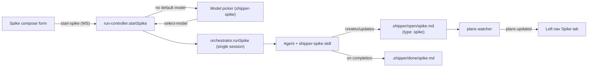

# Spike Tab in the Web Console

## A: Plan Overview

Add a new "Spike" run type to the Shipper web console, powered by the existing `shipper-spike` skill. The left nav gets a two-tab switcher — "Plan" (default) and "Spike" — each listing its own Open/Done files from the existing `.shipper/open` and `.shipper/done` folders. Spikes are differentiated from full plans by a new `type` key in the YAML frontmatter (`type: plan` / `type: spike`; a missing `type` is treated as `plan` for backwards compatibility with existing files).

Decisions already made with the user:

- A spike is a one-shot run: the user enters a description, and a single agent flow gathers context, asks clarifying questions, writes the lightweight spike markdown file into `.shipper/open`, implements the work, checks off tasks, and moves the file to `.shipper/done` when finished.
- PR and worktree preferences are NOT collected in the UI. The `shipper-spike` skill already instructs the agent to ask about them, and those questions surface through the existing question-card flow.
- Going forward the skills write `type: plan` and `type: spike` explicitly, but absence of `type` still means "plan".
- The agent (via the updated `shipper-spike` skill) owns creating and maintaining the spike file — same convention as plans, where the server only observes the filesystem.
- `shipper-spike` gets its own default-model configuration, using the same model-picker flow as `shipper-plan` and `shipper-build`.

## B: Related Files

Server / core:

- [/Users/matt/Documents/shipper/src/core/plan-store.ts](/Users/matt/Documents/shipper/src/core/plan-store.ts) — `PlanMeta`, `parseFrontmatter`, `listPlans`, `findPlanByFilename`. Gains the `type` meta field.
- [/Users/matt/Documents/shipper/src/shared/protocol.ts](/Users/matt/Documents/shipper/src/shared/protocol.ts) — all shared DTOs, client/server message unions, zod schema. Gains `start-spike`, `spike-created`, `"spike"` skill indicator, `shipper-spike` in the skill enums.
- [/Users/matt/Documents/shipper/src/core/skills.ts](/Users/matt/Documents/shipper/src/core/skills.ts) — embedded skill registry + `installSkills`. Must learn to install multi-file skills (spike has `SKILL.md`, `PLAN.md`, `BUILD.md`).
- [/Users/matt/Documents/shipper/src/core/prompts.ts](/Users/matt/Documents/shipper/src/core/prompts.ts) — prompt builders. Gains `buildSpikePrompt`.
- [/Users/matt/Documents/shipper/src/core/orchestrator.ts](/Users/matt/Documents/shipper/src/core/orchestrator.ts) — `runPlanCreation` / `runBuildLoop` / `runFollowUp`. Gains `runSpike`.
- [/Users/matt/Documents/shipper/src/core/config.ts](/Users/matt/Documents/shipper/src/core/config.ts) — `skillModelsSchema` gains `shipper-spike`.
- [/Users/matt/Documents/shipper/src/server/run-controller.ts](/Users/matt/Documents/shipper/src/server/run-controller.ts) — run lifecycle. Gains `startSpike`/`runSpikeRun`/`finishSpike`, `PendingStart` spike variant, follow-up mapping, `enrichConfigInfo` spike model.

Skill content (source of truth for embedded skills):

- [/Users/matt/Documents/shipper/skills/shipper-spike/SKILL.md](/Users/matt/Documents/shipper/skills/shipper-spike/SKILL.md)
- [/Users/matt/Documents/shipper/skills/shipper-spike/PLAN.md](/Users/matt/Documents/shipper/skills/shipper-spike/PLAN.md)
- [/Users/matt/Documents/shipper/skills/shipper-spike/BUILD.md](/Users/matt/Documents/shipper/skills/shipper-spike/BUILD.md)
- [/Users/matt/Documents/shipper/skills/shipper-plan/SKILL.md](/Users/matt/Documents/shipper/skills/shipper-plan/SKILL.md) — add `type: plan` frontmatter instruction.
- [/Users/matt/Documents/shipper/skills/shipper-build/SKILL.md](/Users/matt/Documents/shipper/skills/shipper-build/SKILL.md) — preserve `type` when editing frontmatter.

Frontend:

- [/Users/matt/Documents/shipper/src/web/app.tsx](/Users/matt/Documents/shipper/src/web/app.tsx) — nav mode state, compose state, keyboard shortcuts.
- [/Users/matt/Documents/shipper/src/web/components/left-nav.tsx](/Users/matt/Documents/shipper/src/web/components/left-nav.tsx) — Plan/Spike tabs, filtered lists.
- [/Users/matt/Documents/shipper/src/web/components/main-pane.tsx](/Users/matt/Documents/shipper/src/web/components/main-pane.tsx) — spike compose form, empty states.
- [/Users/matt/Documents/shipper/src/web/hooks/use-socket.ts](/Users/matt/Documents/shipper/src/web/hooks/use-socket.ts) — handle `spike-created`.
- [/Users/matt/Documents/shipper/src/web/components/model-picker.tsx](/Users/matt/Documents/shipper/src/web/components/model-picker.tsx) — title for `shipper-spike`.
- [/Users/matt/Documents/shipper/src/web/components/settings-modal.tsx](/Users/matt/Documents/shipper/src/web/components/settings-modal.tsx) — third model row.
- [/Users/matt/Documents/shipper/src/web/components/keyboard-help.tsx](/Users/matt/Documents/shipper/src/web/components/keyboard-help.tsx) — new shortcut entry.
- [/Users/matt/Documents/shipper/src/web/styles.css](/Users/matt/Documents/shipper/src/web/styles.css) — nav tab styles, `.skill-spike` pill.

Tests:

- [/Users/matt/Documents/shipper/src/core/plan-store.test.ts](/Users/matt/Documents/shipper/src/core/plan-store.test.ts)
- [/Users/matt/Documents/shipper/src/core/orchestrator.test.ts](/Users/matt/Documents/shipper/src/core/orchestrator.test.ts)
- [/Users/matt/Documents/shipper/src/server/run-controller.test.ts](/Users/matt/Documents/shipper/src/server/run-controller.test.ts)
- [/Users/matt/Documents/shipper/src/core/core.test.ts](/Users/matt/Documents/shipper/src/core/core.test.ts)

## C: Existing Code to Utilize

- The `start-plan` pipeline is the template for `start-spike`. Mirror each layer:
  - `startPlan` / `runPlan` / `finishPlan` in [/Users/matt/Documents/shipper/src/server/run-controller.ts](/Users/matt/Documents/shipper/src/server/run-controller.ts) (lines 328–347, 414–460, 612–637).
  - `runPlanCreation` in [/Users/matt/Documents/shipper/src/core/orchestrator.ts](/Users/matt/Documents/shipper/src/core/orchestrator.ts) (lines 168–211), including the before/after `listPlans` diff via `findNewOpenPlan`.
  - `buildPlanPrompt` in [/Users/matt/Documents/shipper/src/core/prompts.ts](/Users/matt/Documents/shipper/src/core/prompts.ts).
- Model-pick deferral already works generically: `resolveDefaultModel` → `requestModelPick(skill, pendingStart)` → `selectModel` resumes the pending start. Only the enums and the `PendingStart` union need a spike variant.
- Frontmatter parsing helpers `asMetaString` / `emptyPlanMeta` in [/Users/matt/Documents/shipper/src/core/plan-store.ts](/Users/matt/Documents/shipper/src/core/plan-store.ts) (lines 51–74).
- `planFileToSummary` in [/Users/matt/Documents/shipper/src/server/plans-watcher.ts](/Users/matt/Documents/shipper/src/server/plans-watcher.ts) passes `plan.meta` straight through to the DTO — once `PlanMeta` and `PlanMetaDto` both gain `type`, no watcher changes are needed.
- The existing `.main-tabs` CSS block in [/Users/matt/Documents/shipper/src/web/styles.css](/Users/matt/Documents/shipper/src/web/styles.css) (lines 440–468) is the visual pattern to reuse for the left-nav Plan/Spike tabs.
- `parsePlan` already treats a checklist with no `## Phase` headings as one implicit phase ("Tasks" section, phase number 1) — see lines 198–218 of [/Users/matt/Documents/shipper/src/core/plan-store.ts](/Users/matt/Documents/shipper/src/core/plan-store.ts). Lightweight spike files therefore get progress bars, phase counts, and Build-loop compatibility for free without any parser changes.

## D: Codebase Conventions to Follow

- All server-client communication is over the single `/ws` WebSocket. New client messages must be added to both the TypeScript union and `clientMessageSchema` (zod) in [/Users/matt/Documents/shipper/src/shared/protocol.ts](/Users/matt/Documents/shipper/src/shared/protocol.ts); unvalidated messages are silently dropped by `parseClientMessage`.
- The server never writes or moves plan/spike files during a run; the agent owns the file per the skill instructions, and the server observes changes via the chokidar watcher and `listPlans` re-reads.
- Frontmatter keys are snake_case in YAML and camelCase in TypeScript (`started_at` → `startedAt`). The new key is just `type`, identical in both.
- Skills are embedded at build time via Bun text imports (`import x from "...md" with { type: "text" }`) and vendored into the target repo by `installSkills` before every session. Never read skills from Shipper's own `skills/` folder at runtime.
- Frontend state lives in `useSocket` (server-derived) plus local `useState` in `app.tsx` / components. No routing, no state libraries, no localStorage except the terminal-collapsed flag.
- Run flows follow: set `runState` + `broadcastRunState()` → call orchestrator with handlers (`onEvent`, `onQuestion`, `onPlanUpdate`, `onSessionLog`, `signal`) → `finishX` appends a notice, updates `lastSkill`/`lastPlanFilename`/`lastSessionId`, calls `deps.onPlanUpdate?.()`, then `clearRun()`.
- Tests use `bun test` with the existing patterns in `run-controller.test.ts` (fake orchestrator via the `orchestrator` dep injection) and `orchestrator.test.ts`.

## E: Gotchas

- `skills.ts` currently maps one skill name to one `SKILL.md` string. The spike skill is three files, and its `SKILL.md` refers to sibling reference files. `installSkills` must write all three into `.cursor/skills/shipper-spike/` (or agent equivalent), and the casing in `SKILL.md` must be fixed: it currently says `./plan.md` and `./build.md` but the real files are `PLAN.md` and `BUILD.md`.
- `SkillName` (derived from the `SKILLS` object keys) is used by `config.ts`, `run-controller.ts`, and the protocol enums. When restructuring `SKILLS` for multi-file support, keep `SkillName` resolving to exactly `"shipper-plan" | "shipper-build" | "shipper-spike"`.
- A successful spike may end with the file already moved to `.shipper/done`. The new-file detection in `runSpike` must diff filenames across BOTH `open` and `done`, unlike `findNewOpenPlan` which only looks at `open`.
- Do not reuse the `plan-created` server message for spikes: in `use-socket.ts` it sets `createdPlanFilename`, which drives the "Build it now" banner in `main-pane.tsx` — meaningless for a spike that already built itself. Use a separate `spike-created` message that only selects the file.
- The current `shipper-spike` PLAN.md tells the agent to ask about PR/worktree preferences "using the tool you have available" — this flows through the existing question protocol and question card automatically. Do not remove that step; it is the agreed UX.
- `runState.skill` is typed as `SkillIndicator` which already contains `"ship"` (unused). Add `"spike"`; the `skill-pill` in `main-pane.tsx` renders `skill-${runState.skill}` as a CSS class, so a `.skill-spike` rule is required in `styles.css`.
- Left-nav keyboard navigation (`ArrowUp`/`ArrowDown`) iterates `[...plans.open, ...plans.done]`. Once lists are filtered by type, the iteration array must be the filtered one, or arrows will select plans invisible in the current tab.
- `pickDefaultPlan` in `use-socket.ts` selects the first open plan regardless of type. This is acceptable (selection and nav mode are decoupled), but the nav-mode switch handler in `app.tsx` should re-select a plan of the new tab's type so the main pane matches the visible list.
- The Build button in the main-pane header shows for any idle open plan. Leave it enabled for spikes: a stalled spike left in `open/` can be resumed through the normal build loop because the spike file parses as an implicit single phase. This is intentional recovery behavior, not a bug.
- `enrichConfigInfo` in `run-controller.ts` resolves models with `Promise.all` over exactly two skills — extend it, and extend `ConfigInfo["models"]`, or the settings modal will show "Not set" forever for spike.
- The existing plans in `.shipper/done` and any user repos have no `type` key. Every `type` read must default to `"plan"` when the key is missing or has an unexpected value.

## Plan

## Phase 1

- Establish the shared foundations: the `type` frontmatter field end to end, protocol additions for spike, and the skill content/embedding changes.
- Outcomes: `PlanSummary.meta.type` reaches the browser for every file; the protocol accepts `start-spike` and can announce `spike-created`; `installSkills` vendors the three-file `shipper-spike` skill; skill markdown is updated for the new file conventions.

### Section 1: Frontmatter `type` field

- Overview: introduce the plan/spike discriminator with backwards-compatible defaults.
- [x] In [/Users/matt/Documents/shipper/src/core/plan-store.ts](/Users/matt/Documents/shipper/src/core/plan-store.ts), add `type: "plan" | "spike"` to `PlanMeta`, return `type: "plan"` from `emptyPlanMeta()`, and in `parseFrontmatter` read `record.type`, mapping the string `"spike"` to `"spike"` and anything else (missing, wrong type, unknown value) to `"plan"`.
- [x] In [/Users/matt/Documents/shipper/src/shared/protocol.ts](/Users/matt/Documents/shipper/src/shared/protocol.ts), add the same `type: "plan" | "spike"` field to `PlanMetaDto`. Verify `planFileToSummary` in [/Users/matt/Documents/shipper/src/server/plans-watcher.ts](/Users/matt/Documents/shipper/src/server/plans-watcher.ts) still compiles unchanged (it forwards `plan.meta` as a whole).

### Section 2: Protocol additions for spike

- Overview: extend the shared message and enum types; every list below lives in [/Users/matt/Documents/shipper/src/shared/protocol.ts](/Users/matt/Documents/shipper/src/shared/protocol.ts).
- [x] Add `"spike"` to `SkillIndicator`.
- [x] Add `ClientStartSpike = { type: "start-spike"; description: string }`, include it in the `ClientMessage` union, and add the matching entry to `clientMessageSchema`.
- [x] Widen the skill enums to include `"shipper-spike"`: `ClientSelectModel["skill"]`, `ClientConfigureModel["skill"]`, `ModelPickRequest["skill"]`, and the two `z.enum(["shipper-plan", "shipper-build"])` occurrences in `clientMessageSchema`.
- [x] Add `"shipper-spike"?: string` to `ConfigInfo["models"]`.
- [x] Add `ServerSpikeCreated = { type: "spike-created"; filename: string; title: string }` and include it in the `ServerMessage` union.

### Section 3: Skill embedding and skill content

- Overview: make the spike skill installable and teach it the lightweight spike-file convention; keep plan/build skills consistent with the new `type` key.
- [x] Restructure `SKILLS` in [/Users/matt/Documents/shipper/src/core/skills.ts](/Users/matt/Documents/shipper/src/core/skills.ts) so each skill maps to a list of files, e.g. `{ "shipper-plan": [{ file: "SKILL.md", content: planSkill }], ..., "shipper-spike": [{ file: "SKILL.md", ... }, { file: "PLAN.md", ... }, { file: "BUILD.md", ... }] }`, importing the three spike files with `with { type: "text" }`. Keep `SkillName` and `SKILL_NAMES` semantics identical. Replace `skillPathForAgent(agent, name)` with a directory resolver (same `.claude/skills/<name>/`, `.cursor/skills/<name>/`, `.opencode/skill/<name>/` mapping) and update `installSkills` to write every file of every skill via the existing `writeSkillIfChanged`. Update the one other caller of `skillPathForAgent`, `skillInstruction` in [/Users/matt/Documents/shipper/src/core/prompts.ts](/Users/matt/Documents/shipper/src/core/prompts.ts), to point at the skill's `SKILL.md`.
- [x] Update [/Users/matt/Documents/shipper/skills/shipper-spike/SKILL.md](/Users/matt/Documents/shipper/skills/shipper-spike/SKILL.md): fix the reference-file casing to `./PLAN.md` and `./BUILD.md`.
- [x] Update [/Users/matt/Documents/shipper/skills/shipper-spike/PLAN.md](/Users/matt/Documents/shipper/skills/shipper-spike/PLAN.md): after the three context/clarification steps (keep the PR/worktree questions), add a step to write a lightweight spike file into `.shipper/open/` named after the spike (kebab-case). Specify the format: YAML frontmatter at the very top with `type: spike`, `branch` (current git branch), and `started_at` (quoted ISO 8601 timestamp); then a `# Title`, a short overview paragraph, and a flat `- [ ]` task checklist. Explicitly state that no `## Phase` headings are needed and that this file is the single source of truth for the spike's status.
- [x] Update [/Users/matt/Documents/shipper/skills/shipper-spike/BUILD.md](/Users/matt/Documents/shipper/skills/shipper-spike/BUILD.md): instruct the agent to check off each task in the spike file as it completes (in addition to the todo-list tool), and on completion set `completed_at` in the frontmatter and move the file from `.shipper/open/` to `.shipper/done/` — mirroring the wording in [/Users/matt/Documents/shipper/skills/shipper-build/SKILL.md](/Users/matt/Documents/shipper/skills/shipper-build/SKILL.md) line 28.
- [x] Update [/Users/matt/Documents/shipper/skills/shipper-plan/SKILL.md](/Users/matt/Documents/shipper/skills/shipper-plan/SKILL.md): instruct that new plan files start with a YAML frontmatter block containing `type: plan`.
- [x] Update [/Users/matt/Documents/shipper/skills/shipper-build/SKILL.md](/Users/matt/Documents/shipper/skills/shipper-build/SKILL.md): note that an existing `type` key in the frontmatter must be preserved, and include `type: plan` in the example frontmatter block.

### Completion Notes

- `SKILLS` is now `Record<SkillName, readonly SkillFile[]>`; access embedded content via `SKILLS[name][0].content` for single-file skills. `skillPathForAgent` still returns the `SKILL.md` path (join of `skillDirForAgent` + `SKILL.md`) for prompts and tests.
- `parseFrontmatter` defaults missing/unknown `type` to `"plan"`; only the literal string `"spike"` maps to spike. Existing frontmatter-free files get `type: "plan"` via `emptyPlanMeta()`.
- Protocol spike messages (`start-spike`, `spike-created`) and `shipper-spike` skill enums are defined but not wired in run-controller/orchestrator yet — Phase 2.
- `core.test.ts` installSkills expectations updated for the new `SKILLS` shape; `plan-store.test.ts` and `plans-watcher.test.ts` expectations include `type: "plan"`. Phase 4 will add dedicated `type: spike` parse cases and spike install coverage.
- `skillModelsSchema` in `config.ts` gained `"shipper-spike"` early (Phase 2 item) because expanding `SKILLS` widened `SkillName` and broke typecheck otherwise. `enrichConfigInfo` spike model resolution is still Phase 2.

## Phase 2

- Wire the spike run through the server: prompt, orchestrator, model config, and run controller.
- Outcomes: sending `start-spike` over the WebSocket runs a one-shot spike session with its own default model (with model-picker fallback), broadcasts `spike-created` on success, and supports follow-up messages afterwards.

### Section 1: Prompt and orchestrator

- Overview: add the single-session spike flow next to `runPlanCreation`.
- [x] In [/Users/matt/Documents/shipper/src/core/prompts.ts](/Users/matt/Documents/shipper/src/core/prompts.ts), add `buildSpikePrompt(description, agentKind)` following the `buildPlanPrompt` shape: the `skillInstruction` line for `shipper-spike`, then "Run a Shipper Spike for the following feature or task:" plus the description, then `questionInstructions(agentKind)`.
- [x] In [/Users/matt/Documents/shipper/src/core/orchestrator.ts](/Users/matt/Documents/shipper/src/core/orchestrator.ts), add `SpikeResult` (`{ status: "success"; filename: string; title: string; location: "open" | "done"; lastSessionId: string | null } | { status: "error"; message: string; lastSessionId?: string | null }`) and `runSpike(repoPath, agent, description, handlers, model?)`: snapshot filenames from BOTH `open` and `done` via `listPlans`, `installSkills`, run one `consumeAgentRun` session with `buildSpikePrompt` (create a `RunLogger` like `runPlanCreation` does), then re-list and find the new file in either folder. Success requires a new file; report `location` from the folder it ended in. If the run failed or no file appeared, return an error result (mirror the two error branches of `runPlanCreation`, lines 198–210).

### Section 2: Model configuration

- Overview: give `shipper-spike` its own default model.
- [x] Add `"shipper-spike": z.string().optional()` to `skillModelsSchema` in [/Users/matt/Documents/shipper/src/core/config.ts](/Users/matt/Documents/shipper/src/core/config.ts). `resolveDefaultModel` and `saveModelChoice` already key off `SkillName` and need no changes.
- [x] Extend `enrichConfigInfo` in [/Users/matt/Documents/shipper/src/server/run-controller.ts](/Users/matt/Documents/shipper/src/server/run-controller.ts) (lines 804–825) to resolve and include the `shipper-spike` model.

### Section 3: Run controller wiring

- Overview: mirror the plan-start flow in [/Users/matt/Documents/shipper/src/server/run-controller.ts](/Users/matt/Documents/shipper/src/server/run-controller.ts).
- [x] Add `runSpike` to `OrchestratorFns` and `defaultOrchestrator`, and `{ kind: "spike"; description: string }` to `PendingStart`.
- [x] Add `startSpike(description)`: guard `isRunActive()`, trim/validate the description, resolve the agent, `resolveDefaultModel(repoPath, agent, "shipper-spike")`, fall back to `requestModelPick("shipper-spike", { kind: "spike", description })`, else call the run function — a direct mirror of `startPlan` (lines 612–637).
- [x] Add the spike run function modeled on `runPlan` (lines 414–460): reset chat/question/pending state, set `runState` to `{ status: "running", skill: "spike", planFilename: null, activePhaseNumber: null, logPath: null }`, `appendUserMessage(description)`, call `orchestrator.runSpike` with `signal`, `onEvent`, `onQuestion`, plus `onSessionLog: (path) => setRunState({ logPath: path })` and `onPlanUpdate: () => deps.onPlanUpdate?.()` so the nav updates as the agent writes the spike file.
- [x] Add `finishSpike(result)`: set `lastSkill = "spike"`; on success set `lastPlanFilename`, append a notice such as "Spike complete — {title}" including the final location (mention when it was left in `open/`), broadcast `{ type: "spike-created", filename, title }`, and call `deps.onPlanUpdate?.()`; on error append "Spike failed: {message}". Always `clearRun()`.
- [x] Update `runFollowUpMessage` (line 470) so `lastSkill === "spike"` maps to the `"shipper-spike"` skill name for model resolution.
- [x] Update `selectModel` (lines 639–663) to resume `pending.kind === "spike"` when `skill === "shipper-spike"`, and add a `case "start-spike"` to `handleClientMessage`.

### Completion Notes

- `runSpike` uses `findNewPlan` to diff filenames across both `open/` and `done/` before and after the session; `SpikeHandlers` extends `AgentRunHandlers` with optional `onPlanUpdate`, called once after the agent session completes.
- `finishSpike` broadcasts `spike-created` (not `plan-created`) and mentions when the file was left in `open/`.
- `skillModelsSchema` already included `shipper-spike` from Phase 1; no config.ts changes in this phase.
- Frontend UI for `start-spike` / `spike-created` is Phase 3; spike-specific tests are Phase 4.

## Phase 3

- Build the web console UI: left-nav tabs, spike compose flow, and supporting chrome.
- Outcomes: the left nav shows Plan/Spike tabs with filtered lists; a "+ New spike" flow starts a spike run; the model picker and settings modal know about spike; run state renders correctly during a spike.

### Section 1: Socket handling

- Overview: receive the new server message in [/Users/matt/Documents/shipper/src/web/hooks/use-socket.ts](/Users/matt/Documents/shipper/src/web/hooks/use-socket.ts).
- [x] Handle `spike-created` in `handleMessage` by calling `setSelectedPlanFilename(msg.filename)`. Do NOT set `createdPlanFilename` (that drives the plan-only "Build it now" banner).

### Section 2: Left nav tabs

- Overview: two-tab switcher with type-filtered lists.
- [x] In [/Users/matt/Documents/shipper/src/web/app.tsx](/Users/matt/Documents/shipper/src/web/app.tsx), add `navMode: "plan" | "spike"` state (default `"plan"`) and replace the boolean `composingNewPlan` with `composing: "plan" | "spike" | null` (update `closeOverlays`, the Escape handler, and all `MainPane`/`LeftNav` props accordingly).
- [x] In [/Users/matt/Documents/shipper/src/web/components/left-nav.tsx](/Users/matt/Documents/shipper/src/web/components/left-nav.tsx), accept `mode` and `onModeChange` props and render a two-button tab bar ("Plan" / "Spike") above the new-item button, styled like the existing `.main-tabs` pattern (add a `.nav-tabs` block in [/Users/matt/Documents/shipper/src/web/styles.css](/Users/matt/Documents/shipper/src/web/styles.css)).
- [x] Filter both sections by type: `plans.open.filter((p) => (p.meta.type === "spike") === (mode === "spike"))` and likewise for `done`. Base `allPlans` (keyboard navigation) and the `noPlans` empty-state check on the filtered arrays, and adjust the empty-state copy per mode ("No spikes yet." with a hint about `+ New spike`).
- [x] Change the new-item button label to "+ New plan" / "+ New spike" based on `mode`, invoking the compose flow for that mode.
- [x] In `app.tsx`, when `navMode` changes, re-select the first open (else first done) item of the new tab's type, or clear the selection if the tab is empty, so the main pane matches the visible list.

### Section 3: Spike compose and main pane

- Overview: the entry point for starting a spike, mirroring the plan compose form in [/Users/matt/Documents/shipper/src/web/components/main-pane.tsx](/Users/matt/Documents/shipper/src/web/components/main-pane.tsx) (lines 66–101).
- [x] Generalize the compose branch to render per mode: for spike, heading "New spike", subtitle like "Describe a small, one-off task. Shipper will plan and build it in one run.", and a "Start spike" primary button that sends `{ type: "start-spike", description }` (thread an `onStartSpike` prop from `app.tsx`, or generalize `onStartPlan` to accept the mode).
- [x] Update the running-header fallback title (line 138) to show "Spike in progress" when `runState.skill === "spike"`, and add a `.skill-spike` rule in `styles.css` next to `.skill-plan`/`.skill-build` (lines 422–438) so the skill pill renders.
- [x] Update the idle empty state (lines 103–119) to be mode-aware: pass `navMode` into `MainPane` and show a "New spike" button and spike copy when in spike mode with no selection. Leave the Build button logic untouched (intentionally available for open spikes as a resume path).

### Section 4: Model picker, settings, shortcuts

- Overview: surface the third skill everywhere models and shortcuts are shown.
- [x] In [/Users/matt/Documents/shipper/src/web/components/model-picker.tsx](/Users/matt/Documents/shipper/src/web/components/model-picker.tsx), extend the title logic for `shipper-spike` ("Choose a model for spikes").
- [x] In [/Users/matt/Documents/shipper/src/web/components/settings-modal.tsx](/Users/matt/Documents/shipper/src/web/components/settings-modal.tsx), add `"shipper-spike": "Spike"` to `SKILL_LABELS` and include it in the model rows array (line 89).
- [x] In `app.tsx`, add an `s` keyboard shortcut that switches `navMode` to `"spike"` and opens the spike compose form (mirror the `n` handler), and document it in [/Users/matt/Documents/shipper/src/web/components/keyboard-help.tsx](/Users/matt/Documents/shipper/src/web/components/keyboard-help.tsx).

### Completion Notes

- `NavMode` is exported from `left-nav.tsx` and shared with `app.tsx` / `main-pane.tsx`. `pickPlanByType` in `app.tsx` handles re-selection when switching tabs.
- Keyboard `n` forces plan mode + compose; `s` forces spike mode + compose. The left-nav tab bar also switches mode without opening compose.
- `spike-created` only updates `selectedPlanFilename` — no "Build it now" banner. Phase 4 adds spike-specific tests.

## Phase 4

- Test coverage and verification.
- Outcomes: new behavior is covered by unit tests following existing patterns; the full suite and typecheck pass.

### Section 1: Core tests

- Overview: cover parsing and orchestration.
- [ ] In [/Users/matt/Documents/shipper/src/core/plan-store.test.ts](/Users/matt/Documents/shipper/src/core/plan-store.test.ts), add `parseFrontmatter` cases: `type: spike` yields `"spike"`; `type: plan`, missing `type`, and an unknown value all yield `"plan"`.
- [ ] In [/Users/matt/Documents/shipper/src/core/orchestrator.test.ts](/Users/matt/Documents/shipper/src/core/orchestrator.test.ts), add `runSpike` cases using the existing temp-repo/fake-adapter patterns: success with the new file left in `open/` (location `"open"`), success with the file created in `done/` (location `"done"`), and error when no new file appears.
- [ ] In [/Users/matt/Documents/shipper/src/core/core.test.ts](/Users/matt/Documents/shipper/src/core/core.test.ts) (or wherever prompts/skills are covered), assert `buildSpikePrompt` references the `shipper-spike` SKILL.md path and includes the description, and that `installSkills` writes all three `shipper-spike` files for a cursor-agent target.

### Section 2: Run controller tests and final verification

- Overview: cover the WebSocket-facing behavior and run the suite.
- [ ] In [/Users/matt/Documents/shipper/src/server/run-controller.test.ts](/Users/matt/Documents/shipper/src/server/run-controller.test.ts), using the injected fake orchestrator: `start-spike` with no default model broadcasts `needs-model-pick` for `shipper-spike` and then `select-model` resumes the pending spike; `start-spike` with a model runs `runSpike` and sets `runState.skill` to `"spike"`; a successful result broadcasts `spike-created` and a completion notice; a follow-up after a spike resolves the model via `shipper-spike`.
- [ ] Run `bun test` and fix any failures; check for new linter/type errors in all edited files.
