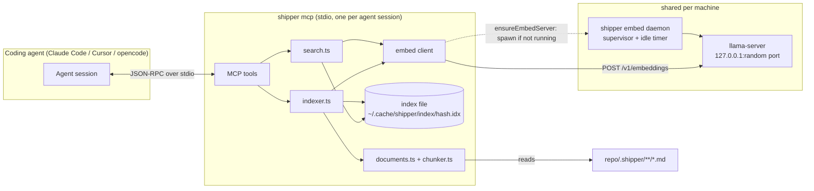
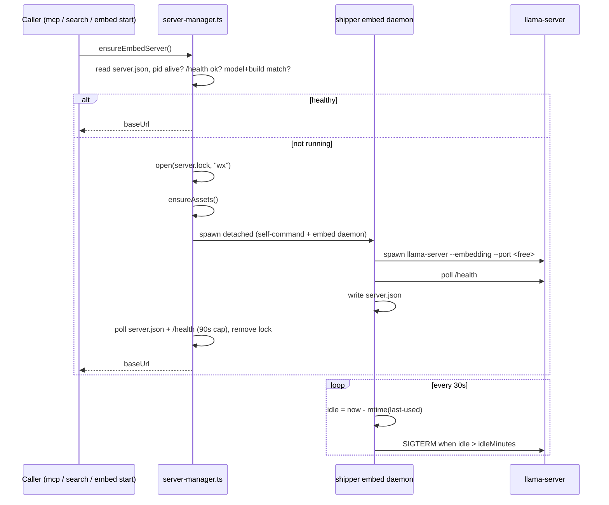

# Semantic Search MCP for Shipper Files

## A: Plan Overview

Give coding agents fast semantic (embeddings) search over a repository's Shipper artifacts — plans, spikes, bugs, and reviews — through an MCP server that the Shipper CLI provides. Repos with hundreds of `.shipper/` files make grep-based discovery slow and noisy ("have we planned something like this before?", "is this bug a regression of an old one?"). An embeddings index answers those questions with one tool call.

The feature has five parts:

1. **Managed local embeddings model.** Shipper downloads a pinned, prebuilt [llama.cpp](https://github.com/ggml-org/llama.cpp) `llama-server` binary for the current platform plus a small GGUF embedding model (`nomic-embed-text-v1.5` Q4_K_M, 84 MB, 768 dimensions, 2048-token context) into a user cache directory, verifies SHA-256 checksums, and runs it on `127.0.0.1`. One shared server per machine is managed by a tiny Shipper supervisor process that shuts it down after 15 idle minutes (configurable). Users control it with `shipper embed start|stop|status`; everything else auto-starts it on demand.
2. **Embeddings index.** Shipper discovers `.shipper/{plans,spikes,bugs}/{open,done}/*.md` and `.shipper/reviews/*.md`, chunks them by markdown heading, embeds the chunks, and stores vectors plus metadata in a single binary index file per repo under the user cache dir (nothing is written into the target repo). Sync is incremental (only changed files are re-read; unchanged chunk text is never re-embedded, so moving a plan from `open/` to `done/` costs nothing). Search is brute-force cosine similarity in TypeScript — at Shipper scale (tens of thousands of chunks at most) that takes a few milliseconds and needs no vector database.
3. **MCP server (`shipper mcp`).** A stdio MCP server that agents spawn. It exposes `shipper_search`, `shipper_similar`, `shipper_get_doc`, `shipper_list_docs`, and `shipper_reindex` tools, resolves the repo root from `--dir`, MCP roots, or cwd, and warms up (download, start, sync) in the background so the agent's MCP handshake is never blocked.
4. **CLI ergonomics.** `shipper mcp install|uninstall` registers the server with Claude Code, Cursor, and opencode. `shipper index` builds or refreshes the index, and `shipper search <query>` runs a search from the terminal for humans and debugging.
5. **Skills and docs.** The bundled `shipper-plan`, `shipper-spike`, `shipper-bug`, and `shipper-build` skills learn to call `shipper_search` first when the tool exists (falling back to grep otherwise). The README and the shipper.is docs get a new "Semantic search" page.

Decisions already made with the user (do not revisit without asking):

- Runtime: Shipper-managed llama.cpp `llama-server` + GGUF model (not Ollama, not in-process Transformers.js).
- Transport: stdio only.
- Index location: user cache dir keyed by repo path (`~/.cache/shipper/index/<hash>.idx`), not inside the repo.
- Indexed artifacts: plans, spikes, bugs, reviews (not modules, not `.shipper/tests/`).
- Server lifecycle: one shared background server per machine with idle shutdown (default 15 minutes).
- Model: `nomic-embed-text-v1.5` Q4_K_M.
- Extras in scope: `shipper mcp install`, skill updates, `shipper search`, README + web docs.

Pre-verified facts (the planner smoke-tested these on macOS arm64 against build `b11149`):

- `llama-server -m nomic.gguf --embedding --host 127.0.0.1 --port N` is healthy (`GET /health` returns `{"status":"ok"}`) about 1 second after launch.
- `POST /v1/embeddings` with `{"input": ["...", "..."]}` returns the OpenAI shape `{ model, object, usage, data: [{ embedding: number[] }] }`. Vectors are 768-dimensional and already L2-normalized (norm 1.000), so a dot product equals cosine similarity.
- The default per-slot context was 2048 tokens.

Architecture:



Cache layout (all under `cacheDir()` = `$XDG_CACHE_HOME/shipper` or `~/.cache/shipper`):

```
~/.cache/shipper/
  llama/b11149-darwin-arm64/llama-b11149/llama-server   (+ dylibs / .so files)
  models/nomic-embed-text-v1.5.Q4_K_M.gguf
  embed/server.json      (supervisor state: pids, port, model, build)
  embed/server.lock      (start lock, created with O_EXCL)
  embed/last-used        (mtime touched on every embed request)
  embed/daemon.log       (supervisor + llama-server output, truncated per start)
  index/<sha256(realpath(repo)).slice(0,16)>.idx
```

## B: Related Files

Files to create:

- [src/embeddings/paths.ts](/Users/mattmichel/Documents/shipper/src/embeddings/paths.ts) — `cacheDir()` and every derived cache path
- [src/embeddings/assets.ts](/Users/mattmichel/Documents/shipper/src/embeddings/assets.ts) — platform detection, streaming download with SHA-256 verification, tarball extraction, `ensureAssets()`
- [src/embeddings/self-command.ts](/Users/mattmichel/Documents/shipper/src/embeddings/self-command.ts) — resolves how to re-invoke Shipper (compiled binary vs `bun run src/index.ts`)
- [src/embeddings/daemon.ts](/Users/mattmichel/Documents/shipper/src/embeddings/daemon.ts) — supervisor process body (spawns `llama-server`, idle shutdown, signal handling)
- [src/embeddings/server-manager.ts](/Users/mattmichel/Documents/shipper/src/embeddings/server-manager.ts) — `ensureEmbedServer()`, `stopEmbedServer()`, `getEmbedServerStatus()`, lock and state file handling
- [src/embeddings/client.ts](/Users/mattmichel/Documents/shipper/src/embeddings/client.ts) — `Embedder` interface and the llama.cpp HTTP implementation (batching, prefixes, last-used touch)
- [src/search/repo-root.ts](/Users/mattmichel/Documents/shipper/src/search/repo-root.ts) — resolves the target repo from `--dir`, MCP roots, cwd
- [src/search/documents.ts](/Users/mattmichel/Documents/shipper/src/search/documents.ts) — discovers Shipper artifacts and extracts metadata
- [src/search/chunker.ts](/Users/mattmichel/Documents/shipper/src/search/chunker.ts) — heading-aware markdown chunker
- [src/search/index-file.ts](/Users/mattmichel/Documents/shipper/src/search/index-file.ts) — binary index format read/write (atomic)
- [src/search/indexer.ts](/Users/mattmichel/Documents/shipper/src/search/indexer.ts) — incremental sync
- [src/search/search.ts](/Users/mattmichel/Documents/shipper/src/search/search.ts) — query, per-file aggregation, similar-docs, text formatting
- [src/mcp/server.ts](/Users/mattmichel/Documents/shipper/src/mcp/server.ts) — MCP server and tool registrations
- [src/mcp/install.ts](/Users/mattmichel/Documents/shipper/src/mcp/install.ts) — register or unregister the MCP server with each agent
- Co-located tests: `src/embeddings/*.test.ts`, `src/search/*.test.ts`, `src/mcp/*.test.ts`
- [web/app/docs/search/page.tsx](/Users/mattmichel/Documents/shipper/web/app/docs/search/page.tsx) — new docs page

Files to modify:

- [src/index.ts](/Users/mattmichel/Documents/shipper/src/index.ts) — register the `embed`, `index`, `search`, and `mcp` commands
- [src/constants.ts](/Users/mattmichel/Documents/shipper/src/constants.ts) — pinned llama.cpp build, per-platform asset names and checksums, model descriptor
- [src/core/config.ts](/Users/mattmichel/Documents/shipper/src/core/config.ts) — `defaults.embeddings.idleMinutes` setting
- [package.json](/Users/mattmichel/Documents/shipper/package.json) and `bun.lock` — add `@modelcontextprotocol/sdk`
- [skills/shipper-plan/SKILL.md](/Users/mattmichel/Documents/shipper/skills/shipper-plan/SKILL.md), [skills/shipper-spike/PLAN.md](/Users/mattmichel/Documents/shipper/skills/shipper-spike/PLAN.md), [skills/shipper-bug/CATALOG.md](/Users/mattmichel/Documents/shipper/skills/shipper-bug/CATALOG.md), [skills/shipper-build/SKILL.md](/Users/mattmichel/Documents/shipper/skills/shipper-build/SKILL.md) — "use `shipper_search` when available"
- [README.md](/Users/mattmichel/Documents/shipper/README.md) — CLI table, "Where things live" table, new "Semantic search (MCP)" section
- [web/app/docs/layout.tsx](/Users/mattmichel/Documents/shipper/web/app/docs/layout.tsx) — nav link
- [web/app/docs/page.tsx](/Users/mattmichel/Documents/shipper/web/app/docs/page.tsx) — docs index card
- [web/app/docs/skills/page.tsx](/Users/mattmichel/Documents/shipper/web/app/docs/skills/page.tsx) — one-paragraph mention that skills use the search tool when installed

Files to read for reference (do not modify unless a task says so):

- [src/core/plan-store.ts](/Users/mattmichel/Documents/shipper/src/core/plan-store.ts) — frontmatter parsing, folder layout, symlink skipping
- [src/core/skills.ts](/Users/mattmichel/Documents/shipper/src/core/skills.ts) — per-agent global config directory conventions
- [src/agents/detect.ts](/Users/mattmichel/Documents/shipper/src/agents/detect.ts) — agent binary detection with `execa`
- [src/core/modules.ts](/Users/mattmichel/Documents/shipper/src/core/modules.ts) — injectable `fetchFn` pattern and error style
- [src/core/core.test.ts](/Users/mattmichel/Documents/shipper/src/core/core.test.ts) — HOME / XDG override test pattern

## C: Existing Code to Utilize

**Frontmatter parsing and folder layout.** Reuse `parseFrontmatter` for plan and spike metadata, and mirror how `readFolderPlans` skips symlinks and non-`.md` files. For bugs and reviews, parse the frontmatter block generically with the same `yaml` package (bugs have no `type:` key; reviews have `type: review`).

```106:143:/Users/mattmichel/Documents/shipper/src/core/plan-store.ts
export function parseFrontmatter(markdown: string): PlanMeta {
  const lines = markdown.split(/\r?\n/);
  if (lines[0] !== "---") {
    return emptyPlanMeta();
  }

  let closingIndex = -1;
  for (let i = 1; i < lines.length; i++) {
    if (lines[i] === "---") {
      closingIndex = i;
      break;
    }
  }
  // ... parses with `yaml`, returns PlanMeta
}
```

```459:486:/Users/mattmichel/Documents/shipper/src/core/plan-store.ts
async function readFolderPlans(
  shipperRoot: string,
  category: PlanCategory,
  folder: "open" | "done",
): Promise<PlanFile[]> {
  const dir = join(shipperRoot, PLAN_ROOTS[category], folder);
  let entries: string[];
  try {
    entries = await readdir(dir);
  } catch {
    return [];
  }

  const mdFiles = entries.filter((f) => f.endsWith(".md")).sort();
  // ... skips symlinks via isSymlink(filePath)
}
```

The title regex `const TITLE_RE = /^# (.+)$/;` (line 170 of `plan-store.ts`) is the canonical way to get a document title. Export it, or re-declare an identical constant in the chunker.

**Config directory helpers.** Mirror `configDir()` for the new `cacheDir()` (same XDG pattern, but `XDG_CACHE_HOME` and `.cache`). Add the idle setting to the existing zod schema instead of creating a new config file.

```45:51:/Users/mattmichel/Documents/shipper/src/core/config.ts
function configDir(): string {
  const xdg = process.env["XDG_CONFIG_HOME"];
  if (xdg) {
    return join(xdg, "shipper");
  }
  return join(homedir(), ".config", "shipper");
}
```

**Injectable fetch plus clear errors.** Downloads and the embed client should take a `fetchFn: typeof fetch = fetch` parameter exactly like `modules.ts`, so tests can stub it.

```151:162:/Users/mattmichel/Documents/shipper/src/core/modules.ts
async function fetchJson<T>(url: string, fetchFn: FetchFn): Promise<T> {
  const response = await fetchFn(url, {
    headers: { Accept: "application/vnd.github+json" },
  });
  if (response.status === 403 || response.status === 429) {
    throw new Error(rateLimitMessage(response.status));
  }
  if (!response.ok) {
    throw new Error(`GitHub API request failed: ${response.status} ${response.statusText}`);
  }
  return (await response.json()) as T;
}
```

**Agent detection and per-agent config roots.** `detectAgents()` tells `shipper mcp install` which agents to register. `globalSkillsRoot` shows the exact home-relative directories, including the opencode XDG rule.

```68:78:/Users/mattmichel/Documents/shipper/src/core/skills.ts
export function globalSkillsRoot(agent: AgentKind): string {
  switch (agent) {
    case "claude":
      return join(homedir(), ".claude", "skills");
    case "cursor":
      return join(homedir(), ".cursor", "skills");
    case "opencode": {
      const configHome = process.env["XDG_CONFIG_HOME"] ?? join(homedir(), ".config");
      return join(configHome, "opencode", "skills");
    }
  }
}
```

**CLI command shape.** New commands follow the `modules` command group, including reading the global `--dir` option through `cmd.optsWithGlobals()` and the try/catch + `process.exit(1)` error style. Reuse `isAgentKind` / `AGENT_KINDS` from the same file for `--agent` validation.

```203:217:/Users/mattmichel/Documents/shipper/src/index.ts
  modulesCmd
    .command("add")
    .description("install a module into .shipper/modules/ in the target repository")
    .argument("<module>", "module id, shipper.is URL, or GitHub modules URL")
    .action(async (moduleRef: string, _opts, cmd) => {
      const globalOpts = cmd.optsWithGlobals() as { dir?: string };
      try {
        await runModulesAdd(moduleRef, globalOpts.dir ?? process.cwd());
      } catch (err: unknown) {
        const message = err instanceof Error ? err.message : String(err);
        console.error(message);
        process.exit(1);
      }
    });
```

**Version string.** `getVersion()` from [src/version.ts](/Users/mattmichel/Documents/shipper/src/version.ts) is the MCP server's `version` field.

**Test isolation for home directories.** Copy this `beforeEach`/`afterEach` pattern for every test that touches the cache dir or agent config files. Also save and restore `XDG_CACHE_HOME`.

```40:59:/Users/mattmichel/Documents/shipper/src/core/core.test.ts
  beforeEach(async () => {
    homeDir = await mkdtemp(join(tmpdir(), "shipper-model-home-"));
    previousHome = process.env["HOME"];
    previousXdg = process.env["XDG_CONFIG_HOME"];
    process.env["HOME"] = homeDir;
    delete process.env["XDG_CONFIG_HOME"];
  });
  // afterEach restores HOME / XDG_CONFIG_HOME and rm -rf's homeDir
```

**MCP SDK (new dependency, `@modelcontextprotocol/sdk@^1.30.1`).** It declares `zod: ^3.25 || ^4.0`, so it works with the repo's zod v4. Relevant imports:

```ts
import { McpServer } from "@modelcontextprotocol/sdk/server/mcp.js";
import { StdioServerTransport } from "@modelcontextprotocol/sdk/server/stdio.js";
// tests only:
import { Client } from "@modelcontextprotocol/sdk/client/index.js";
import { InMemoryTransport } from "@modelcontextprotocol/sdk/inMemory.js";
```

## D: Codebase Conventions to Follow

- **Tests use Vitest, not `bun:test`.** `package.json` runs `vitest run`, and tests import `describe`/`it`/`expect` from `"vitest"`. The root `CLAUDE.md` says to use `bun test`, but the repo does not follow that. Match the repo.
- **Tests run under Node.** `bun run test` executes the Vitest bin, whose shebang is `node`. Any module a test imports must not use `Bun.*` globals or `bun:*` modules. Use `node:fs/promises`, `node:crypto`, `node:child_process`, `node:net`, and global `fetch` (Node 24 is installed). This is why the index is a plain binary file instead of `bun:sqlite`: Node cannot load `bun:sqlite`, and Bun 1.3.13 cannot resolve `node:sqlite`.
- **Co-locate tests** as `src/<area>/<file>.test.ts`. Use `mkdtemp(join(tmpdir(), "shipper-<topic>-"))` for temp dirs and `rm(..., { recursive: true, force: true })` in `afterEach`.
- **Imports use explicit `.ts` extensions** (`import { x } from "./paths.ts";`), and type-only imports use `import type`.
- **TypeScript strictness:** `noUncheckedIndexedAccess` is on, so array and record indexing returns `T | undefined`. Handle it; the existing code uses `!` only right after a regex match.
- **Access env vars with bracket notation:** `process.env["XDG_CACHE_HOME"]`.
- **Errors** are thrown as `new Error("human readable message")`, with `{ cause }` when wrapping. CLI actions catch, `console.error(message)`, and `process.exit(1)`.
- **Atomic writes:** write `<path>.tmp` (add the pid for files several processes may write) and then `rename`, like `writeConfig` in `config.ts`.
- **Injectable dependencies for I/O:** `fetchFn`, command runners (`runCommand`), and clocks (`now: () => number`) are parameters with real defaults, so tests don't need module mocking.
- **Shell out with `execa`** (as in `detect.ts`), with `reject: false` and explicit timeouts, for `tar`, `claude mcp ...`, and similar.
- **Code comments** are sparse and state constraints only (see the JSDoc one-liners in `constants.ts` and `plan-store.ts`). Do not narrate.
- **Web docs pages** are Next.js App Router pages with `export const metadata`, hardcoded `const` arrays of content, and the `<main className="px-6 py-20 md:px-12 md:py-28">` + `max-w-6xl` wrapper, with commands in `font-mono text-white` spans (see `web/app/docs/console/page.tsx`). No MDX.
- **Skills are embedded in the binary** through `with { type: "text" }` imports in `src/core/skills.ts`. Editing the markdown files under `skills/` is enough; no code change is needed for existing files.
- **No emojis** in code, docs, or CLI output.

## E: Gotchas

1. **stdout belongs to the MCP protocol.** In `shipper mcp`, any `console.log` or `process.stdout.write` corrupts JSON-RPC and the agent drops the server. Send all logs and download progress to stderr. As a safety net, reassign `console.log = console.error` (and `console.info`) at the top of the `mcp` action, before importing or calling anything else.
2. **Never block the MCP handshake.** Agents time out MCP startup after a few seconds, and the first run downloads about 100 MB. `connect()` the transport first, then kick off a background `warmUp()` promise (ensure assets, then the server, then a sync). Tool handlers await that promise with a cap of about 45 seconds. If it isn't ready, return a normal text result (not an error), such as: "Shipper search is warming up (downloading embedding model, 62%). Try again in a moment, or run `shipper embed start` in a terminal."
3. **Compiled binary versus dev re-invocation.** In a `bun build --compile` binary, `process.execPath` is the Shipper binary itself. In dev (`bun run src/index.ts`), it is `bun`. `self-command.ts` must return `{ command: process.execPath, args: [] }` when compiled, and `{ command: process.execPath, args: ["run", resolve(process.argv[1]!)] }` when `basename(process.execPath)` starts with `bun`. The supervisor spawn and `shipper mcp install` both depend on this. Do not use `process.argv[0]` (it is `"bun"` even in compiled binaries).
4. **Embedding models need the whole input in one micro-batch.** llama-server rejects embedding inputs longer than `--ubatch-size` ("input is too large to process, increase the physical batch size"). Launch with `--ctx-size 4096 --parallel 2 --batch-size 2048 --ubatch-size 2048`, which gives 2048 tokens per slot, matching the model's training context. Cap chunks at 4000 characters (about 1000 tokens with margin). In the client, if a batch request fails, retry its items one at a time. If a single item still fails, retry once with the text truncated to half, then skip it with a stderr warning. Never fail the whole sync.
5. **nomic requires task prefixes.** Documents must be embedded as `search_document: <text>` and queries as `search_query: <text>`, or relevance drops noticeably. Keep the prefixes in the model descriptor in `constants.ts`, not hardcoded in the client, so a future model swap is one constant change.
6. **The llama.cpp tarball contains symlinks and shared libraries.** Extract with the system `tar -xzf` (present on macOS and Linux) so dylib and `.so` symlinks survive. Don't write a JS tar extractor. Extract into a temp sibling dir and `rename` it into place so a half-extracted folder is never used. The binary lives at `<dir>/llama-b11149/llama-server`. On Linux, also set `LD_LIBRARY_PATH=<that dir>` when spawning, because the ubuntu build loads CPU-variant backends (`libggml-cpu-haswell.so` and others) from beside the binary. Ensure `llama-server` is executable (`chmod 0o755`) after extraction.
7. **Pin everything and verify checksums.** llama.cpp publishes many prerelease builds a day. Pin `b11149` and the Hugging Face revision `0188c9bf409793f810680a5a431e7b899c46104c` (values in Phase 1). Hash while streaming to disk, compare with the pinned SHA-256, and delete the file on mismatch. Download to `<file>.partial` and rename only after verification.
8. **The Linux build targets glibc.** The ubuntu tarballs may not run on Alpine/musl or very old distros. When `llama-server` exits within the health-check window, surface the last 20 lines of `daemon.log` in the error so users can see the loader failure.
9. **Concurrent starters.** Several `shipper mcp` processes, one per agent session, can call `ensureEmbedServer()` at the same moment. Guard the start with `open(lockPath, "wx")`, which fails if the file exists. A lock is stale if its recorded pid is dead or the lock is older than 120 seconds. Losers poll `server.json` plus `/health` instead of spawning.
10. **pid liveness and reuse.** `process.kill(pid, 0)` throws `ESRCH` when the process is dead. `EPERM` means it is alive but owned by someone else, so treat that as alive. Because pids get reused, "running" requires a live pid, `GET /health` returning `ok`, and `server.json` recording the same model id and llama build as the current constants. If any check fails, restart.
11. **The supervisor must outlive its parent.** Spawn it with `detached: true`, `stdio: ["ignore", logFd, logFd]`, and `cwd: cacheDir()` (never the repo), then call `.unref()`. Otherwise it dies when the first agent session closes, or holds the parent process open.
12. **The `${workspaceFolder}` literal.** Cursor's `mcp.json` supports `${workspaceFolder}` interpolation in the IDE, but other clients such as `cursor-agent` may pass it through unexpanded. `repo-root.ts` must treat any `--dir` value that still contains `${` as unset and fall back to MCP roots, then cwd.
13. **The `--dir` default hides intent.** The root program declares `--dir` with a `process.cwd()` default, so `optsWithGlobals().dir` is always set. For `shipper mcp`, check `program.getOptionValueSource("dir")` (`"cli"` versus `"default"`). Only an explicit `--dir` beats MCP roots.
14. **Don't clobber agent configs.** For `~/.cursor/mcp.json` and opencode's config, read the file, parse it, modify only the `shipper` entry, and write atomically. If the file fails `JSON.parse`, or opencode has an `opencode.jsonc` (comments), do not write. Print the exact snippet for the user to paste instead. For Claude Code, use its CLI (`claude mcp add --scope user ...`) rather than editing `~/.claude.json`, which Claude Code rewrites constantly.
15. **Path traversal in `shipper_get_doc`.** Resolve the requested path against the repo root, then `realpath` it. Require the result to stay inside `<repo>/.shipper/` and end in `.md`. Reject anything else with a text error.
16. **Markdown headings inside code fences.** Plans are full of fenced snippets containing lines like `## Phase 1` or `# comment`. The chunker must track fenced state (lines starting with a backtick fence or a `~~~` fence) and ignore headings inside fences.
17. **Endianness and alignment in the index file.** `Float32Array` uses platform byte order. All four targets are little-endian, so write the raw buffer, but store `"endianness": "le"` in the header and refuse to load anything else. When reading, copy the vector region into a fresh `ArrayBuffer`, or ensure the byte offset is a multiple of 4. `new Float32Array(buf.buffer, offset, n)` throws on a misaligned offset, and Node `Buffer`s from `readFile` can share a pooled `ArrayBuffer` with a non-zero `byteOffset`.
18. **`skills-lock.json` hashes.** [skills-lock.json](/Users/mattmichel/Documents/shipper/skills-lock.json) stores `computedHash` values for skill files, generated by an external skills tool. Do not hand-compute them. Leave the file alone, and mention in Completion Notes that it may need regenerating.
19. **Do not touch `ensureShipperDirs`.** Reviews live at `.shipper/reviews/`, which may not exist. Discovery must tolerate missing folders (return `[]` on `readdir` failure), not create them.
20. **Bundle check.** After adding the SDK, confirm `bun run build` still produces a working binary and that `./dist/shipper mcp` answers `initialize` (Phase 4 has the exact command). The SDK pulls in `express`/`hono` for HTTP transports. Import only the `server/mcp.js` and `server/stdio.js` subpaths so those stay out of the bundle.

---

## Plan

## Phase 1: Cache Paths, Pinned Assets, and Downloads

Outcomes:
- A single source of truth for the pinned llama.cpp build, per-platform assets, and the embedding model.
- `ensureAssets()` downloads, verifies, and extracts everything needed into the user cache dir, idempotently, with progress reported to stderr.
- Unit tests cover platform mapping, checksum verification, idempotency, and cache path resolution.

### Section 1: Constants and cache paths

- [x] In [src/constants.ts](/Users/mattmichel/Documents/shipper/src/constants.ts) add the pinned build and assets. Use these exact values, which were verified from the GitHub Releases API `digest` field and a local `shasum -a 256`:

```ts
/** Pinned llama.cpp release. Bump build, asset names, and checksums together. */
export const LLAMA_CPP_BUILD = "b11149";

export type EmbedPlatform = "darwin-arm64" | "darwin-x64" | "linux-x64" | "linux-arm64";

export const LLAMA_CPP_ASSETS: Record<EmbedPlatform, { asset: string; sha256: string }> = {
  "darwin-arm64": {
    asset: "llama-b11149-bin-macos-arm64.tar.gz",
    sha256: "791eb0200a7c846ca925b6274fc21f0f21f537fda2924cc5a47402655816f56e",
  },
  "darwin-x64": {
    asset: "llama-b11149-bin-macos-x64.tar.gz",
    sha256: "32f38e33825c2013c0ac9c0c9bdd9d5d6a4a96b3260a7e9b0ed3fc6679a1c270",
  },
  "linux-x64": {
    asset: "llama-b11149-bin-ubuntu-x64.tar.gz",
    sha256: "214b9e26677221df9b6c84d396f236839c716a10acaf3eff8dde01fb26fbcd2c",
  },
  "linux-arm64": {
    asset: "llama-b11149-bin-ubuntu-arm64.tar.gz",
    sha256: "7a4ca8a91014a399dacb987efbd408621634e9079974f5a4fec80152d65b5e5b",
  },
};

export function llamaCppAssetUrl(asset: string): string {
  return `https://github.com/ggml-org/llama.cpp/releases/download/${LLAMA_CPP_BUILD}/${asset}`;
}

export const EMBEDDING_MODEL = {
  id: "nomic-embed-text-v1.5-q4_k_m",
  file: "nomic-embed-text-v1.5.Q4_K_M.gguf",
  url: "https://huggingface.co/nomic-ai/nomic-embed-text-v1.5-GGUF/resolve/0188c9bf409793f810680a5a431e7b899c46104c/nomic-embed-text-v1.5.Q4_K_M.gguf",
  sha256: "d4e388894e09cf3816e8b0896d81d265b55e7a9fff9ab03fe8bf4ef5e11295ac",
  sizeBytes: 84_106_624,
  dims: 768,
  contextTokens: 2048,
  queryPrefix: "search_query: ",
  documentPrefix: "search_document: ",
} as const;

export const DEFAULT_EMBED_IDLE_MINUTES = 15;
```

- [x] Create [src/embeddings/paths.ts](/Users/mattmichel/Documents/shipper/src/embeddings/paths.ts) with `cacheDir()` (`$XDG_CACHE_HOME/shipper`, else `~/.cache/shipper`, computed on every call rather than cached, so tests can override `HOME`). Add derived helpers: `llamaInstallDir(platform)` (`llama/<build>-<platform>`), `llamaServerBinary(platform)` (`<install>/llama-<build>/llama-server`), `modelPath()`, `embedStateDir()`, `serverStatePath()`, `serverLockPath()`, `lastUsedPath()`, `daemonLogPath()`, `indexDir()`, and `indexPathForRepo(realRepoPath)` (`index/<sha256 hex first 16 chars>.idx`).
- [x] Add `currentEmbedPlatform(): EmbedPlatform` that maps `process.platform`/`process.arch` (`darwin`/`linux` x `arm64`/`x64`) and throws `new Error("Semantic search is not supported on <platform>-<arch>")` otherwise.

### Section 2: Downloads and extraction

- [x] Create [src/embeddings/assets.ts](/Users/mattmichel/Documents/shipper/src/embeddings/assets.ts) with `downloadVerified({ url, dest, sha256, fetchFn = fetch, onProgress })`. It should stream `response.body` to `<dest>.partial` while updating a `createHash("sha256")`, call `onProgress(receivedBytes, totalBytes | null)` from the `content-length` header, compare the digest, `rm` the partial file and throw `Checksum mismatch for <url>` on mismatch, and `rename` to `dest` on success. Throw on non-2xx responses with status and url.
- [x] Add `extractTarball(archive, targetDir, runCommand = execa)`. It extracts into `mkdtemp` next to `targetDir` via `tar -xzf <archive> -C <tmp>`, verifies `llama-server` exists at the expected relative path, then does `rm(targetDir, { force, recursive })` followed by `rename(tmp, targetDir)`. `chmod` `llama-server` to `0o755`.
- [x] Add `ensureAssets({ fetchFn, onProgress, platform = currentEmbedPlatform() })`, which returns `{ serverBinary, modelPath }`. It skips each download when the final file already exists. For the model, also compare the file size against `EMBEDDING_MODEL.sizeBytes`, and re-download if the size differs. The tarball is deleted after successful extraction. It dedupes concurrent calls inside one process with a module-level in-flight promise.
- [x] Add `formatProgress(label, received, total)`, which returns strings like `Downloading embedding model 42% (35.3 / 84.1 MB)`. Callers print it to stderr, throttled to changes of at least 5%.

### Section 3: Tests

- [x] `src/embeddings/paths.test.ts`: respects `XDG_CACHE_HOME`; falls back to `~/.cache/shipper` under an overridden `HOME`; `indexPathForRepo` is stable for the same path and differs across paths; `currentEmbedPlatform` rejects unsupported combos (make it accept injectable `platform`/`arch` params to test this).
- [x] `src/embeddings/assets.test.ts`: a stub `fetchFn` returns a `Response` built from a small `Uint8Array`, and the test asserts the file lands and `.partial` is gone. A wrong sha256 throws and leaves no file. `ensureAssets` skips the network when files already exist (the stub `fetchFn` throws if called). `extractTarball` uses a fake `runCommand` that creates the expected directory tree in the temp dir.

#### Completion Notes

- `currentEmbedPlatform(platform?, arch?)` accepts injectable overrides for tests; defaults to `process.platform` / `process.arch`.
- `ensureAssets` accepts optional `runCommand` (defaults to `execa`) so extraction can be stubbed without a real tar.
- `FetchFn` is a narrow `(input, init?) => Promise<Response>` rather than `typeof fetch`, because Node's `fetch` includes `preconnect` and stubs fail under `tsc`.
- Progress: `downloadVerified` / `ensureAssets` only invoke `onProgress`; callers own stderr printing via `formatProgress` (throttle ≥5% at the call site in later phases).
- `ensureAssets` end-to-end download of the real GGUF was not unit-tested (pinned sha256 has no small preimage); coverage is downloadVerified + extract + skip-when-present + wrong-size re-download path.
- Archive path while downloading: `~/.cache/shipper/llama/<asset>.tar.gz`, deleted after successful extract into `llama/<build>-<platform>/`.

## Phase 2: Shared Embedding Server (supervisor, manager, client, CLI)

Outcomes:
- `shipper embed start|stop|status` work end to end on macOS and Linux.
- Any code path can call `ensureEmbedServer()` and get a base URL for a healthy shared `llama-server`, starting it if needed and safely under concurrency.
- The server shuts itself down after the configured idle time.
- `Embedder` is an interface with a real llama.cpp implementation, so later phases can stub it in tests.



### Section 1: Config setting

- [x] In [src/core/config.ts](/Users/mattmichel/Documents/shipper/src/core/config.ts), extend the `defaults` object schema with `embeddings: z.object({ idleMinutes: z.number().int().positive().optional() }).optional()`.
- [x] Add `getEmbedIdleMinutes(): Promise<number>` (returns the configured value or `DEFAULT_EMBED_IDLE_MINUTES`) and `setEmbedIdleMinutes(n)`, using the existing `readConfig`/`writeConfig`.
- [x] Add a test in [src/core/core.test.ts](/Users/mattmichel/Documents/shipper/src/core/core.test.ts), or a new `src/core/config.test.ts` if cleaner, for the default and a persisted value.

### Section 2: Self command and supervisor

- [x] Create [src/embeddings/self-command.ts](/Users/mattmichel/Documents/shipper/src/embeddings/self-command.ts) exporting `selfCommand(): { command: string; args: string[] }`, per Gotcha 3. Test both branches by making it accept `{ execPath, argv1 }` overrides.
- [x] Create [src/embeddings/daemon.ts](/Users/mattmichel/Documents/shipper/src/embeddings/daemon.ts) exporting `runEmbedDaemon({ idleMinutes })`, the body of the hidden `shipper embed daemon` command. It should:
  - [x] Truncate and open `daemon.log`, and write timestamped lines there (not to stdout).
  - [x] Pick a free port by listening on port 0 with `node:net` `createServer()`, reading `address().port`, and closing.
  - [x] Spawn `llama-server` with `-m <modelPath> --embedding --host 127.0.0.1 --port <port> --ctx-size 4096 --parallel 2 --batch-size 2048 --ubatch-size 2048 --no-webui`. Pipe its stdout and stderr into the log. Set `LD_LIBRARY_PATH` on Linux.
  - [x] Poll `GET http://127.0.0.1:<port>/health` every 250 ms for up to 60 s. On timeout or early child exit, write the failure, remove any state file, and `process.exit(1)`.
  - [x] Write `server.json` atomically: `{ supervisorPid: process.pid, llamaPid, port, modelId: EMBEDDING_MODEL.id, llamaBuild: LLAMA_CPP_BUILD, startedAt: new Date().toISOString(), idleMinutes }`. Touch `last-used` so the idle clock starts now.
  - [x] Every 30 s, check the `mtime` of `last-used`. If `now - mtime > idleMinutes`, shut down: SIGTERM the child, wait up to 5 s, SIGKILL if still alive, remove `server.json`, and exit 0.
  - [x] On SIGTERM or SIGINT, run the same shutdown. If the child exits unexpectedly, remove `server.json` and exit 1.
- [x] Put the idle decision in a pure helper, `shouldShutDown(lastUsedMs, nowMs, idleMinutes)`, and unit test it.

### Section 3: Server manager

- [x] Create [src/embeddings/server-manager.ts](/Users/mattmichel/Documents/shipper/src/embeddings/server-manager.ts) with:
  - [x] `readServerState()` (zod-validated; returns `null` on missing or invalid) and `isPidAlive(pid)` (Gotcha 10).
  - [x] `probeServer(state, fetchFn)`, which returns true only if both pids are alive, `/health` is ok within 1 s, and `modelId`/`llamaBuild` match the constants.
  - [x] `ensureEmbedServer({ fetchFn, onProgress, spawnDaemon, idleMinutes })`, which returns `{ baseUrl: string }`. It implements the sequence diagram above, including stale-lock recovery (Gotcha 9), `ensureAssets()` before spawning, and a 90 s readiness timeout. On timeout, the error message includes the last 20 lines of `daemon.log` (Gotcha 8). `spawnDaemon` defaults to spawning `selfCommand()` + `["embed", "daemon", "--idle-minutes", String(n)]` detached (Gotcha 11). It is injectable for tests.
  - [x] Dedupe `ensureEmbedServer` within one process with a module-level in-flight promise, and cache a healthy `baseUrl` for 10 s to avoid a `/health` round trip on every query.
  - [x] `stopEmbedServer()`: SIGTERM `supervisorPid`, wait up to 10 s for `server.json` to disappear, and report whether it was running.
  - [x] `getEmbedServerStatus()`: `{ running, port, pid, modelId, llamaBuild, startedAt, idleMinutes, lastUsedAt, assets: { serverBinary: boolean, model: boolean }, cacheDir }`.
- [x] `src/embeddings/server-manager.test.ts`: use an overridden HOME/XDG cache and a fake `spawnDaemon` that writes a `server.json` pointing at a tiny local HTTP server started in the test with `node:http` (`/health` returns ok). Cover: healthy reuse without spawning; a stale `server.json` with a dead pid triggers a spawn; a model id mismatch triggers a spawn; a stale lock with a dead pid is recovered; two concurrent `ensureEmbedServer()` calls spawn only once. Use `process.pid` as the "alive" pid in fixtures, and a very large number such as `2 ** 22 + 12345` as the "dead" pid.

### Section 4: Embed client

- [x] Create [src/embeddings/client.ts](/Users/mattmichel/Documents/shipper/src/embeddings/client.ts):

```ts
export type Embedder = {
  modelId: string;
  dims: number;
  embedDocuments(texts: string[]): Promise<Float32Array[]>;
  embedQuery(text: string): Promise<Float32Array>;
};

export function createLlamaEmbedder(opts?: {
  fetchFn?: typeof fetch;
  ensureServer?: () => Promise<{ baseUrl: string }>;
}): Embedder;
```

- [x] `embedDocuments` prefixes each text with `EMBEDDING_MODEL.documentPrefix` and posts batches of 16 to `${baseUrl}/v1/embeddings` with body `{ input: string[] }`. It asserts `data.length === input.length` and every vector's length equals `EMBEDDING_MODEL.dims`, and applies the per-item retry and truncate fallback from Gotcha 4. A skipped item returns a zero-length `Float32Array`, which the indexer must drop.
- [x] `embedQuery` uses `queryPrefix` and keeps an in-process LRU of the last 100 queries.
- [x] Every request touches `last-used` (`utimes`, creating the file if missing) before sending.
- [x] If a request fails with a connection error (server idled out between the health cache and the request), clear the cached `baseUrl`, call `ensureServer()` once more, and retry.
- [x] `src/embeddings/client.test.ts`: a stub `fetchFn` covers prefixes, batching (40 texts should produce 3 requests), the dimension check, the fallback when one item errors, the LRU hit (no second fetch), and the `last-used` touch.

### Section 5: CLI commands

- [x] In [src/index.ts](/Users/mattmichel/Documents/shipper/src/index.ts), add an `embed` command group:
  - [x] `embed start [--idle-minutes <n>]`: if a value is given, persist it via `setEmbedIdleMinutes`. Call `ensureEmbedServer` with stderr progress output, then print `Embedding server running at http://127.0.0.1:<port> (model nomic-embed-text-v1.5, idle shutdown after N min)`.
  - [x] `embed stop`: print `Stopped embedding server.` or `Embedding server is not running.`
  - [x] `embed status`: print status fields one per line, including cache dir and whether assets are downloaded.
  - [x] Hidden `embed daemon --idle-minutes <n>` (`.command("daemon", { hidden: true })`), which calls `runEmbedDaemon`.
- [x] Wrap each action in the existing try/catch + `console.error` + `process.exit(1)` style.
- [x] Manual verification (record results in Completion Notes): `bun run dev -- embed start` downloads on the first run and is instant on the second; `embed status` shows running; `ps` shows one `llama-server`; `embed stop` stops it. Then run `embed start --idle-minutes 1`, wait about 90 s, and confirm the server exits on its own. Reset the idle setting to 15 afterwards.

#### Completion Notes

- `FetchFn` in the client/manager is the same narrow `(input, init?) => Promise<Response>` shape as Phase 1 (not `typeof fetch`) so stubs typecheck under Node.
- Idle decision: `shouldShutDown` uses strict `>` (`now - mtime > idleMinutes * 60_000`), so exactly N minutes of idle does not shut down until the next tick past that boundary. Daemon polls every 30 s.
- `ensureEmbedServer` tests seed a sparse model file via `truncate(sizeBytes)` under an overridden `XDG_CACHE_HOME` so `ensureAssets` skips the network.
- Manual verification (macOS arm64):
  - `bun run dev -- embed start`: first run downloaded llama (~10.7 MB) + model (~80.2 MB), became ready at `http://127.0.0.1:53583` in ~26 s; second start was instant (reused healthy server).
  - `embed status`: `running: true`, one `llama-server` + one `embed daemon` in `ps`.
  - `embed stop`: printed `Stopped embedding server.` and cleared processes/state.
  - `embed start --idle-minutes 1`, waited 90 s: status became `running: false`, no leftover processes (idle shutdown worked).
  - Reset with `embed start --idle-minutes 15` then `embed stop`. Idle config left at 15. No `llama-server` left running.
- `createLlamaEmbedder` skips failed document items with a zero-length `Float32Array` (Gotcha 4); Phase 3 indexer must drop those.
## Phase 3: Document Discovery, Chunking, Index, and Search

Outcomes:
- `syncIndex(repoRoot, embedder)` builds and incrementally updates a per-repo index file in the cache dir.
- `searchIndex(...)` and `findSimilar(...)` return ranked, file-aggregated results with filters.
- `shipper index` and `shipper search <query>` work from the terminal.
- Everything except the real embedder is unit tested, using a deterministic fake embedder.

### Section 1: Repo root resolution

- [x] Create [src/search/repo-root.ts](/Users/mattmichel/Documents/shipper/src/search/repo-root.ts) exporting `resolveRepoRoot({ explicitDir?: string, rootUris?: string[], cwd: string }): Promise<string>`:
  - [x] Candidate order: `explicitDir` (ignored if it contains `${`, per Gotcha 12), then the first `file://` root URI converted with `fileURLToPath`, then `cwd`.
  - [x] From the candidate, walk up to the nearest ancestor containing a `.shipper` directory. If none is found, walk up to the nearest ancestor containing `.git`. Otherwise, use the candidate itself. Return the `realpath`.
- [x] Tests: explicit dir wins; a `${workspaceFolder}` literal is ignored; a root URI is used over cwd; walking up from a nested folder finds `.shipper`.

### Section 2: Document discovery

- [x] Create [src/search/documents.ts](/Users/mattmichel/Documents/shipper/src/search/documents.ts):

```ts
export type DocType = "plan" | "spike" | "bug" | "review";
export type DocStatus = "open" | "done" | null; // reviews have no status

export type ShipperDoc = {
  relPath: string;        // forward slashes, e.g. ".shipper/plans/done/foo.md"
  absPath: string;
  type: DocType;
  status: DocStatus;
  mtimeMs: number;
  size: number;
};

export async function discoverDocs(repoRoot: string): Promise<ShipperDoc[]>;
```

- [x] Scan `.shipper/plans|spikes|bugs/{open,done}/*.md` and `.shipper/reviews/*.md`. Also scan the legacy `.shipper/open` and `.shipper/done`, classifying each file as plan or spike via `parseFrontmatter(markdown).type` (import it from `plan-store.ts`). Skip symlinks, non-`.md` files, and files over 1 MB. Tolerate missing folders (Gotcha 19). Sort by `relPath`.
- [x] Add `readDocMetadata(markdown, doc)`, which returns `{ title, frontmatter: Record<string, string | number> }`. The title comes from the first `# ` line outside frontmatter, falling back to the filename without `.md`. Frontmatter keeps only scalar values of `branch`, `base_branch`, `pr_url`, `pr_number`, `severity`, `started_at`, `completed_at`, `fixed_at`, `reported_at`, `reviewed_at`, `merge_risk`, and `production_risk`.
- [x] Tests: build a temp repo containing one of each type plus a legacy file, a symlink, and a `.txt` file, and assert the discovered list and metadata.

### Section 3: Chunker

- [x] Create [src/search/chunker.ts](/Users/mattmichel/Documents/shipper/src/search/chunker.ts) exporting `CHUNKER_VERSION = 1` and:

```ts
export type Chunk = {
  headingPath: string;   // e.g. "Phase 2: Branching > Section 1" ("" for the preamble)
  startLine: number;     // 1-based, in the original file (frontmatter included)
  endLine: number;
  text: string;          // body text of the chunk, no prefix
  embedText: string;     // what gets embedded: `${typeLabel}: ${title}\n${headingPath}\n\n${text}`
  textHash: string;      // sha256 of embedText, hex
};

export function chunkMarkdown(markdown: string, opts: { title: string; type: DocType }): Chunk[];
```

- [x] Rules:
  - [x] Skip the frontmatter block, but keep line numbers relative to the original file.
  - [x] Split on `## ` and `### ` headings outside code fences (Gotcha 16). The `# ` title line belongs to the preamble. `headingPath` joins the current `##` and `###` headings with ` > `.
  - [x] Merge sections under 300 characters into the next section (or the previous one, if last), keeping the first heading path and extending the line range.
  - [x] Split sections over 4000 characters at blank lines, then at line boundaries, with each piece keeping the same heading path and its own line range.
  - [x] Drop chunks whose trimmed text is empty.
  - [x] `typeLabel` values are `Plan`, `Spike`, `Bug`, and `Review`.
- [x] Tests: a small plan with phases and sections gives the expected heading paths and line ranges; `## Phase 9` inside a fenced block does not split; tiny sections merge; a 10,000-character section splits into pieces of at most 4000 characters; a spike with only a flat checklist yields one chunk; a bug's `## Symptom` and `## Root Cause` sections become separate chunks. Also load a real done plan fixture via `import.meta.dirname`, as `plan-store.test.ts` does, and assert that no chunk exceeds 4000 characters.

### Section 4: Index file format

- [x] Create [src/search/index-file.ts](/Users/mattmichel/Documents/shipper/src/search/index-file.ts). Layout: 8-byte magic `SHIPIDX1`, a `uint32 LE` header byte length, UTF-8 JSON header, zero padding to a 4-byte boundary, then `chunkCount * dims` float32 values.

```ts
export type IndexHeader = {
  formatVersion: 1;
  endianness: "le";
  repoPath: string;
  modelId: string;
  dims: number;
  chunkerVersion: number;
  updatedAt: string;
  files: Record<string, {
    type: DocType; status: DocStatus; mtimeMs: number; size: number; contentHash: string;
    title: string; frontmatter: Record<string, string | number>;
  }>;
  chunks: Array<{ relPath: string; headingPath: string; startLine: number; endLine: number; textHash: string; preview: string }>;
};

export type LoadedIndex = { header: IndexHeader; vectors: Float32Array }; // chunk i = vectors.subarray(i*dims, (i+1)*dims)

export async function readIndex(path: string): Promise<LoadedIndex | null>; // null on missing/corrupt/version mismatch
export async function writeIndex(path: string, index: LoadedIndex): Promise<void>; // atomic: `${path}.tmp-${process.pid}` then rename
```

- [x] `preview` holds the first 400 characters of the chunk text, whitespace collapsed.
- [x] Follow Gotcha 17 for alignment when reading.
- [x] Tests: round trip; corrupt magic returns null; truncated vectors return null; a Buffer with a non-zero `byteOffset` still loads correctly.

### Section 5: Incremental sync

- [x] Create [src/search/indexer.ts](/Users/mattmichel/Documents/shipper/src/search/indexer.ts) exporting `syncIndex({ repoRoot, embedder, force = false, onProgress })`, which returns `{ index: LoadedIndex; stats: { files: number; chunks: number; embedded: number; reused: number; removed: number; ms: number } }`.
  - [x] Load the existing index. Treat it as empty if `force`, or if `modelId`, `dims`, `chunkerVersion`, or `repoPath` differ.
  - [x] `discoverDocs`. For each doc whose `mtimeMs` and `size` match the header, keep its chunks and vectors as they are. Otherwise, read the file, compute `contentHash`, and if the hash is unchanged just update `mtimeMs`. If it changed, re-chunk it.
  - [x] Build a `Map<textHash, Float32Array>` from the old index and reuse vectors for chunks with a matching `textHash`, so moving a file between `open/` and `done/` re-embeds nothing. Only the remaining chunks go to `embedder.embedDocuments` (drop the zero-length results).
  - [x] Drop files that no longer exist.
  - [x] Write the index only if something changed.
  - [x] Dedupe concurrent `syncIndex` calls for the same repo within a process with a `Map<repoRoot, Promise>`. Also export `syncIndexIfStale`, which skips `discoverDocs` entirely when the last completed sync for that repo was under 2 seconds ago.
- [x] Tests, using a fake embedder that deterministically hashes text into a normalized 8-dimension vector: a first sync embeds all chunks; a second sync embeds 0; editing one file re-embeds only its changed chunks; moving a file from `open/` to `done/` re-embeds 0 and updates `status`; deleting a file removes its chunks; a model id change forces a full rebuild.

### Section 6: Search

- [x] Create [src/search/search.ts](/Users/mattmichel/Documents/shipper/src/search/search.ts):

```ts
export type SearchFilters = { types?: DocType[]; status?: "open" | "done" | "any"; limit?: number };

export type SearchHit = {
  relPath: string; type: DocType; status: DocStatus; title: string; score: number;
  frontmatter: Record<string, string | number>;
  matches: Array<{ headingPath: string; startLine: number; endLine: number; score: number; preview: string }>; // top 2 chunks
};

export function searchIndex(index: LoadedIndex, queryVector: Float32Array, filters?: SearchFilters): SearchHit[];
export function findSimilar(index: LoadedIndex, relPath: string, filters?: SearchFilters): SearchHit[]; // excludes relPath itself
export function formatHits(hits: SearchHit[]): string; // markdown text for MCP and CLI output
```

- [x] Score each chunk with a dot product (vectors are normalized). Apply the filters: a `status` filter excludes reviews unless `"any"`. Group by file, where the file score is its best chunk score, and keep the top 2 chunks per file. Sort descending and slice to `limit` (default 8, clamp 1 to 25).
- [x] `findSimilar` uses the normalized mean of the target file's chunk vectors as the query. It throws `Not indexed: <relPath>` if the file is missing.
- [x] `formatHits` output shape, one block per hit:

```
1. [plan, done] Git First-Class Workflow — .shipper/plans/done/git-first-class-workflow.md (score 0.71)
   Phase 2: Branching > Section 1 (lines 88-120): <preview>
   Section A: Plan Overview (lines 5-30): <preview>
```

- [x] Tests: ranking order with hand-built vectors, type and status filters, the limit clamp, the grouping keeping 2 matches, `findSimilar` excluding itself, and `formatHits` snapshot-style string assertions.

### Section 7: CLI commands

- [x] In [src/index.ts](/Users/mattmichel/Documents/shipper/src/index.ts), add `index [--force]`. It resolves the repo via `resolveRepoRoot({ explicitDir: globalOpts.dir, cwd: process.cwd() })`, runs `syncIndex` with `createLlamaEmbedder()`, and prints `Indexed <files> files (<chunks> chunks): embedded <n>, reused <n>, removed <n> in <ms> ms`, plus the index path.
- [x] Add `search <query...> [--type <types>] [--status <open|done|any>] [--limit <n>] [--json]`. `--type` accepts comma-separated values and is validated against the `DocType` list. The command runs `syncIndexIfStale` and then `searchIndex`, printing `formatHits` or `JSON.stringify(hits, null, 2)` with `--json`.
- [x] Manual verification: in this repo, run `bun run dev -- index`, then `bun run dev -- search "moving plans between open and done folders"`. The top hits should include `plan-completion-metadata.md` or `git-first-class-workflow.md`. Record the output in Completion Notes.

#### Completion Notes

- Tiny-section merge: a section under 300 chars is absorbed into the **next** section (last into previous). The survivor keeps the **next** section's `headingPath` (not the tiny preamble's empty path), so short preambles do not wipe real headings. Line range still extends backward to the tiny section's start.
- Indexer drops zero-length `Float32Array` results from `embedDocuments` (Phase 2 Gotcha 4 skip path).
- `contentHash()` lives in `documents.ts` (sha256 of full markdown) for mtime-mismatch / unchanged-content detection.
- Manual verification (this repo, macOS arm64):
  - `bun run dev -- index`: `Indexed 20 files (333 chunks): embedded 333, reused 0, removed 0 in 8311 ms` → `~/.cache/shipper/index/ebc949c425ce4942.idx`
  - `bun run dev -- search "moving plans between open and done folders"`: top hits included `#2 plan-completion-metadata.md` (0.69) and `#4 git-first-class-workflow.md` (0.68); `#1` was `done-plan-cursor-tagging.md` (bug about open→done moves, 0.78).
  - `bun run dev -- embed stop` afterward; no leftover `llama-server` processes.

## Phase 4: MCP Server

Outcomes:
- `shipper mcp` is a spec-compliant stdio MCP server exposing five tools.
- It answers `initialize` and `tools/list` instantly, warms up in the background, and never writes non-protocol bytes to stdout.
- Tool behavior is tested with the SDK's in-memory transport and a fake embedder.
- The compiled binary works as an MCP server.

### Section 1: Dependency

- [x] Run `bun add @modelcontextprotocol/sdk@^1.30.1`, and confirm `bun run typecheck` still passes with zod v4.

### Section 2: Server and tools

- [x] Create [src/mcp/server.ts](/Users/mattmichel/Documents/shipper/src/mcp/server.ts) exporting `createShipperMcpServer({ embedder, resolveRoot, log })`, which returns an `McpServer`, and `runMcpStdio(opts)`, which connects `StdioServerTransport`.
  - [x] Server info: `{ name: "shipper", version: getVersion() }`. Set `instructions` to a short string such as: "Semantic search over this repository's Shipper plans, spikes, bugs, and reviews in .shipper/. Use shipper_search before grepping .shipper/."
  - [x] Root resolution: after initialization, if `server.server.getClientCapabilities()?.roots` is set, call `server.server.listRoots()` and pass the URIs to `resolveRepoRoot`. Cache the resolved root for the process lifetime. Log it to stderr.
  - [x] Warm-up: start `warmUp()` (ensure server, then `syncIndex`) right after connect, without awaiting it (Gotcha 2). Record progress text from `ensureAssets` `onProgress` so the "warming up" message can include a percentage.
- [x] Register the tools with `server.registerTool(name, { title, description, inputSchema: { ...zod shape }, annotations }, handler)`. Every handler returns `{ content: [{ type: "text", text }], structuredContent }`. The read-only tools set `annotations: { readOnlyHint: true }`.
  - [x] `shipper_search`: `{ query: z.string().min(1), types: z.array(z.enum(["plan","spike","bug","review"])).optional(), status: z.enum(["open","done","any"]).optional(), limit: z.number().int().min(1).max(25).optional() }`. Description: "Semantic search across this repo's Shipper plans, spikes, bugs, and reviews (open and done). Returns the most relevant files with matching sections and line ranges. Prefer this over grep for questions like 'have we planned/fixed something like X before?'" It runs `syncIndexIfStale`, then `embedder.embedQuery`, then `searchIndex`, then `formatHits`.
  - [x] `shipper_similar`: `{ path: z.string(), types?, status?, limit? }`, which finds documents similar to an existing Shipper file (for example, a likely duplicate or regression bug).
  - [x] `shipper_get_doc`: `{ path: z.string(), startLine: z.number().int().min(1).optional(), endLine: z.number().int().min(1).optional() }`. It returns file content (optionally a line range) with a `path:line` header, and enforces Gotcha 15.
  - [x] `shipper_list_docs`: `{ types?, status? }`. It returns one line per doc (`[type, status] title — relPath`) from the index header after `syncIndexIfStale`.
  - [x] `shipper_reindex`: `{ force: z.boolean().optional() }`. It returns the `syncIndex` stats text. Do not set `readOnlyHint`, since it writes the cache.
  - [x] Errors inside handlers return `{ isError: true, content: [{ type: "text", text: message }] }` rather than throwing.
- [x] In [src/index.ts](/Users/mattmichel/Documents/shipper/src/index.ts), add the `mcp` command. Its action (the default, with no subcommand) first redirects `console.log`/`console.info` to `console.error` (Gotcha 1), then computes `explicitDir` using `program.getOptionValueSource("dir") === "cli"` (Gotcha 13), then calls `runMcpStdio`. It must not call `ensureShipperDirs` or `installGlobalSkillsForServe`, because an MCP server should not mutate the repo. Exit cleanly when stdin closes, and do not stop the shared embedding server.

### Section 3: Tests

- [x] `src/mcp/server.test.ts`: create the server with a fake embedder and a temp repo fixture. Link it to a `Client` with `InMemoryTransport.createLinkedPair()`. Assert that `listTools` returns exactly the five names; `shipper_search` returns the expected top file for a query the fake embedder maps close to it; `status: "done"` filtering works; `shipper_get_doc` rejects `../../etc/passwd` and a non-`.md` path under `.shipper/`; `shipper_get_doc` with a line range returns only those lines; and the warm-up message is returned while `ensureServer` is a never-resolving promise and the wait cap is overridden to about 50 ms.

### Section 4: Compiled binary verification

- [x] Run `bun run build`, then:

```bash
printf '%s\n' '{"jsonrpc":"2.0","id":1,"method":"initialize","params":{"protocolVersion":"2025-06-18","capabilities":{},"clientInfo":{"name":"smoke","version":"0"}}}' '{"jsonrpc":"2.0","method":"notifications/initialized"}' '{"jsonrpc":"2.0","id":2,"method":"tools/list"}' | ./dist/shipper mcp --dir .
```

- [x] Confirm that stdout contains only two JSON-RPC responses (tool list with five tools) and that the logs went to stderr. Record the binary size before and after the SDK in Completion Notes.
- [x] Run `bun run build:release` once to confirm cross-compiling to all four targets still succeeds.

#### Completion Notes

- Dependency: `@modelcontextprotocol/sdk@1.30.1`. Typecheck passes with zod v4. Imports only `server/mcp.js` and `server/stdio.js` (plus client/inMemory in tests) so HTTP transports stay out of the bundle.
- Warm-up is kicked off from `server.server.oninitialized` (not literally the line after `connect()`), so `listRoots` / capabilities are available and the handshake is never blocked. Tool handlers still await the same promise with a 45s cap (`warmUpTimeoutMs` injectable for tests).
- `createShipperMcpServer` accepts injectable `embedder`, `resolveRoot`, `log`, `ensureServer`, `explicitDir`, `cwd`, and `warmUpTimeoutMs`. Default `ensureServer` is `ensureEmbedServer` with stderr progress.
- Binary size: before SDK `67825570` (~65M); after SDK `68568610` (~65M, +~743 KB). Smoke test: 2 JSON-RPC lines on stdout (initialize + tools/list with five tools); repo-root / sync logs on stderr only. `bun run build:release` succeeded for all four targets.
- `mcp` command is structured as a parent command with a default action; Phase 5 can attach `install`/`uninstall` subcommands on the same `mcpCmd`.
- Stopped embed server after verification; no leftover `llama-server` processes.

## Phase 5: Agent Registration (`shipper mcp install` / `uninstall`)

Outcomes:
- One command registers Shipper's MCP server with every detected agent (or one agent via `--agent`), prefetches the model, and tells the user to restart their agent.
- Existing agent configs are preserved. Unparseable configs are never overwritten.

### Section 1: Installer

- [x] Create [src/mcp/install.ts](/Users/mattmichel/Documents/shipper/src/mcp/install.ts) exporting `installMcp(agents: AgentKind[], deps)` and `uninstallMcp(agents, deps)`. `deps` holds `{ runCommand = execa, self = selfCommand(), homeDir = homedir() }`. Each returns a list of `{ agent, status: "registered" | "updated" | "removed" | "skipped" | "manual", detail: string }`.
  - [x] **Claude Code:** run `claude mcp remove shipper --scope user` (ignore failure), then `claude mcp add --scope user shipper -- <self.command> <...self.args> mcp`. Use `reject: false` and a 15 s timeout. If the exit code is non-zero, return `manual` with the command text for the user to run.
  - [x] **Cursor:** in `~/.cursor/mcp.json`, set `mcpServers.shipper = { command: self.command, args: [...self.args, "mcp", "--dir", "${workspaceFolder}"] }`, preserving all other keys. Create the file if missing. Write atomically with a 2-space indent and a trailing newline. On parse failure, return `manual` with the JSON snippet (Gotcha 14).
  - [x] **opencode:** at `$XDG_CONFIG_HOME/opencode/opencode.json` or `~/.config/opencode/opencode.json`, set `mcp.shipper = { type: "local", command: [self.command, ...self.args, "mcp"], enabled: true }`. If `opencode.jsonc` exists, or `opencode.json` fails to parse, return `manual` with the snippet. Create `opencode.json` with `{ "$schema": "https://opencode.ai/config.json" }` if neither file exists.
  - [x] Uninstall removes only the `shipper` entry (and runs `claude mcp remove shipper --scope user`).
  - [x] If `self.args` is non-empty (dev mode), include `detail: "registered the dev entrypoint (bun run ...); reinstall after installing the release binary"`.
- [x] Tests (`src/mcp/install.test.ts`), with HOME and XDG overridden: an existing Cursor `mcp.json` with another server keeps it and gains `shipper`; running twice is idempotent (`updated`); invalid JSON is left byte-for-byte unchanged and returns `manual`; `opencode.jsonc` present returns `manual`; the Claude path asserts the exact argv passed to the fake `runCommand`; uninstall removes only `shipper`.

### Section 2: CLI wiring

- [x] Add the `mcp install [--agent <kind>] [--no-download]` and `mcp uninstall [--agent <kind>]` subcommands. Agent selection mirrors `runSkillsInstall`: validate with `isAgentKind`, otherwise use `detectAgents()`, and error when none are detected.
- [x] After registering, unless `--no-download` is passed, call `ensureAssets` with stderr progress so the first agent search is fast. Then print one line per agent result and a final line: `Restart your coding agent to load the Shipper MCP server. Cursor may ask you to enable it in Settings > MCP.`
- [x] Manual verification (record in Completion Notes): run `bun run build` and `./dist/shipper mcp install`. Then, in each available agent (Cursor IDE, `cursor-agent`, Claude Code, opencode), open this repo and ask "use shipper_search to find plans about git branching". Note whether `${workspaceFolder}` was expanded (check the stderr log line with the resolved root) and whether roots or cwd resolution was needed. Adjust the Cursor entry if the literal is passed through.

#### Completion Notes

- `installMcp` / `uninstallMcp` take injectable `runCommand`, `self`, and `homeDir`. opencode config dir still respects `process.env["XDG_CONFIG_HOME"]` (same pattern as `globalSkillsRoot`).
- Invalid Cursor/opencode JSON and existing `opencode.jsonc` never write; status `manual` includes the paste snippet. Atomic writes use `<path>.tmp-<pid>` + rename.
- Manual verification (macOS arm64, real agent configs protected):
  - Backed up `~/.cursor/mcp.json` (existed); `~/.config/opencode/opencode.json` and `.jsonc` were absent. `claude` CLI not on PATH, so Claude install/uninstall against the real CLI was skipped.
  - `HOME=$(mktemp -d) ./dist/shipper mcp install --agent cursor|opencode --no-download` wrote the expected entries (`${workspaceFolder}` for Cursor; `[binary, "mcp"]` + schema for opencode). Uninstall left empty `mcpServers` / `mcp` objects and removed only `shipper`.
  - Smoke-tested the generated command lines with Phase 4 JSON-RPC (initialize → initialized → tools/list): five tools returned for (1) `./dist/shipper mcp --dir <repo>`, (2) `./dist/shipper mcp --dir '${workspaceFolder}'` (stderr: `Shipper MCP repo root: <repo>` — literal `${` ignored, fell back to cwd), and (3) `./dist/shipper mcp` (opencode-style, cwd).
  - Post-check: real `~/.cursor/mcp.json` byte-identical to backup; opencode configs still absent. No leftover `llama-server`.
  - Real in-agent verification (whether Cursor IDE expands `${workspaceFolder}`, and live `shipper_search` from Cursor / cursor-agent / Claude Code / opencode) is left for the user.

## Phase 6: Skills and Documentation

Outcomes:
- Bundled skills prefer `shipper_search` when available and fall back gracefully when it is not.
- The README and shipper.is docs explain setup, commands, what gets downloaded, where it lives, and how to remove it.

### Section 1: Skill updates

- [x] Add this paragraph (adapt the wording to each skill's context, keeping the tool names exact) to [skills/shipper-plan/SKILL.md](/Users/mattmichel/Documents/shipper/skills/shipper-plan/SKILL.md) (Standard flow, first step), [skills/shipper-spike/PLAN.md](/Users/mattmichel/Documents/shipper/skills/shipper-spike/PLAN.md) (step 1), and [skills/shipper-build/SKILL.md](/Users/mattmichel/Documents/shipper/skills/shipper-build/SKILL.md) (the "do your own context gathering" paragraph, aimed at Completion Notes from related done plans):

```markdown
If the `shipper_search` MCP tool is available, start by searching with a short natural-language description of the request to find related plans, spikes, bugs, and reviews (open and done), then read the most relevant hits with `shipper_get_doc` or your file reader. If the tool is not available, fall back to grep/glob over `.shipper/`. Treat hits as leads, not truth — verify against the current code.
```

- [x] In [skills/shipper-bug/CATALOG.md](/Users/mattmichel/Documents/shipper/skills/shipper-bug/CATALOG.md) step 1, extend the duplicate check: "If the `shipper_search` MCP tool is available, search with the symptom (`types: ["bug"]`, `status: "any"`) to find duplicates in `open/` and possible regressions in `done/`; use `shipper_similar` on an existing bug file for near-duplicates. Otherwise, check `.shipper/bugs/open` manually."
- [x] Keep the edits short. The skills are intentionally terse. Do not touch the module-flow section of `shipper-plan`.
- [x] Run `bun run test` to confirm the skill-embedding tests in `core.test.ts` still pass.

### Section 2: README

- [x] In [README.md](/Users/mattmichel/Documents/shipper/README.md), add rows to the **Commands** table for `shipper embed start|stop|status`, `shipper index`, `shipper search <query>`, `shipper mcp`, and `shipper mcp install|uninstall`.
- [x] Add rows to **Where things live** for `~/.cache/shipper/llama/`, `~/.cache/shipper/models/`, `~/.cache/shipper/embed/`, and `~/.cache/shipper/index/`.
- [x] Add a **Semantic search (MCP)** section covering: what it is; `shipper mcp install` as the one-step setup; the first-run download (about 12-17 MB llama.cpp build from GitHub plus an 84 MB model from Hugging Face, both checksum-verified); that everything runs locally on `127.0.0.1` with no data leaving the machine; idle shutdown and `shipper embed start --idle-minutes <n>`; the five tool names with a one-line description each; a manual config snippet for each agent; and removal (`shipper mcp uninstall`, `shipper embed stop`, `rm -rf ~/.cache/shipper`).

### Section 3: Web docs

- [x] Create [web/app/docs/search/page.tsx](/Users/mattmichel/Documents/shipper/web/app/docs/search/page.tsx), titled "Semantic search". Follow the `console/page.tsx` structure: `metadata` plus a numbered `steps` array for Install, Register (`shipper mcp install`), Use, and Manage (`shipper embed status|stop`, `--idle-minutes`), followed by a short "Tools" list and a "What gets downloaded" paragraph.
- [x] Add a `Search` link to [web/app/docs/layout.tsx](/Users/mattmichel/Documents/shipper/web/app/docs/layout.tsx) between Skills and Modules.
- [x] Add a card to the `cards` array in [web/app/docs/page.tsx](/Users/mattmichel/Documents/shipper/web/app/docs/page.tsx): `{ href: "/docs/search", title: "Semantic search", description: "Give your coding agent an MCP tool that semantically searches every plan, spike, bug, and review in .shipper/ — powered by a small local embeddings model." }`.
- [x] In [web/app/docs/skills/page.tsx](/Users/mattmichel/Documents/shipper/web/app/docs/skills/page.tsx), add one paragraph after the install-paths paragraph: when the Shipper MCP server is installed, the skills use `shipper_search` to find related prior work before exploring. Link it to `/docs/search`.
- [x] Run `bun run build` inside `web/` (or the site's existing build script) to confirm the pages compile.

### Section 4: Final checks

- [x] `bun run typecheck`, `bun run lint`, and `bun run test` all pass.
- [x] `bun run build`; `./dist/shipper embed status`; `./dist/shipper search "question protocol for cursor"` returns sensible hits in this repo.
- [x] Note in Completion Notes that `skills-lock.json` hashes may need regenerating (Gotcha 18).

#### Completion Notes

- Skills: short conditional `shipper_search` / `shipper_get_doc` guidance added to plan (Standard flow first step), spike (step 1), build (context-gathering paragraph, aimed at done-plan Completion Notes), and bug CATALOG (step 1 duplicate/regression check with `types: ["bug"]`, `status: "any"`, plus `shipper_similar`). Module-flow section of `shipper-plan` untouched. `skills-lock.json` left alone — its `computedHash` values may need regenerating with the external skills tool (Gotcha 18).
- README: Commands + Where-things-live rows; new **Semantic search (MCP)** section with install, download sizes (12–17 MB llama + 84 MB model), local-only note, idle/`--idle-minutes`, five tools, manual Cursor/opencode/Claude snippets matching `src/mcp/install.ts` release-binary shape, and removal steps.
- Web: `/docs/search` page; nav link between Skills and Modules; docs index card; skills page mention + link. `bun install` + `bun run build` in `web/` succeeded (Next.js 16.2.10; `/docs/search` in route table). Also committed `web/bun.lock` from that install if present.
- Final checks (repo root): `typecheck`, `lint`, `test` (31 files / 207 tests) all pass. `bun run build` → `dist/shipper`. `embed status` before search: `running: false`, assets present, `idleMinutes: 15`, `cacheDir: ~/.cache/shipper`. Search `"question protocol for cursor"` top hits: (1) `shipper-cli-foundation.md` 0.76, (2) `cursor-cli-passthrough.md` 0.76, (3) `default-models-per-skill.md` 0.69. `embed stop` afterward; no leftover `llama-server` or embed daemon processes.