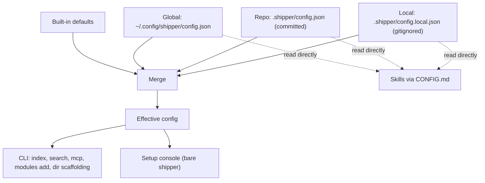

# Repo and User Configuration, and a Setup Console

## A: Plan Overview

Shipper has no repo-level configuration today. The only config is a machine-local JSON file at `~/.config/shipper/config.json` (written by [src/core/config.ts](/Users/mattmichel/Documents/shipper/src/core/config.ts)) that stores per-project agent choice, last plan, and default models for the web workspace. Artifact locations (`.shipper/plans`, `.shipper/spikes`, ...) are hardcoded in roughly a dozen source files and in every bundled skill's markdown.

This plan delivers three things:

1. **Layered configuration.** Three JSON files with the same settings shape:
   - **Global user defaults**: `~/.config/shipper/config.json` (or `$XDG_CONFIG_HOME/shipper/config.json`). Applies to every repo for this user. Not committed anywhere.
   - **Repo config (committed)**: `<repo>/.shipper/config.json`. Shared by the team.
   - **Local override (uncommitted)**: `<repo>/.shipper/config.local.json`. Only this user, only this repo. Shipper writes `<repo>/.shipper/.gitignore` so this file is never committed.
2. **Skills and CLI honor the config.** The CLI (search index, MCP server, module installer, directory scaffolding) resolves config in code. The bundled skills read the files themselves, following a new shared `CONFIG.md` reference file installed alongside every skill.
3. **Bare `shipper` becomes a setup console.** The existing plan workspace (plan list, agent runs, chat, terminal, demo mode) is **removed entirely**. `shipper` now opens a web app that shows how Shipper is set up for this repo and this user: configuration (editable, per layer), artifact directories, installed skills, MCP registration, search index and embedding server, detected agents, and installed modules, with actions to refresh skills, install/uninstall MCP, rebuild the index, and start/stop the embedding server.

Decisions confirmed with the user:

- **Workspace**: remove it entirely. Agents run through skills in the user's own coding agent, not through the console.
- **Override locations**: both `.shipper/config.local.json` (per repo) and `~/.config/shipper/config.json` (global).
- **Precedence (lowest to highest)**: built-in defaults < global user defaults < committed repo config < per-repo local override. Explicit requests in a chat always beat config.
- **Paths**: one configurable directory per artifact type (plans, spikes, bugs, reviews, modules). The `open/` and `done/` subfolders stay fixed. The config file itself always lives at `.shipper/config.json`.
- **v1 settings**: artifact paths, default models per agent and skill, personalization instructions (all skills plus per skill), git workflow defaults, search settings. A "default agent" setting is **not** included.
- **Skill delivery**: skills read the config files themselves and apply the precedence rules (no CLI or MCP dependency).
- **Setup view**: editable config forms with a scope choice, plus actions.

Design decisions made in this plan (flag to the user if they disagree):

- `paths` is **repo-only**. If `paths` appears in the global or local file it is ignored and the setup view shows a warning. Rationale: plans are committed, so the whole team must agree on where they live; one user moving them locally would scatter artifacts.
- `instructions` **accumulate** across layers instead of replacing each other (team instructions plus personal instructions). Order: global, repo, local; later text wins on conflict.
- Objects merge **field by field**; arrays (`search.extraDirs`) are **replaced**, not concatenated.
- `models` only take effect when a skill spawns a subagent to run another Shipper skill (today: `shipper-loop` spawning `shipper-build` subagents). An agent cannot switch its own model mid-session.
- `git.branchMode` unset means "each skill's own default" (build/loop default to current branch; spike/bug default to a feature branch).



Example repo config:

```json
{
  "paths": {
    "plans": "docs/shipper/plans",
    "spikes": "docs/shipper/spikes"
  },
  "git": { "branchMode": "feature", "branchPrefix": "feat/" },
  "instructions": {
    "all": "This repo uses pnpm workspaces. Never edit generated files under src/gen/.",
    "shipper-plan": "Every plan must include a rollout and rollback section."
  },
  "search": { "extraDirs": ["docs/adr"] }
}
```

Example local override:

```json
{
  "git": { "commitEachPhase": false },
  "models": { "cursor": { "shipper-build": "composer-2.5" } },
  "instructions": { "all": "Explain changes to me in plain language; I am new to this codebase." }
}
```

Out of scope: JSON Schema generation for editor autocomplete, moving existing artifacts when `paths` change (the UI only warns), configurable `open`/`done` folder names, a default-agent setting, making `.shipper/tests/` (used by the unbundled shipper-test skill) configurable.

## B: Related Files

Deleted in Phase 1 (workspace removal):

| File | Why it goes |
|------|-------------|
| [src/core/orchestrator.ts](/Users/mattmichel/Documents/shipper/src/core/orchestrator.ts) + test | Runs plan/build/loop/spike through agent adapters |
| [src/core/prompts.ts](/Users/mattmichel/Documents/shipper/src/core/prompts.ts) + test | Builds prompts for orchestrated runs |
| [src/core/run-logger.ts](/Users/mattmichel/Documents/shipper/src/core/run-logger.ts) + test | NDJSON logs for orchestrated runs |
| [src/server/run-controller.ts](/Users/mattmichel/Documents/shipper/src/server/run-controller.ts) + test | Run state, chat, questions, model picks |
| [src/server/terminal-session.ts](/Users/mattmichel/Documents/shipper/src/server/terminal-session.ts), [src/server/byte-ring-buffer.ts](/Users/mattmichel/Documents/shipper/src/server/byte-ring-buffer.ts) + test | Embedded PTY terminal |
| [src/server/plans-watcher.ts](/Users/mattmichel/Documents/shipper/src/server/plans-watcher.ts) + test | Plan list for the left nav |
| [src/demo/script.ts](/Users/mattmichel/Documents/shipper/src/demo/script.ts) | `--demo` mode |
| [src/agents/claude.ts](/Users/mattmichel/Documents/shipper/src/agents/claude.ts), [cursor.ts](/Users/mattmichel/Documents/shipper/src/agents/cursor.ts), [opencode.ts](/Users/mattmichel/Documents/shipper/src/agents/opencode.ts), [index.ts](/Users/mattmichel/Documents/shipper/src/agents/index.ts), [event-bus.ts](/Users/mattmichel/Documents/shipper/src/agents/event-bus.ts), [question-protocol.ts](/Users/mattmichel/Documents/shipper/src/agents/question-protocol.ts), [cursor-stream.ts](/Users/mattmichel/Documents/shipper/src/agents/cursor-stream.ts), [cursor-tools.ts](/Users/mattmichel/Documents/shipper/src/agents/cursor-tools.ts), [cursor-transcript.ts](/Users/mattmichel/Documents/shipper/src/agents/cursor-transcript.ts), [labels.ts](/Users/mattmichel/Documents/shipper/src/agents/labels.ts), `__fixtures__/cursor-stream.ndjson`, and their tests | Agent adapters used only by the orchestrator (`labels.ts` is already unused) |
| [src/shared/markdown.ts](/Users/mattmichel/Documents/shipper/src/shared/markdown.ts) | Only used by the plan document view |
| `src/web/components/`: `chat-input.tsx`, `chat-log.tsx`, `left-nav.tsx`, `main-pane.tsx`, `plan-document-view.tsx`, `plan-view.tsx`, `question-card.tsx`, `session-paths-bar.tsx`, `terminal-pane.tsx`, `keyboard-help.tsx`, `settings-modal.tsx` | Workspace UI |

Kept and modified:

| File | Role in this feature |
|------|----------------------|
| [src/index.ts](/Users/mattmichel/Documents/shipper/src/index.ts) | Remove `--demo`; boot steps for the setup console; add `shipper config`; honor `search.enabled` in `index`/`search` |
| [src/server/http.ts](/Users/mattmichel/Documents/shipper/src/server/http.ts) | Strip to `/` + `/ws`, wire the setup controller |
| [src/server/ws-hub.ts](/Users/mattmichel/Documents/shipper/src/server/ws-hub.ts) | Generic JSON hub (drop binary terminal frames, `buildConfigInfo`) |
| [src/shared/protocol.ts](/Users/mattmichel/Documents/shipper/src/shared/protocol.ts) | Replaced with setup messages |
| [src/core/config.ts](/Users/mattmichel/Documents/shipper/src/core/config.ts) | Rewritten: layered config loader, merger, writers, global migration |
| [src/core/plan-store.ts](/Users/mattmichel/Documents/shipper/src/core/plan-store.ts) | Shrinks to frontmatter parsing; renamed to `src/core/frontmatter.ts` |
| [src/core/skills.ts](/Users/mattmichel/Documents/shipper/src/core/skills.ts) | Register `CONFIG.md` in every skill; add skill status check |
| [src/core/modules.ts](/Users/mattmichel/Documents/shipper/src/core/modules.ts) | Install into configured modules dir; list installed modules |
| [src/search/documents.ts](/Users/mattmichel/Documents/shipper/src/search/documents.ts) | Discover docs from configured dirs plus `search.extraDirs` |
| [src/search/index-file.ts](/Users/mattmichel/Documents/shipper/src/search/index-file.ts) | Add header-only reader for status |
| [src/mcp/server.ts](/Users/mattmichel/Documents/shipper/src/mcp/server.ts) | Safe-path check against configured dirs; honor `search.enabled`; add `doc` type |
| [src/mcp/install.ts](/Users/mattmichel/Documents/shipper/src/mcp/install.ts) | Add read-only `getMcpStatus` |
| [src/embeddings/server-manager.ts](/Users/mattmichel/Documents/shipper/src/embeddings/server-manager.ts) | Status for the setup view (reuse as-is) |
| [src/agents/types.ts](/Users/mattmichel/Documents/shipper/src/agents/types.ts), [utils.ts](/Users/mattmichel/Documents/shipper/src/agents/utils.ts) | Trim to what `detect.ts` and `models.ts` need |
| [src/web/app.tsx](/Users/mattmichel/Documents/shipper/src/web/app.tsx), [hooks/use-socket.ts](/Users/mattmichel/Documents/shipper/src/web/hooks/use-socket.ts), [components/model-picker.tsx](/Users/mattmichel/Documents/shipper/src/web/components/model-picker.tsx), [styles.css](/Users/mattmichel/Documents/shipper/src/web/styles.css) | Rebuilt as the setup console |
| `skills/shipper-{plan,build,loop,spike,ship,bug}/*.md` | Read `CONFIG.md`; replace hardcoded paths and git defaults |
| [skills/shipper-review/SKILL.md](/Users/mattmichel/Documents/shipper/skills/shipper-review/SKILL.md) | Use configured reviews dir (not bundled, but lives in this repo) |
| [README.md](/Users/mattmichel/Documents/shipper/README.md), [web/app/docs/console/page.tsx](/Users/mattmichel/Documents/shipper/web/app/docs/console/page.tsx), [web/app/docs/page.tsx](/Users/mattmichel/Documents/shipper/web/app/docs/page.tsx), [web/components/how-to-use-shipper.tsx](/Users/mattmichel/Documents/shipper/web/components/how-to-use-shipper.tsx) | Docs |
| [package.json](/Users/mattmichel/Documents/shipper/package.json) | Drop `@xterm/*` and `react-markdown` |

New files:

| File | Purpose |
|------|---------|
| `src/shared/config-schema.ts` | Zod schemas, types, defaults, skill names. No Node imports (the web bundle uses it) |
| `src/core/artifact-paths.ts` | Resolve artifact dirs, scaffold them, find stray artifacts |
| `src/core/skill-status.ts` | Compare installed global skill files to the bundled ones |
| `src/server/setup-snapshot.ts` | Collect everything the setup view shows |
| `src/server/setup-controller.ts` | Hold the snapshot, handle client messages, run actions, watch files |
| `skills/CONFIG.md` + a copy in each bundled skill folder | The config contract for agents |
| `src/web/components/*-section.tsx`, `config-form.tsx`, `setup-nav.tsx` | Setup UI |

## C: Existing Code to Utilize

- **Global config plumbing**: `configDir()`, `configPath()`, atomic `writeConfig()` (temp file + `rename`) in [src/core/config.ts](/Users/mattmichel/Documents/shipper/src/core/config.ts) lines 51-80. Keep the XDG handling and the atomic write pattern for all three layers.
- **Embedding idle and update-check helpers**: `getEmbedIdleMinutes`, `setEmbedIdleMinutes`, `getUpdateCheckState`, `setUpdateCheckState` in the same file. Keep their signatures; only their storage location inside the global file changes. `getEmbedIdleMinutes` is imported by [src/embeddings/server-manager.ts](/Users/mattmichel/Documents/shipper/src/embeddings/server-manager.ts) line 9 and [src/index.ts](/Users/mattmichel/Documents/shipper/src/index.ts) line 7.
- **Update check**: `checkForUpdate()` in [src/core/update-check.ts](/Users/mattmichel/Documents/shipper/src/core/update-check.ts) returns `{ current, latest, installCommand } | null` and throttles to once a day. Not wired anywhere today; the setup view uses it.
- **Version**: `getVersion()` in [src/version.ts](/Users/mattmichel/Documents/shipper/src/version.ts).
- **Skills registry**: `SKILLS`, `SKILL_NAMES`, `globalSkillsRoot(agent)`, `installSkillsGlobally(agents)`, `removeRepoSkills(repo)` in [src/core/skills.ts](/Users/mattmichel/Documents/shipper/src/core/skills.ts). "Up to date" means byte-equal to the bundled content (see `writeSkillIfChanged`, lines 95-108).
- **Agent detection**: `detectAgents()` in [src/agents/detect.ts](/Users/mattmichel/Documents/shipper/src/agents/detect.ts) returns `{ kind, binary, version }[]` and caches; `clearAgentDetectionCache()` resets it.
- **Model lists**: `listModels(kind)` in [src/agents/models.ts](/Users/mattmichel/Documents/shipper/src/agents/models.ts) and `groupModelFamilies(models)` in [src/agents/model-variants.ts](/Users/mattmichel/Documents/shipper/src/agents/model-variants.ts). The deleted run-controller turned these into DTOs like this (copy into the setup controller):

  ```ts
  const models = await listModels(agent);
  const families: ModelFamilyDto[] = groupModelFamilies(models).map((family) => ({
    id: family.id,
    label: family.label,
    variants: family.variants.map((variant) => ({ id: variant.id, label: variant.label })),
  }));
  ```

- **Model picker UI**: [src/web/components/model-picker.tsx](/Users/mattmichel/Documents/shipper/src/web/components/model-picker.tsx) already renders a two-step family/variant picker from `ModelFamilyDto[]`. Adapt its props so it returns a model id via callback instead of sending `select-model`.
- **MCP install internals**: `cursorMcpPath(homeDir)`, `opencodeConfigDir(homeDir)`, `readOptionalFile`, `parseObjectJson`, `selfCommand()` and the injectable `McpInstallDeps` (`runCommand`, `self`, `homeDir`) in [src/mcp/install.ts](/Users/mattmichel/Documents/shipper/src/mcp/install.ts). Build `getMcpStatus` on these so it is testable the same way install is.
- **Index**: `indexPathForRepo(realRepoPath)` in [src/embeddings/paths.ts](/Users/mattmichel/Documents/shipper/src/embeddings/paths.ts); `readIndex(path)` and the `SHIPIDX1` header layout in [src/search/index-file.ts](/Users/mattmichel/Documents/shipper/src/search/index-file.ts); `syncIndex({ repoRoot, embedder, force, onProgress })` in [src/search/indexer.ts](/Users/mattmichel/Documents/shipper/src/search/indexer.ts); `createLlamaEmbedder()` in [src/embeddings/client.ts](/Users/mattmichel/Documents/shipper/src/embeddings/client.ts). Follow how `shipper index` wires them in [src/index.ts](/Users/mattmichel/Documents/shipper/src/index.ts) lines 429-468.
- **Embedding server**: `getEmbedServerStatus()`, `ensureEmbedServer({ idleMinutes, onProgress })`, `stopEmbedServer()` in [src/embeddings/server-manager.ts](/Users/mattmichel/Documents/shipper/src/embeddings/server-manager.ts); `formatProgress` in [src/embeddings/assets.ts](/Users/mattmichel/Documents/shipper/src/embeddings/assets.ts).
- **Repo root**: `resolveRepoRoot({ explicitDir, cwd })` in [src/search/repo-root.ts](/Users/mattmichel/Documents/shipper/src/search/repo-root.ts). It prefers the nearest ancestor containing `.shipper`, which still works because the config lives in `.shipper/`.
- **Doc discovery**: `discoverDocs(repoRoot)` and `collectMdFiles` in [src/search/documents.ts](/Users/mattmichel/Documents/shipper/src/search/documents.ts). Use it for artifact counts in the setup view instead of writing a second scanner.
- **Modules**: `parseModuleFrontmatter(markdown)` in [src/core/modules.ts](/Users/mattmichel/Documents/shipper/src/core/modules.ts) for listing installed modules.
- **WebSocket hub**: `createWsHub` in [src/server/ws-hub.ts](/Users/mattmichel/Documents/shipper/src/server/ws-hub.ts) (snapshot on connect, zod-validated inbound messages, broadcast). Keep the shape; remove the plan/run/terminal getters.
- **Client socket**: reconnect with exponential backoff in [src/web/hooks/use-socket.ts](/Users/mattmichel/Documents/shipper/src/web/hooks/use-socket.ts). Keep the connection logic; replace the message handling.
- **Port and browser handling**: `DEFAULT_PORT`/`FALLBACK_PORT`, `buildUrl`, `openBrowser`, `tryListen` in [src/server/http.ts](/Users/mattmichel/Documents/shipper/src/server/http.ts). Keep unchanged.
- **CSS tokens and primitives**: `:root` variables in [src/web/styles.css](/Users/mattmichel/Documents/shipper/src/web/styles.css) lines 1-19 and the existing `.primary-button`, `.secondary-button`, `.icon-button`, `.modal-overlay`, `.modal`, `.top-bar`, `.toast-notice`, `.connection-dot`, `.reconnect-banner` classes.
- **Install hints**: `INSTALL_COMMANDS` and `INSTALL_URLS` in [src/web/components/settings-modal.tsx](/Users/mattmichel/Documents/shipper/src/web/components/settings-modal.tsx) lines 16-26. Move them into the new agents section before deleting the modal.

## D: Codebase Conventions to Follow

- **Bun-first runtime**, but tests run on **Vitest** (`bun run test` runs `vitest run`; [vitest.config.ts](/Users/mattmichel/Documents/shipper/vitest.config.ts) includes `src/**/*.test.ts`). Co-locate tests as `*.test.ts`, import from `vitest`. There are no component tests; do not add a React testing setup.
- **Checks to run** after each phase: `bun run typecheck`, `bun run lint`, `bun run test`.
- **Explicit `.ts`/`.tsx` extensions** in relative imports (for example `import { x } from "./config.ts"`).
- **Kebab-case filenames**, PascalCase components, camelCase functions.
- **Zod for every boundary**: config files on disk and inbound WebSocket messages (`clientMessageSchema` + `parseClientMessage`, which silently drops invalid messages). New client messages must be added to both the TypeScript union and the zod schema in [src/shared/protocol.ts](/Users/mattmichel/Documents/shipper/src/shared/protocol.ts).
- **`src/shared/` has no Node imports.** It is bundled into the browser. Anything that imports `node:fs` stays in `src/core/`, `src/server/`, `src/search/`, etc.
- **Never throw on bad user files.** The existing `readConfig()` falls back to an empty config on parse failure; the new loader must surface the error as data (`error: string`) instead of crashing.
- **Atomic writes** for any config file (write `<path>.tmp-<pid>`, then `rename`).
- **Dependency injection for testability** in modules that shell out or touch home directories (see `McpInstallDeps`). Tests set `process.env.HOME` and `XDG_CONFIG_HOME` / `XDG_CACHE_HOME` to temp dirs and restore them (see [src/core/config.test.ts](/Users/mattmichel/Documents/shipper/src/core/config.test.ts) lines 8-20).
- **Styling**: plain CSS, no Tailwind in `src/web/`. Black background, white text and borders, no emojis. BEM-ish class names (`setup-nav`, `setup-section`, `config-form__row`).
- **Skill markdown**: plain instructional prose, no emojis. `SKILL.md` keeps its YAML `name`/`description` header; sibling reference files (`GIT.md`, `CONFIG.md`, ...) have no header and are linked as `[./CONFIG.md](./CONFIG.md)`.
- **No database functions or triggers** (user rule); not relevant here beyond keeping all logic in TypeScript.

## E: Gotchas

- **Order matters: delete the workspace first.** `config.ts` functions like `getProjectConfig`, `resolveDefaultModel`, and `saveModelChoice` are used by the orchestrator, run-controller, and ws-hub. Phase 1 deletes those callers so Phase 2 can rewrite `config.ts` freely. Do not reorder.
- **Skills cannot import code.** They are static markdown that agents run directly (`/shipper-plan` in Cursor, etc.). The CLI can resolve config in TypeScript, but skills only see config if their markdown tells the agent to read the files. Keep `CONFIG.md` short and unambiguous; it is the contract.
- **CONFIG.md must physically exist in every bundled skill folder.** Skills are also installed from GitHub by other tools (see [skills-lock.json](/Users/mattmichel/Documents/shipper/skills-lock.json)), which copy one skill folder at a time. A single shared file outside the folder would be missing for those installs. Keep one canonical `skills/CONFIG.md` and identical copies in each folder, enforced by a test.
- **Zod 4 `z.record` with an enum key is exhaustive** (every key required). For `models` and `instructions` keyed by agent or skill, use nested `z.object` with optional fields, as the old `skillModelsSchema` did.
- **Do not drop unknown keys on save.** A plain `z.object` strips unknown keys, so saving from the UI would silently delete anything a user typed by hand (or keys from a newer Shipper). Use `z.looseObject` for every object schema in config files.
- **Global file migration.** The existing global file has the legacy shape `{ projects: {...}, defaults: { agent, models, embeddings, lastUpdateCheckAt, latestKnownVersion } }`. Agents reading it per `CONFIG.md` expect the new top-level shape, so migrate eagerly on boot (`shipper`, `shipper skills`) and on first read in code. Map `defaults.models` to `models`, `defaults.embeddings` to `embeddings`, update-check fields to `state`; drop `projects` and `defaults.agent` (console-only state). Write the migrated file back atomically.
- **`paths` validation.** Values must be relative, use forward slashes, stay inside the repo after normalization (reject `..` escapes and absolute paths), must not point into `.git` or `node_modules`, and no two artifact types may resolve to the same directory. Strip trailing slashes. An invalid `paths` entry falls back to the default for that type and is reported as a layer error.
- **Index keys are repo-relative paths.** `discoverDocs` builds `relPath` from the configured dir (for example `docs/shipper/plans/open/foo.md`). When paths change, the next sync naturally removes old keys and embeds new ones; no special migration is needed. But every consumer that assumed a `.shipper/` prefix (MCP `resolveSafeShipperPath`, tool descriptions, error messages) must be updated.
- **MCP safe-path check is a security boundary.** `shipper_get_doc` must only read `.md` files under `.shipper/`, the configured artifact dirs, or `search.extraDirs`. Resolve every allowed root with `realpath` (skip roots that do not exist) and check the requested file against each. Do not loosen it to "anything in the repo".
- **Legacy `.shipper/open` and `.shipper/done`.** `discoverDocs` still scans them. Keep that behavior regardless of configured paths.
- **Stray artifacts.** When a repo sets `paths.plans` to a new dir, files in the old default dir are not moved and no longer show in search. The setup view must warn ("12 files in `.shipper/plans` are outside the configured plans directory"). Do not auto-move.
- **Slow status probes.** `claude mcp get shipper` and agent detection can take seconds; `listModels` for opencode starts a local server. Run all collectors in parallel, wrap each in a timeout (5 seconds; `listModels` is only called on demand), and return an `"unknown"` state on timeout instead of blocking the whole snapshot.
- **One action at a time.** Index rebuilds, MCP installs, and embed server start/stop all touch shared state. The setup controller must reject (with a notice) a new action while one is running.
- **Do not write config on boot.** Boot may create `.shipper/.gitignore` and scaffold artifact dirs, and may migrate the global file, but must never create `.shipper/config.json` or `.shipper/config.local.json`. Those appear only when the user saves.
- **`.shipper/.gitignore`** must contain `config.local.json`. If the file exists with other lines, append the line only if missing; do not overwrite. This file itself should be committed.
- **Watching config files.** Use chokidar (already a dependency) on the three config paths plus the artifact dirs so hand edits refresh the UI. The global config dir may not exist yet; watch the file path anyway (chokidar handles missing paths) and ignore the `.tmp-*` files written by atomic saves.
- **Saving the global layer must preserve machine keys.** The UI only edits settings (`models`, `instructions`, `git`, `search`). When writing the global file, read the current file and keep `embeddings`, `state`, and any unknown keys.
- **Model ids differ by surface.** Ids from `cursor-agent --list-models` may not match what a given agent's subagent tool accepts. `CONFIG.md` tells agents to retry once without a model if the value is rejected. Mention in the UI that models apply when a skill starts subagents.
- **The marketing site is separate.** `web/` is its own Next.js app with its own package.json; never import from `src/` into it.
- **Removing dependencies.** `@anthropic-ai/claude-agent-sdk` and `@opencode-ai/sdk` look orchestrator-only, but `listModels` in [src/agents/models.ts](/Users/mattmichel/Documents/shipper/src/agents/models.ts) uses both. Keep them. `execa` is used by `detect.ts`, `models.ts`, `mcp/install.ts`, and `embeddings/assets.ts`; keep it.
- **`bun build --compile`**: the web bundle is pulled in by `import indexHtml from "../web/index.html"` in `http.ts`. Keep that import or the compiled binary ships without the UI.

## Plan

## Phase 1: Remove the plan workspace

- Delete everything that exists only to run agents from the console or show plans in it, and leave bare `shipper` serving a minimal placeholder page so the binary still builds and runs.
- Outcomes: the orchestrator, agent adapters, run controller, terminal, plan list, and demo mode are gone; `shipper` boots and serves a page; `typecheck`, `lint`, and `test` pass.

### Section 1: Delete server, core, and agent code

- Overview: remove the run pipeline end to end.
- [x] Delete `src/core/orchestrator.ts`, `src/core/orchestrator.test.ts`, `src/core/prompts.ts`, `src/core/prompts.test.ts`, `src/core/run-logger.ts`, `src/core/run-logger.test.ts`.
- [x] Delete `src/server/run-controller.ts`, `src/server/run-controller.test.ts`, `src/server/terminal-session.ts`, `src/server/byte-ring-buffer.ts`, `src/server/byte-ring-buffer.test.ts`, `src/server/plans-watcher.ts`, `src/server/plans-watcher.test.ts`.
- [x] Delete `src/demo/script.ts` (and the `src/demo/` folder).
- [x] Delete `src/agents/claude.ts`, `cursor.ts`, `cursor.test.ts`, `opencode.ts`, `index.ts`, `event-bus.ts`, `question-protocol.ts`, `question-protocol.test.ts`, `cursor-stream.ts`, `cursor-stream.test.ts`, `cursor-tools.ts`, `cursor-tools.test.ts`, `cursor-transcript.ts`, `cursor-transcript.test.ts`, `labels.ts`, and `src/agents/__fixtures__/`.
- [x] Trim [src/agents/types.ts](/Users/mattmichel/Documents/shipper/src/agents/types.ts) to `AgentKind` and `DetectedAgent` only.
- [x] Trim [src/agents/utils.ts](/Users/mattmichel/Documents/shipper/src/agents/utils.ts) to `getFreePort` only (remove `summarizeToolInput` and `extractAssistantText`).
- [x] Delete `src/shared/markdown.ts`.

### Section 2: Shrink plan-store to frontmatter

- Overview: only `parseFrontmatter` survives (used by [src/search/documents.ts](/Users/mattmichel/Documents/shipper/src/search/documents.ts) line 5). `ensureShipperDirs` moves to a new home in Phase 3; keep it temporarily.
- [x] Create `src/core/frontmatter.ts` containing `PlanMeta`, `emptyPlanMeta`, `parseFrontmatter`, and their private helpers (`asPlanType`, `asMetaString`, `asMetaNumber`, `parsePhaseCommits`), moved verbatim from [src/core/plan-store.ts](/Users/mattmichel/Documents/shipper/src/core/plan-store.ts) lines 49-143.
- [x] Create `src/core/artifact-paths.ts` and move `ensureShipperDirs` into it unchanged (Phase 3 makes it config-aware).
- [x] Move the `describe("parseFrontmatter", ...)` block from `src/core/plan-store.test.ts` into `src/core/frontmatter.test.ts`. Delete the `parsePlan`, `getPlanProgress`, `parsePlan with frontmatter`, and `listPlans` tests.
- [x] Delete `src/core/plan-store.ts` and `src/core/plan-store.test.ts`. Update the import in `src/search/documents.ts` to `../core/frontmatter.ts` and in `src/index.ts` to `./core/artifact-paths.ts`.
- [x] Remove the `config`/`buildSpikePrompt` tests in [src/core/core.test.ts](/Users/mattmichel/Documents/shipper/src/core/core.test.ts) that import deleted code (`buildSpikePrompt`). Leave the config tests there until Phase 2 rewrites them; keep the skills tests.

### Section 3: Strip the server and protocol

- Overview: leave a working server with an empty protocol that Phase 5 fills in.
- [x] Replace [src/shared/protocol.ts](/Users/mattmichel/Documents/shipper/src/shared/protocol.ts) with a minimal placeholder: `ServerMessage = { type: "hello"; repoPath: string; version: string }`, an empty-ish `ClientMessage = { type: "refresh" }`, and `clientMessageSchema` / `parseClientMessage` for that one message. Keep the `ModelVariantDto` and `ModelFamilyDto` types (the model picker uses them).
- [x] Simplify [src/server/ws-hub.ts](/Users/mattmichel/Documents/shipper/src/server/ws-hub.ts): `WsHubDeps` becomes `{ getSnapshot: () => ServerMessage; handlers?: WsMessageHandlers }`. Remove `broadcastBinary`, `sendBinary`, `buildConfigInfo`, `defaultTerminalState`, `AGENT_LABELS`, and the `idleRunState` re-export.
- [x] Simplify [src/server/http.ts](/Users/mattmichel/Documents/shipper/src/server/http.ts): remove terminal, plans watcher, run controller, `refreshConfigInfo`, and `demoMode`. `startServer(repoPath, { port, openBrowser })` builds a hub whose snapshot is the `hello` message. `StartedServer` drops `runController`.
- [x] In [src/index.ts](/Users/mattmichel/Documents/shipper/src/index.ts): remove the `--demo` option, `demo` from `ServeOptions`, the demo log line, and the `demoMode` argument. Change the program description to `"Shipper — see how Shipper is set up for this repo"`.

### Section 4: Placeholder web app and dependencies

- Overview: the browser shows a minimal shell until Phase 6.
- [x] Delete the workspace components listed in section B (`chat-input.tsx`, `chat-log.tsx`, `left-nav.tsx`, `main-pane.tsx`, `plan-document-view.tsx`, `plan-view.tsx`, `question-card.tsx`, `session-paths-bar.tsx`, `terminal-pane.tsx`, `keyboard-help.tsx`, `settings-modal.tsx`). Before deleting `settings-modal.tsx`, copy `INSTALL_COMMANDS` and `INSTALL_URLS` into a new `src/web/install-hints.ts` for Phase 6.
- [x] Keep [src/web/components/model-picker.tsx](/Users/mattmichel/Documents/shipper/src/web/components/model-picker.tsx) but change its props to `{ title: string; families: ModelFamilyDto[]; onSelect: (modelId: string) => void; onCancel: () => void }` so it no longer depends on `ModelPickRequest` or `ClientMessage`. It is unused until Phase 6.
- [x] Rewrite [src/web/hooks/use-socket.ts](/Users/mattmichel/Documents/shipper/src/web/hooks/use-socket.ts) to keep connect/reconnect/backoff and `send`, store the latest `hello` message, and drop plans, chat, questions, terminal, and model-pick state.
- [x] Rewrite [src/web/app.tsx](/Users/mattmichel/Documents/shipper/src/web/app.tsx) to render the existing `.top-bar` (brand, repo path, connection dot) and a placeholder main area reading "Setup view coming soon". Remove all keyboard shortcuts and localStorage use.
- [x] Remove `@xterm/addon-fit`, `@xterm/xterm`, and `react-markdown` from [package.json](/Users/mattmichel/Documents/shipper/package.json) with `bun remove`. Grep `src/` to confirm nothing imports them.

### Section 5: Verify

- [x] `bun run typecheck`, `bun run lint`, `bun run test` all pass.
- [x] `bun run dev -- --no-open` starts, prints the URL, and the page loads with the placeholder and a connected dot.
- [x] `bun run build` succeeds and `./dist/shipper --version` prints the version.

### Completion Notes

- `scripts/try-adapter.ts` was deleted. It only existed to drive the agent adapters this phase removed, and it is outside `tsconfig` so typecheck would not have caught the broken imports.
- `parseClientMessage` tests lived in `src/server/plans-watcher.test.ts` and went away with that file. The placeholder schema accepts only `{ type: "refresh" }`; Phase 5 replaces the protocol and should add coverage then. A `refresh` message is parsed and then ignored until a handler is wired.
- `ensureShipperDirs` moved unchanged into `src/core/artifact-paths.ts`. Config tests stayed in `src/core/core.test.ts`; only the `buildSpikePrompt` describe block was removed.
- `INSTALL_COMMANDS` and `INSTALL_URLS` are in `src/web/install-hints.ts` (unused until Phase 6). `model-picker.tsx` now takes `title`, `families`, `onSelect(modelId)`, and `onCancel`, and nothing renders it yet.
- The placeholder page keeps the existing reconnect banner (no toast: the protocol has no `notice` yet) and adds a `.setup-placeholder` rule so the main area fills the shell. Workspace CSS is still in `styles.css` for Phase 6 to strip. README still documents `--demo`; Phase 7 owns the docs.
- `chokidar`, `@anthropic-ai/claude-agent-sdk`, and `@opencode-ai/sdk` stay. Chokidar is unused until the Phase 5 watcher; the SDKs are still used by `listModels`.
- Verification: port 80 was unavailable, so `bun run dev -- --no-open` served `http://shipper.localhost:8712`. Headless Chrome showed "Setup view coming soon" and `connection-dot connected`. `./dist/shipper --version` printed `0.2.3`.


## Phase 2: Layered configuration core

- Build the config schema, the three-layer loader and merger, writers, global migration, the `.shipper/.gitignore` helper, and a `shipper config` command.
- Outcomes: `loadConfig(repoRoot)` returns the effective config with per-key sources and per-layer status; layers can be written safely; the legacy global file is migrated; `shipper config` prints the effective config.

### Section 1: Shared schema

- Overview: one source of truth for shapes and defaults, importable by the browser.
- [x] Create `src/shared/config-schema.ts` (zod only, no Node imports). Export:
  - `AGENT_KINDS = ["claude", "cursor", "opencode"] as const` and `AgentKind`.
  - `SKILL_NAMES = ["shipper-plan", "shipper-build", "shipper-loop", "shipper-spike", "shipper-ship", "shipper-bug"] as const` and `SkillName`.
  - `ARTIFACT_TYPES = ["plans", "spikes", "bugs", "reviews", "modules"] as const` and `ArtifactType`.
  - `CONFIG_LAYERS = ["global", "repo", "local"] as const` and `ConfigLayer`.
  - `DEFAULT_ARTIFACT_PATHS: Record<ArtifactType, string>` = `.shipper/plans`, `.shipper/spikes`, `.shipper/bugs`, `.shipper/reviews`, `.shipper/modules`.
  - `DEFAULT_GIT = { branchMode: null, commitEachPhase: true, branchPrefix: "shipper/" }` and `DEFAULT_SEARCH = { enabled: true, extraDirs: [] }`.
- [x] Define schemas with `z.looseObject` at every level and optional fields everywhere:

  ```ts
  const relativeDir = z.string().min(1); // semantic checks happen in artifact-paths.ts
  const perSkill = <T extends z.ZodType>(value: T) =>
    z.looseObject({
      "shipper-plan": value.optional(),
      "shipper-build": value.optional(),
      "shipper-loop": value.optional(),
      "shipper-spike": value.optional(),
      "shipper-ship": value.optional(),
      "shipper-bug": value.optional(),
    });
  const modelsSchema = z.looseObject({
    claude: perSkill(z.string().min(1)).optional(),
    cursor: perSkill(z.string().min(1)).optional(),
    opencode: perSkill(z.string().min(1)).optional(),
  });
  const instructionsSchema = perSkill(z.string()).extend({ all: z.string().optional() });
  const gitSchema = z.looseObject({
    branchMode: z.enum(["current", "feature"]).optional(),
    commitEachPhase: z.boolean().optional(),
    branchPrefix: z.string().regex(/^[A-Za-z0-9._/-]*$/).optional(),
  });
  const searchSchema = z.looseObject({
    enabled: z.boolean().optional(),
    extraDirs: z.array(relativeDir).optional(),
  });
  const pathsSchema = z.looseObject({
    plans: relativeDir.optional(), spikes: relativeDir.optional(), bugs: relativeDir.optional(),
    reviews: relativeDir.optional(), modules: relativeDir.optional(),
  });
  export const settingsSchema = z.looseObject({
    models: modelsSchema.optional(),
    instructions: instructionsSchema.optional(),
    git: gitSchema.optional(),
    search: searchSchema.optional(),
  });
  export const repoConfigSchema = settingsSchema.extend({ paths: pathsSchema.optional() });
  export const localConfigSchema = settingsSchema;
  export const globalConfigSchema = settingsSchema.extend({
    embeddings: z.looseObject({ idleMinutes: z.number().int().positive().optional() }).optional(),
    state: z.looseObject({
      lastUpdateCheckAt: z.number().optional(),
      latestKnownVersion: z.string().optional(),
    }).optional(),
  });
  ```

- [x] Export the inferred types (`Settings`, `RepoConfig`, `LocalConfig`, `GlobalConfig`) and an `EffectiveConfig` type:

  ```ts
  export type InstructionEntry = { layer: ConfigLayer; scope: "all" | SkillName; text: string };
  export type EffectiveConfig = {
    paths: Record<ArtifactType, string>;
    models: Partial<Record<AgentKind, Partial<Record<SkillName, string>>>>;
    instructions: InstructionEntry[]; // ordered global -> repo -> local, "all" before the skill entry within a layer
    git: { branchMode: "current" | "feature" | null; commitEachPhase: boolean; branchPrefix: string };
    search: { enabled: boolean; extraDirs: string[] };
  };
  export type ConfigSource = ConfigLayer | "default";
  ```

- [x] Change [src/agents/types.ts](/Users/mattmichel/Documents/shipper/src/agents/types.ts) to re-export `AgentKind` from `src/shared/config-schema.ts` so there is one definition.
- [x] In [src/core/skills.ts](/Users/mattmichel/Documents/shipper/src/core/skills.ts), type `SKILLS` with `satisfies Record<SkillName, readonly SkillFile[]>` using the shared `SkillName`, and export `SKILL_NAMES` from the shared module instead of `Object.keys`. Remove `OrchestratedSkillName`.

### Section 2: Loader, merger, and writers

- Overview: rewrite [src/core/config.ts](/Users/mattmichel/Documents/shipper/src/core/config.ts) around layers.
- [x] Remove `projectConfigSchema`, `configSchema`, `getProjectConfig`, `setProjectConfig`, `getDefaultAgent`, `setDefaultAgent`, `resolveDefaultModel`, `saveModelChoice`, and the `ProjectConfig`/`ShipperConfig`/`AgentModels` types. Keep `configDir()` and rename `configPath()` to `globalConfigPath()` (grep for callers and update them).
- [x] Add `repoConfigPath(repoRoot)` = `<repoRoot>/.shipper/config.json` and `localConfigPath(repoRoot)` = `<repoRoot>/.shipper/config.local.json`, plus `layerPath(layer, repoRoot)`.
- [x] Add `type LayerState = { layer: ConfigLayer; path: string; exists: boolean; value: Record<string, unknown> | null; error: string | null; ignoredKeys: string[] }` and `readLayer(layer, repoRoot): Promise<LayerState>`. Missing file: `exists: false, value: null, error: null`. Invalid JSON or schema failure: `exists: true, value: null, error: <short message>` (use `z.prettifyError` or the first issue's path and message). For `global` and `local`, a present `paths` key is kept in `value` but listed in `ignoredKeys`.
- [x] Add `mergeConfig(layers: Record<ConfigLayer, LayerState>): { effective: EffectiveConfig; sources: Record<string, ConfigSource>; pathErrors: string[] }`. Rules:
  - Start from defaults; apply global, then repo, then local, field by field.
  - `paths.*` only from the repo layer, each value passed through `validateArtifactDir`. Implement it in `src/shared/config-schema.ts` as a pure function (no `node:path`; split on `/`, drop `.` segments, resolve `..` manually) so the browser can reuse it: `validateArtifactDir(value: string): { ok: true; dir: string } | { ok: false; error: string }`. It strips trailing `/` and rejects empty values, absolute paths, backslashes, anything escaping the repo, and `.git` or `node_modules` segments. Duplicate dirs across types are checked in `mergeConfig`. An invalid value keeps the default and adds a message to `pathErrors`.
  - `search.extraDirs` replaced by the highest layer that sets it, each entry validated the same way (invalid entries dropped with a message).
  - `instructions` collected in order into `InstructionEntry[]`, skipping empty strings.
  - `sources` uses dotted keys: `paths.plans`, `git.branchMode`, `models.cursor.shipper-build`, `search.extraDirs`, etc. Instruction entries carry their own `layer`.
- [x] Add `loadConfig(repoRoot): Promise<{ layers: Record<ConfigLayer, LayerState>; effective: EffectiveConfig; sources: Record<string, ConfigSource>; pathErrors: string[] }>` that reads all three layers in parallel and merges.
- [x] Add `writeLayer(layer, repoRoot, value: unknown): Promise<LayerState>`:
  - Validate with the layer's schema (`repoConfigSchema`, `localConfigSchema`, or `globalConfigSchema`); throw a readable error on failure.
  - Remove empty objects and `undefined` values before writing so files stay tidy (a helper `pruneEmpty`).
  - For `global`, read the current file first and preserve `embeddings`, `state`, and unknown top-level keys that are not part of the settings shape.
  - For `local`, call `ensureShipperGitignore(repoRoot)` first.
  - Write atomically (`<path>.tmp-<pid>` then `rename`), creating `.shipper/` or the global config dir if needed. Return the re-read `LayerState`.
- [x] Re-implement `getEmbedIdleMinutes`/`setEmbedIdleMinutes` against `globalConfig.embeddings.idleMinutes` and `getUpdateCheckState`/`setUpdateCheckState` against `globalConfig.state`, preserving their exported signatures.

### Section 3: Global migration and gitignore

- [x] Add `migrateGlobalConfig(): Promise<boolean>` in `src/core/config.ts`. If the file parses as an object with `projects` or `defaults` keys, build the new shape (`models` from `defaults.models`, `embeddings` from `defaults.embeddings`, `state.lastUpdateCheckAt`/`state.latestKnownVersion` from the old `defaults` fields), keep any other unknown top-level keys, drop `projects` and `defaults`, and write atomically. Return `true` if it rewrote the file. If an existing new-shape key conflicts with a legacy value, the new-shape value wins.
- [x] Call `migrateGlobalConfig()` from `readLayer("global")` before reading, so code paths that never boot the console still see the new shape. Make it idempotent and cheap (exit early when no legacy keys).
- [x] Add `ensureShipperGitignore(repoRoot): Promise<void>`: ensure `<repoRoot>/.shipper/.gitignore` exists and contains the line `config.local.json`, appending (with a leading newline if needed) instead of overwriting.

### Section 4: `shipper config` command

- Overview: a quick terminal view, also handy for debugging what skills should see.
- [x] In [src/index.ts](/Users/mattmichel/Documents/shipper/src/index.ts) add `shipper config` (honors the global `--dir`, resolves the root with `resolveRepoRoot`). Default output: the three layer paths with `exists`/`error`, then each effective key with its value and source, then `pathErrors` and `ignoredKeys` as warnings. `--json` prints `{ layers, effective, sources, pathErrors }`.
- [x] Add `shipper config path` that prints the three file paths, one per line, labeled.

### Section 5: Tests

- [x] Replace the old config tests in `src/core/core.test.ts` and extend `src/core/config.test.ts` (use temp `HOME`, `XDG_CONFIG_HOME`, and a temp repo dir). Cover:
  - Defaults when no files exist; every source is `"default"`.
  - Precedence: global < repo < local for `git.branchMode`, `models.cursor.shipper-build`, `search.enabled`.
  - Field-by-field merge (local sets only `git.commitEachPhase`; repo's `git.branchPrefix` survives).
  - `search.extraDirs` replaced, not concatenated.
  - `paths` ignored in local and global, with `ignoredKeys` populated.
  - Invalid paths (`../x`, `/abs`, `.git/x`, duplicates) fall back to defaults with `pathErrors`.
  - Instructions ordering across layers.
  - Invalid JSON produces `error` and is treated as empty.
  - `writeLayer` preserves unknown keys and the global `embeddings`/`state` keys; creates `.shipper/.gitignore` for local.
  - `migrateGlobalConfig` converts the legacy shape and is idempotent.
  - Embed idle minutes round-trip through the new location.
- [x] Run `bun run typecheck`, `bun run lint`, `bun run test`.

### Completion Notes

- `validateArtifactDir` is in `src/shared/config-schema.ts` (no `node:path`, so the browser can import it). Phase 3 should call it and not reimplement it. It strips trailing slashes, drops `.` and empty segments, and resolves `..` without leaving the repo. `docs/plans/` becomes `docs/plans`; `./a/../b` becomes `b`. It rejects an empty result, a leading `/`, any backslash, and any `.git` or `node_modules` segment.
- Duplicate directories are resolved in `ARTIFACT_TYPES` order. The earlier type keeps the path. A later type that normalizes to the same directory, including another type's default, stays on its default and adds a `pathErrors` line.
- `search.extraDirs` is replaced by the highest layer that sets the array. Each entry is normalized the same way. Invalid entries are dropped with a `pathErrors` line and do not fail the rest of the layer.
- `sources` always includes `paths.*`, the three `git.*` keys, `search.enabled`, and `search.extraDirs`. Model keys are added only when a layer sets them (`models.cursor.shipper-build`). Instructions are not source keys; each entry carries its own `layer`. Empty instruction strings are skipped. Within a layer, `all` comes before skills in `SKILL_NAMES` order.
- Invalid JSON or a schema failure sets `error` and `value: null`, and that layer contributes nothing. The message is `z.prettifyError` on the first issue, collapsed to one line. One bad field fails the whole file.
- `writeLayer` replaces known settings (`models`, `instructions`, `git`, `search`, plus `paths` on the repo layer) with the object passed in. It does not deep-merge those objects. Unknown top-level keys are kept. On the global layer, `embeddings` and `state` are kept when the written value omits them. `setEmbedIdleMinutes` and `setUpdateCheckState` patch those machine keys in place, so they do not clear settings. A partial `writeLayer` drops settings keys that were omitted, so the setup UI must send the full draft. A write against invalid JSON throws instead of overwriting the file.
- `paths` on the global or local file stays in `value` and is listed in `ignoredKeys`. Only repo `paths` are applied.
- `migrateGlobalConfig` runs at the start of every global read. It does nothing when the file is missing, not a JSON object, or has neither `projects` nor `defaults`. It copies `defaults.models`, `defaults.embeddings`, `defaults.lastUpdateCheckAt`, and `defaults.latestKnownVersion` onto the new shape, drops `projects`, `defaults`, and `defaults.agent`, and keeps other top-level keys. An existing new-shape key wins. Missing `state` fields are still filled from the legacy defaults.
- `configDir()` checks `XDG_CONFIG_HOME`, then `process.env.HOME`, then `os.homedir()`. `os.homedir()` caches its first result, so a test that only assigns `HOME` after startup still targets the real home directory. Config tests set both `HOME` and `XDG_CONFIG_HOME` to temp directories and restore them. Do not unset `XDG_CONFIG_HOME` and rely on `HOME`.
- `shipper config` prints tab-separated lines: each layer's path and exists/error, then each effective key with its value and source, then `instructions.<scope>`, then `warning:` lines for `pathErrors` and ignored keys. `--json` prints `{ layers, effective, sources, pathErrors }`. `shipper config path` prints the three paths. Both honor `--dir` through `resolveRepoRoot`.
- `AgentKind` is defined in the shared schema and re-exported from `src/agents/types.ts`. `SKILL_NAMES` and `SkillName` are defined there too and re-exported from `src/core/skills.ts`. `OrchestratedSkillName` is gone. Config writes use `<path>.tmp-<pid>` then `rename`. `ensureShipperGitignore` appends `config.local.json` and leaves other lines in place.
- `src/shared/config-schema.test.ts` is still Phase 3. Path checks are covered from `src/core/config.test.ts`.

## Phase 3: Make the CLI honor the config

- Every code path that assumed `.shipper/<type>` now resolves directories from the effective config, and search settings take effect.
- Outcomes: artifact dirs scaffold where configured; search, index, and MCP read from configured dirs and `search.extraDirs`; `search.enabled: false` turns search off cleanly; modules install into the configured dir.

### Section 1: Artifact paths module

- [x] Flesh out `src/core/artifact-paths.ts` (validation already lives in `validateArtifactDir` in `src/shared/config-schema.ts` from Phase 2; reuse it, do not reimplement):
  - `resolveArtifactDirs(repoRoot, effective): Record<ArtifactType, string>` returning absolute paths.
  - `ensureArtifactDirs(repoRoot, effective)`: create `<plans>`, `<spikes>`, `<bugs>` each with `open/` and `done/` (same as today's `ensureShipperDirs`), and nothing for reviews or modules. Also call `ensureShipperGitignore`.
  - `findStrayArtifacts(repoRoot, effective): Promise<Array<{ type: ArtifactType; dir: string; count: number }>>`: for each of plans/spikes/bugs/reviews whose configured dir differs from the default, count `.md` files in the default dir (including `open/` and `done/`). Return only non-zero entries.
- [x] Delete the temporary `ensureShipperDirs`; in [src/index.ts](/Users/mattmichel/Documents/shipper/src/index.ts) `runServe`, call `loadConfig(repoPath)` then `ensureArtifactDirs(repoPath, effective)`.
- [x] Add `src/core/artifact-paths.test.ts` covering resolution, scaffolding at custom paths, and stray detection, and `src/shared/config-schema.test.ts` covering `validateArtifactDir` (`docs/plans/` ok and normalized, `./a/../b` becomes `b`, `../x`, `/abs`, `a\\b`, `.git/x`, `x/node_modules` rejected).

### Section 2: Discovery and the `doc` type

- [x] Change `discoverDocs(repoRoot, opts)` in [src/search/documents.ts](/Users/mattmichel/Documents/shipper/src/search/documents.ts) to accept `opts.config?: EffectiveConfig` (load it with `loadConfig` when omitted). Replace the hardcoded `typedFolders` roots with `effective.paths.plans/spikes/bugs` and the reviews folder with `effective.paths.reviews`. `relDir` becomes the configured repo-relative dir (for example `docs/shipper/plans/open`). Keep the legacy `.shipper/open|done` scan unchanged.
- [x] Add `DocType` value `"doc"` for `search.extraDirs`: scan each extra dir non-recursively for `.md` files with `status: null`, skipping anything already in `seen`. Recursion is not supported in v1; say so in the README.
- [x] Update every `DocType` enum: `DOC_TYPES` in [src/index.ts](/Users/mattmichel/Documents/shipper/src/index.ts) line 35, `DOC_TYPE_ENUM` in [src/mcp/server.ts](/Users/mattmichel/Documents/shipper/src/mcp/server.ts) line 24, and any switch over `DocType` in `src/search/chunker.ts`, `search.ts`, and `index-file.ts` (grep for `"review"` to find them). Update the `shipper search --type` help text.
- [x] Bump `CHUNKER_VERSION` only if chunk output changes; it should not. Do not bump it just for the new type.
- [x] Update `src/search/documents.test.ts`: custom paths, extra dirs as `doc`, legacy layout still found, defaults unchanged.

### Section 3: MCP server

- [x] Rename `resolveSafeShipperPath` in [src/mcp/server.ts](/Users/mattmichel/Documents/shipper/src/mcp/server.ts) to `resolveSafeDocPath(repoRoot, requested, config)`. Allowed roots: `.shipper/`, each configured artifact dir, and each `search.extraDirs` entry, each resolved with `realpath` (skip missing roots). The file must be inside one root and end in `.md`. Error text: `Path must be a .md file inside a Shipper artifact directory: <requested>`.
- [x] Load the effective config per tool call (cheap; three small file reads) so edits apply without restarting the agent.
- [x] When `search.enabled` is `false`, `shipper_search`, `shipper_similar`, and `shipper_reindex` return a non-error text result: `Search is disabled for this repository (search.enabled is false in Shipper config). Use grep/glob over the artifact directories instead.` `shipper_get_doc` and `shipper_list_docs` keep working (list from discovery, not the index, when disabled).
- [x] Update `INSTRUCTIONS` and tool descriptions to say "Shipper artifact directories (default `.shipper/`)" instead of hardcoding `.shipper/`, and add `doc` to the type lists.
- [x] Update `src/mcp/server.test.ts`: custom-path reads allowed, escapes still rejected, extra dirs allowed, disabled search message.

### Section 4: CLI commands and modules

- [x] In [src/index.ts](/Users/mattmichel/Documents/shipper/src/index.ts), `shipper index` and `shipper search` print `Search is disabled for this repository (search.enabled is false).` and exit 0 when disabled.
- [x] Change `installModule(id, targetDir, fetchFn)` in [src/core/modules.ts](/Users/mattmichel/Documents/shipper/src/core/modules.ts) line 238 to write into `<repoRoot>/<effective.paths.modules>/<id>/`. Accept an optional `modulesDir` parameter (absolute) for tests; `runModulesAdd` passes the resolved dir. Update the `modules add` description to `install a module into the configured modules directory (default .shipper/modules/)`.
- [x] Add `listInstalledModules(modulesDir): Promise<Array<{ id: string; name: string; version: string | null }>>` reading each `<id>/MODULE.md` with `parseModuleFrontmatter`, skipping folders without one.
- [x] Update `src/core/modules.test.ts` for the custom dir and the new list function.
- [x] Run `bun run typecheck`, `bun run lint`, `bun run test`.

### Completion Notes

- `resolveArtifactDirs(repoRoot, effective)` joins each already-validated `effective.paths` entry onto `repoRoot` and returns absolute paths. It does not call `validateArtifactDir` again. `ensureArtifactDirs` creates `open/` and `done/` only under plans, spikes, and bugs, then calls `ensureShipperGitignore`. It does not create reviews, modules, `.shipper/config.json`, or `.shipper/config.local.json`. `runServe` loads config and then calls `ensureArtifactDirs`. `ensureShipperDirs` is gone.
- `findStrayArtifacts` compares each of plans, spikes, bugs, and reviews to `DEFAULT_ARTIFACT_PATHS`. The `dir` field is that default repo-relative path (`.shipper/plans`, not an absolute path). Counts are non-recursive: the default directory itself, plus `open/` and `done/` for plans, spikes, and bugs. Reviews are only the directory itself. Modules are not checked. Zero counts are omitted. Order follows `ARTIFACT_TYPES`.
- `discoverDocs(repoRoot, opts)` uses `opts.config` when passed and otherwise `loadConfig(repoRoot).effective`. Configured plans/spikes/bugs use `<path>/open` and `<path>/done`. Reviews use `effective.paths.reviews`. Legacy `.shipper/open` and `.shipper/done` are unchanged. `search.extraDirs` are scanned non-recursively as type `doc` with `status: null`, and paths already in `seen` are skipped (including legacy files, which are now marked seen). `CHUNKER_VERSION` stayed `1`. `src/search/index-file.ts` stores `DocType` and has no switch; `chunker.ts` `TYPE_LABELS` and the hit formatters in `search.ts` and `mcp/server.ts` treat a null status as the type name (`review`, `doc`).
- Any test that reaches `discoverDocs` or `loadConfig` must set `HOME`, `XDG_CONFIG_HOME`, and `XDG_CACHE_HOME` to temp dirs and restore them. `configDir()` prefers `XDG_CONFIG_HOME`, then `HOME`. A test that leaves them unset will read and possibly migrate the real `~/.config/shipper/config.json`. Indexer tests now pin those variables because `syncIndex` calls `discoverDocs`.
- `resolveSafeDocPath(repoRoot, requested, config)` allows `.shipper`, each configured artifact dir (including modules), and each `search.extraDirs` entry. Missing roots are skipped. Both the root and the file are `realpath`'d, so a symlink that leaves an allowed root is rejected, as is a sibling such as `.shipper-not/`. Missing files still throw `File not found: <requested>`. An existing file that is outside the roots or does not end in `.md` throws `Path must be a .md file inside a Shipper artifact directory: <requested>`. Nested markdown under an extra dir is readable even though discovery does not recurse.
- Each MCP tool loads config itself. When `search.enabled` is false, `shipper_search`, `shipper_similar`, and `shipper_reindex` return a non-error with `Search is disabled for this repository (search.enabled is false in Shipper config). Use grep/glob over the artifact directories instead.` Warm-up returns before starting the embed server or calling `syncIndex`. `shipper_get_doc` still reads through the safe-path check. `shipper_list_docs` lists from `discoverDocs` (titles via `readDocMetadata`) instead of the index. `startWarmUp` attaches a catch so a client that disconnects before a tool call does not leave a warm-up failure unhandled.
- `shipper index` and `shipper search` print `Search is disabled for this repository (search.enabled is false).` and return without indexing, so the process exits 0. `installModule(id, targetDir, fetchFn = fetch, modulesDir?)` writes to `modulesDir` when passed, otherwise `<targetDir>/.shipper/modules`. `runModulesAdd` passes `resolveArtifactDirs(...).modules`. `listInstalledModules(modulesDir)` skips folders with no `MODULE.md` and folders whose frontmatter does not parse. `version` is `String(meta.version)` because `parseModuleFrontmatter` stores a number.
- README now says `search.extraDirs` are type `doc` and are not recursive in v1. Phase 7 still owns the rest of the docs.

## Phase 4: Skills read the config

- Teach every bundled skill to resolve paths and preferences from the config files, using one shared reference file.
- Outcomes: `CONFIG.md` exists canonically and in every bundled skill folder; all hardcoded artifact paths in skill text use placeholders resolved by `CONFIG.md`; git defaults and branch prefix come from config; instructions and models are applied; `shipper skills` installs the new file.

### Section 1: Write CONFIG.md

- [x] Create `skills/CONFIG.md` with exactly this content (adjust wording only if a test or review finds an ambiguity):

  ```markdown
  This file tells you where Shipper artifacts live in this repository and which preferences the team and the user have set. Read it before doing anything else in a Shipper skill.

  ## Files to read

  Read each of these files if it exists. Missing files are normal; skip them silently.

  1. Global user defaults: `$XDG_CONFIG_HOME/shipper/config.json`, or `~/.config/shipper/config.json` when `XDG_CONFIG_HOME` is not set.
  2. Repo config (committed, shared by the team): `.shipper/config.json` at the repository root.
  3. Local override (uncommitted, this user only): `.shipper/config.local.json` at the repository root.

  If a file is not valid JSON, tell the user which file is broken in one sentence and continue as if it did not exist. Ignore keys you do not recognize.

  ## Precedence

  Later files win: global, then repo, then local. Merge field by field: a local `git.branchMode` replaces only that field, not the whole `git` object. Arrays such as `search.extraDirs` are replaced, not combined.

  Exceptions:

  - `paths` is read only from the repo config. Ignore `paths` in the global and local files.
  - `instructions` are combined, not replaced (see below).

  What the user asks for in the current conversation always beats config.

  ## Keys and defaults

  | Key | Default | Meaning |
  |-----|---------|---------|
  | `paths.plans` | `.shipper/plans` | Plans live in `<plans>/open/` and `<plans>/done/` |
  | `paths.spikes` | `.shipper/spikes` | Spikes live in `<spikes>/open/` and `<spikes>/done/` |
  | `paths.bugs` | `.shipper/bugs` | Bugs live in `<bugs>/open/` and `<bugs>/done/` |
  | `paths.reviews` | `.shipper/reviews` | Reviews live directly in `<reviews>/` |
  | `paths.modules` | `.shipper/modules` | Modules live in `<modules>/<id>/` |
  | `git.branchMode` | not set | `"current"` or `"feature"`. When not set, each skill uses its own default |
  | `git.commitEachPhase` | `true` | shipper-build and shipper-loop: commit after each phase |
  | `git.branchPrefix` | `"shipper/"` | Prefix for feature branches Shipper creates |
  | `instructions.all` | none | Extra instructions for every Shipper skill |
  | `instructions.<skill-name>` | none | Extra instructions for one skill, for example `instructions.shipper-plan` |
  | `models.<agent>.<skill-name>` | none | Model to use when starting a subagent for that skill |
  | `search.enabled` | `true` | Whether to use the `shipper_search` MCP tools |
  | `search.extraDirs` | `[]` | Extra markdown directories included in search |

  All `paths` are relative to the repository root. In the rest of these skill files, `<plans>`, `<spikes>`, `<bugs>`, `<reviews>`, and `<modules>` mean the resolved directories from this table. When you tell the user where a file is, use the real path, not the placeholder. Create a directory (and its `open/` and `done/` subfolders where listed) if it does not exist yet.

  ## Instructions

  Collect instructions in this order: global `all`, global `<this skill>`, repo `all`, repo `<this skill>`, local `all`, local `<this skill>`. Treat them as standing preferences for this repository. When two conflict, the later one wins. They never override this skill's hard rules (for example a read-only restriction or a required document structure), and they never override what the user asks for in the current conversation.

  ## Models

  `models` are keyed by coding agent, then by skill name. Use `claude` if you are Claude Code, `cursor` if you are Cursor (editor or CLI), and `opencode` if you are opencode. You cannot change your own model. Only use this setting when you start a subagent to run a Shipper skill: if `models.<your agent>.<that skill>` is set and your subagent tool accepts a model, pass it. If the tool rejects the value, retry once without a model and mention it to the user.

  ## Search

  If `search.enabled` is `false`, do not call `shipper_search`, `shipper_similar`, or `shipper_reindex`. Use grep or glob over the artifact directories instead.
  ```

- [x] Copy `skills/CONFIG.md` into `skills/shipper-plan/`, `skills/shipper-build/`, `skills/shipper-loop/`, `skills/shipper-spike/`, `skills/shipper-ship/`, `skills/shipper-bug/`, and `skills/shipper-review/`.

### Section 2: Update skill text

- Overview: each `SKILL.md` gets one opening line, and every hardcoded path becomes a placeholder. Use the line numbers below as a guide (from the current files) but grep each file for `.shipper` to be sure nothing is missed.
- [x] Add this paragraph right after the intro paragraph of each bundled `SKILL.md` (plan, build, loop, spike, ship, bug) and of `skills/shipper-review/SKILL.md`: `Before anything else, read and follow [./CONFIG.md](./CONFIG.md). It tells you where plans, spikes, bugs, reviews, and modules live in this repository (written below as \`<plans>\`, \`<spikes>\`, \`<bugs>\`, \`<reviews>\`, and \`<modules>\`) and which team and personal preferences apply.`
- [x] [skills/shipper-plan/SKILL.md](/Users/mattmichel/Documents/shipper/skills/shipper-plan/SKILL.md): module flow lines 14, 15, 18 use `<modules>/<id>/`; line 26 allowed writes become `<plans>/open/` and `<modules>/<id>/`; line 28 "grep/glob over the artifact directories"; line 69 becomes "Place the plan in `<plans>/open/` (committed to the repository). If they do not exist yet, also create `open/` and `done/` folders under `<plans>`, `<spikes>`, and `<bugs>`." Note in the module flow that `shipper modules add` already installs into the configured directory.
- [x] [skills/shipper-build/SKILL.md](/Users/mattmichel/Documents/shipper/skills/shipper-build/SKILL.md): line 6 "Shipper plans (in `<plans>`)"; line 16 grep fallback over artifact directories; respect `search.enabled` (CONFIG.md covers it; no extra text needed).
- [x] [skills/shipper-build/GIT.md](/Users/mattmichel/Documents/shipper/skills/shipper-build/GIT.md):
  - "Choosing where the work happens": precedence becomes (1) what the prompt or user says, (2) frontmatter `branch` already set means feature-branch mode, (3) `git.branchMode` from CONFIG.md, (4) current-branch mode.
  - Feature branch name: `<git.branchPrefix><plan-name>` (default `shipper/<plan-name>`), in both the instructions and the frontmatter example comment.
  - "Committing": "By default, commit after each phase. Skip committing if the prompt or user says not to, or if `git.commitEachPhase` is `false` and the user has not asked you to commit."
  - Completion step 2: move from `<plans>/open/` to `<plans>/done/`.
- [x] [skills/shipper-loop/SKILL.md](/Users/mattmichel/Documents/shipper/skills/shipper-loop/SKILL.md): line 6 "in `<plans>`"; line 10 `<plans>/open/`; Step 2 git preferences resolve from the user's message first, then plan frontmatter, then `git.branchMode` and `git.commitEachPhase`, then the defaults; Step 3 item 1 adds "If `models.<your agent>.shipper-build` is set, start each phase subagent with that model (see CONFIG.md)" and adds the shipper-build `CONFIG.md` path to the list of skill files the subagent must read first; Step 4 line 59 uses `<plans>/open/` and `<plans>/done/`.
- [x] [skills/shipper-spike/PLAN.md](/Users/mattmichel/Documents/shipper/skills/shipper-spike/PLAN.md) lines 3 and 15, [BUILD.md](/Users/mattmichel/Documents/shipper/skills/shipper-spike/BUILD.md) line 9, [GIT.md](/Users/mattmichel/Documents/shipper/skills/shipper-spike/GIT.md) line 30: use `<spikes>`. In spike GIT.md "Branching": skip branch creation if the user asked for the current branch **or** `git.branchMode` is `"current"`; otherwise branch name `<git.branchPrefix><spike-name>`.
- [x] [skills/shipper-bug/SKILL.md](/Users/mattmichel/Documents/shipper/skills/shipper-bug/SKILL.md) lines 14 and 19, [CATALOG.md](/Users/mattmichel/Documents/shipper/skills/shipper-bug/CATALOG.md) lines 3 and 7, [FIX.md](/Users/mattmichel/Documents/shipper/skills/shipper-bug/FIX.md) lines 1 and 45, [GIT.md](/Users/mattmichel/Documents/shipper/skills/shipper-bug/GIT.md) line 23: use `<bugs>`. In bug GIT.md "Branching": skip branch creation if the user asked for the current branch or `git.branchMode` is `"current"`; otherwise branch name `<git.branchPrefix>bug-<short-bug-name>`.
- [x] [skills/shipper-ship/GIT.md](/Users/mattmichel/Documents/shipper/skills/shipper-ship/GIT.md) line 5: `<plans>/done/<filename>.md` and `<spikes>/done/<filename>.md`.
- [x] [skills/shipper-review/SKILL.md](/Users/mattmichel/Documents/shipper/skills/shipper-review/SKILL.md): description and lines 10, 90, 116 use `<reviews>`, `<plans>`, `<spikes>`, `<bugs>`. Leave `.shipper/tests/` references unchanged (not configurable).
- [x] Grep `skills/` for `\.shipper/` afterwards. The only allowed remaining hits are in `CONFIG.md` (the defaults table and file locations) and `.shipper/tests/` in shipper-review and shipper-test.

### Section 3: Registry and sync test

- [x] In [src/core/skills.ts](/Users/mattmichel/Documents/shipper/src/core/skills.ts), import each folder's `CONFIG.md` with `with { type: "text" }` and add `{ file: "CONFIG.md", content: ... }` to each of the six bundled skills.
- [x] Add `src/core/skills-config.test.ts` that reads `skills/CONFIG.md` and asserts every copy in `skills/*/CONFIG.md` (the six bundled folders plus `shipper-review`) is byte-identical, and that every bundled `SKILL.md` links `./CONFIG.md`.
- [x] Extend the existing skills test in [src/core/core.test.ts](/Users/mattmichel/Documents/shipper/src/core/core.test.ts) so `installSkillsGlobally` writes `CONFIG.md` for each skill.
- [x] Run `bun run typecheck`, `bun run lint`, `bun run test`, then `bun run src/index.ts skills` and confirm `~/.cursor/skills/shipper-plan/CONFIG.md` exists.

### Completion Notes

- Canonical config contract is `skills/CONFIG.md`. Byte-identical copies live in the six bundled skill folders and in `skills/shipper-review/`. `shipper-test` is unchanged and has no `CONFIG.md`. `shipper-review` is not in the `SKILLS` registry, so `shipper skills` does not install it; `src/core/skills-config.test.ts` still requires its copy and its `./CONFIG.md` link.
- `CONFIG.md` follows the loader, not the draft, where they differed. A file that is not valid JSON, or that gives a known key a value that key does not allow, is skipped entirely (one bad field drops the file). Unknown keys are ignored and do not fail the file. Empty instruction strings are skipped. `instructions` and `models` skill names are only `SKILL_NAMES` (`shipper-plan`, `shipper-build`, `shipper-loop`, `shipper-spike`, `shipper-ship`, `shipper-bug`); `shipper-review` follows `instructions.all` only. `git.branchPrefix` is limited to letters, digits, `.`, `_`, `/`, and `-`.
- Path values are normalized the same way as `validateArtifactDir`: forward slashes, trailing slashes stripped, `.` and empty segments dropped, `..` resolved only inside the repo. Invalid values keep that type's default and do not fail the file. Duplicate directories keep the earlier of plans, spikes, bugs, reviews, modules. `search.extraDirs` replaces the lower layer's array; invalid entries are dropped, and a layer that sets the key still replaces the lower array when every entry is dropped.
- Hardcoded artifact paths in skill prose are placeholders (`<plans>`, `<spikes>`, `<bugs>`, `<reviews>`, `<modules>`). `shipper-spike/PLAN.md` step 1 says "artifact directories" rather than `<spikes>`, because that sentence is the search fallback over every artifact type (same wording as plan and build). `.shipper/tests/` in shipper-review and shipper-test is unchanged.
- Git precedence in `shipper-build/GIT.md` is prompt or user, then frontmatter `branch`, then `git.branchMode`, then current-branch mode. Feature branch names are `<git.branchPrefix><plan-name>` (default `shipper/<plan-name>`). Commits are skipped when the prompt says not to, or when `git.commitEachPhase` is `false` and the user did not ask for a commit. Spike and bug branching skip creation when the user asked for the current branch or `git.branchMode` is `"current"`; otherwise the names are `<git.branchPrefix><spike-name>` and `<git.branchPrefix>bug-<short-bug-name>`. Frontmatter examples still show the default `shipper/` prefix, with a comment for the configured form.
- `shipper-loop` resolves git the same way (user message, frontmatter, config, defaults), tells each phase subagent to read shipper-build `SKILL.md`, `GIT.md`, and `CONFIG.md`, and passes `models.<agent>.shipper-build` when set.
- Each bundled skill's `CONFIG.md` is appended after `SKILL.md` in `SKILLS`, so index 0 stays `SKILL.md`. `bun run typecheck`, `bun run lint`, and `bun run test` passed (159 tests). `bun run src/index.ts skills` wrote `~/.cursor/skills/shipper-plan/CONFIG.md`.

## Phase 5: Setup console backend

- Collect everything the setup view shows, define the protocol, and handle edits and actions.
- Outcomes: connecting to `/ws` yields a full `setup` snapshot; saving a layer validates and writes it; actions run one at a time with progress; hand edits to config files refresh connected clients.

### Section 1: Status helpers

- [x] Create `src/core/skill-status.ts` with `getSkillStatus(agents: AgentKind[]): Promise<Array<{ agent: AgentKind; root: string; skills: Array<{ name: SkillName; state: "current" | "outdated" | "missing" }> }>>`. A skill is `missing` if its `SKILL.md` is absent, `outdated` if any bundled file is missing or differs from `SKILLS[name]`, else `current`. Add a test with a temp `HOME`.
- [x] Add `getMcpStatus(agents, deps?)` to [src/mcp/install.ts](/Users/mattmichel/Documents/shipper/src/mcp/install.ts) returning `Array<{ agent; state: "registered" | "outdated" | "missing" | "manual" | "unknown"; detail: string }>`:
  - Cursor: read `cursorMcpPath(homeDir)`; `registered` if `mcpServers.shipper.command`/`args` match what `installCursor` would write for `self`, `outdated` if present but different, `missing` otherwise.
  - opencode: same against `opencode.json` `mcp.shipper`; `manual` if only `opencode.jsonc` exists (mirrors `installOpencode`).
  - Claude: `runCommand("claude", ["mcp", "get", "shipper"], { reject: false, timeout: 5000 })`; exit 0 means `registered` (compare the command line in stdout to `self` when possible, else `registered`), non-zero means `missing`, thrown/timeout means `unknown`.
  - Add tests in `src/mcp/install.test.ts` using the existing fake `runCommand`/`homeDir` pattern.
- [x] Add `readIndexHeader(path): Promise<IndexHeader | null>` to [src/search/index-file.ts](/Users/mattmichel/Documents/shipper/src/search/index-file.ts) that reads only the magic, header length, and JSON header (not the vectors). Reuse it inside `readIndex` if that is clean. Test it.
- [x] Add `getIndexStatus(repoRoot, docs: ShipperDoc[]): Promise<{ path; exists; files; chunks; updatedAt; modelId; stale: boolean }>` in `src/search/index-status.ts`. `stale` is true when the index is missing, the set of `relPath`s differs from `docs`, or any doc's `mtimeMs` is newer than `updatedAt`. Test it.

### Section 2: Protocol

- [x] Replace the placeholder in [src/shared/protocol.ts](/Users/mattmichel/Documents/shipper/src/shared/protocol.ts) with:

  ```ts
  export type LayerStateDto = {
    layer: ConfigLayer; path: string; exists: boolean;
    value: Record<string, unknown> | null; error: string | null; ignoredKeys: string[];
  };
  export type SetupSnapshot = {
    repoRoot: string;
    version: string;
    update: { latest: string; installCommand: string } | null;
    config: {
      layers: Record<ConfigLayer, LayerStateDto>;
      effective: EffectiveConfig;
      sources: Record<string, ConfigSource>;
      pathErrors: string[];
    };
    artifacts: Array<{ type: ArtifactType; dir: string; exists: boolean; open: number | null; done: number | null; total: number }>;
    strayArtifacts: Array<{ type: ArtifactType; dir: string; count: number }>;
    modules: Array<{ id: string; name: string; version: string | null }>;
    agents: Array<{ kind: AgentKind; detected: boolean; version: string | null; binary: string | null }>;
    skills: Array<{ agent: AgentKind; root: string; skills: Array<{ name: SkillName; state: "current" | "outdated" | "missing" }> }>;
    mcp: Array<{ agent: AgentKind; state: "registered" | "outdated" | "missing" | "manual" | "unknown"; detail: string }>;
    search: {
      index: { path: string; exists: boolean; files: number; chunks: number; updatedAt: string | null; modelId: string | null; stale: boolean };
      embed: { running: boolean; port: number | null; idleMinutes: number; lastUsedAt: string | null; assets: { serverBinary: boolean; model: boolean }; cacheDir: string };
    };
    collectedAt: string;
  };
  export type SetupAction =
    | { kind: "refresh-skills" }
    | { kind: "install-mcp"; agent?: AgentKind }
    | { kind: "uninstall-mcp"; agent?: AgentKind }
    | { kind: "sync-index"; force: boolean }
    | { kind: "start-embed" }
    | { kind: "stop-embed" };
  export type ActionStatus = {
    id: string; action: SetupAction; state: "running" | "done" | "error"; message: string; progress: string | null;
  };
  export type ServerMessage =
    | { type: "setup"; setup: SetupSnapshot; action: ActionStatus | null }
    | { type: "action-status"; action: ActionStatus }
    | { type: "models-list"; agent: AgentKind; families: ModelFamilyDto[] }
    | { type: "save-result"; layer: ConfigLayer; ok: boolean; error: string | null }
    | { type: "notice"; text: string };
  export type ClientMessage =
    | { type: "refresh" }
    | { type: "save-config"; layer: ConfigLayer; value: unknown }
    | { type: "run-action"; action: SetupAction }
    | { type: "list-models"; agent: AgentKind };
  ```

- [x] Write the matching `clientMessageSchema` (discriminated union) and `parseClientMessage`. `save-config.value` is `z.unknown()`; the server validates it with the layer schema. Import `ConfigLayer`, `EffectiveConfig`, etc. from `./config-schema.ts`.

### Section 3: Snapshot collector

- [x] Create `src/server/setup-snapshot.ts` with `collectSetupSnapshot(repoRoot, deps = defaultDeps): Promise<SetupSnapshot>`. `deps` holds every collector (`loadConfig`, `discoverDocs`, `detectAgents`, `getSkillStatus`, `getMcpStatus`, `getIndexStatus`, `getEmbedServerStatus`, `listInstalledModules`, `findStrayArtifacts`, `checkForUpdate`, `getVersion`) so tests can stub them.
- [x] Run collectors in parallel with a `withTimeout(promise, 5000, fallback)` helper. Fallbacks: MCP entries `state: "unknown"`, skill status empty, embed status `running: false`, update `null`.
- [x] `artifacts`: from `discoverDocs(repoRoot, { config: effective })`, count per type and status. Map `DocType` to `ArtifactType` (`plan` to `plans`, etc.). Modules count comes from `listInstalledModules`. Reviews have `open`/`done` as `null`.
- [x] `skills` and `mcp` only for detected agents. `agents` lists all three kinds with `detected` flags and versions.
- [x] Add `src/server/setup-snapshot.test.ts` with stubbed deps: a timed-out MCP probe yields `unknown` without failing the snapshot; artifact counts are right.

### Section 4: Setup controller

- [x] Create `src/server/setup-controller.ts` with `createSetupController({ repoRoot, broadcast, deps })` exposing `start()`, `stop()`, `getSnapshotMessage()`, and `handleClientMessage(msg)`:
  - `refresh`: clear `detectAgents` cache, recollect, broadcast `setup`.
  - `save-config`: `writeLayer(layer, repoRoot, value)`; on success broadcast `save-result { ok: true }` and a fresh `setup`; on failure `save-result { ok: false, error }`. Reject `paths` in `local` or `global` saves with a clear error (the UI should not send it, but enforce it).
  - `list-models`: build `ModelFamilyDto[]` with `listModels` + `groupModelFamilies` (see section C) and send `models-list`; on failure send `notice`.
  - `run-action`: if an action is running, send `notice` "Another action is running." Otherwise create an `ActionStatus` with `crypto.randomUUID()`, broadcast `running`, execute, broadcast `done`/`error`, then recollect and broadcast `setup`. Implementations: `refresh-skills` uses `installSkillsGlobally(detected)`; `install-mcp`/`uninstall-mcp` use `installMcp`/`uninstallMcp` for the given agent or all detected, message joins each result's `detail`; `sync-index` uses `syncIndex({ repoRoot, embedder: createLlamaEmbedder(), force, onProgress })` and forwards progress as a short string in `progress` (throttle broadcasts to about 4 per second); `start-embed` uses `ensureEmbedServer({ idleMinutes: await getEmbedIdleMinutes(), onProgress })` with `formatProgress` for download progress; `stop-embed` uses `stopEmbedServer()`. If `search.enabled` is false, `sync-index` returns an error status "Search is disabled for this repository."
  - Watching: chokidar on the three config file paths and the resolved artifact dirs (`ignoreInitial: true`, `awaitWriteFinish`, ignore `*.tmp-*`), debounced 300 ms, recollect and broadcast `setup`. When `paths` change, re-create the watcher with the new dirs.
- [x] Add `src/server/setup-controller.test.ts` with stubbed deps covering: save success and validation failure, `paths` rejected for local, concurrent action rejected, action status sequence, `list-models` mapping.

### Section 5: Wire the server and boot

- [x] In [src/server/ws-hub.ts](/Users/mattmichel/Documents/shipper/src/server/ws-hub.ts) and [src/server/http.ts](/Users/mattmichel/Documents/shipper/src/server/http.ts), replace the `hello` snapshot with `setupController.getSnapshotMessage()` and route all client messages to `setupController.handleClientMessage`. `startServer` awaits `setupController.start()` before listening; `stop()` calls `setupController.stop()`.
- [x] In `runServe` in [src/index.ts](/Users/mattmichel/Documents/shipper/src/index.ts), the boot order is: resolve root (use `resolveRepoRoot({ explicitDir: opts.dir, cwd })` so it matches the index and MCP), `migrateGlobalConfig()`, `loadConfig`, `ensureArtifactDirs`, `installGlobalSkillsForServe`, `startServer`. Print any `pathErrors` and layer `error`s as warnings. Also call `migrateGlobalConfig()` at the start of `runSkillsInstall`.
- [x] Run `bun run typecheck`, `bun run lint`, `bun run test`.

### Completion Notes

- `/ws` sends `{ type: "setup", setup, action: null }` once `start()` has collected the first snapshot. The HTTP server does not listen until that returns. `src/server/ws-hub.ts` was already a generic JSON hub, so Phase 5 only wires it from `http.ts`: snapshot from `getSnapshotMessage()`, every parsed client message to `handleClientMessage`, `stop()` closes the watcher.
- The placeholder hook stores the latest `setup` server message as `setup`. The top bar reads `setup.setup.repoRoot`. Other server messages are ignored until Phase 6 stores `action`, `modelsByAgent`, `lastSave`, and `notice`. The page still says "Setup view coming soon".
- `collectSetupSnapshot(repoRoot, deps)` runs independent collectors together, each with a 5 second timeout (`deps.timeoutMs` is for tests). A timed-out or rejected MCP probe becomes `{ state: "unknown", detail: "Status check timed out" }` for each detected agent. A skill probe that times out or throws becomes `[]`. An embed probe that times out or throws becomes `running: false`. `skills` and `mcp` include only detected agents. `agents` always lists claude, cursor, and opencode.
- Artifact `dir` is the repo-relative configured path. Plans, spikes, and bugs count `open` and `done` from `discoverDocs`. Type `doc` is not a row. Reviews and modules use `open: null` and `done: null`. Module `total` comes from `listInstalledModules`. `exists` is whether that directory is on disk. `strayArtifacts` is `findStrayArtifacts` unchanged (`dir` is the default repo-relative path).
- `readIndexHeader` reads magic, header length, and JSON only. `getIndexStatus` uses `indexPathForRepo(realpath(repoRoot))`. `stale` is true when the index is missing, the `relPath` set differs from the docs, `updatedAt` is not a date, or any doc `mtimeMs` is greater than `Date.parse(updatedAt)`.
- `getMcpStatus(agents, deps?)` is read-only and uses `McpInstallDeps`. Cursor is `registered` when `mcpServers.shipper.command` and `args` match install (`command` plus `mcp --dir ${workspaceFolder}`), `outdated` when that entry exists but differs, `missing` when it is absent, and `manual` when the file is not JSON. opencode matches `mcp.shipper` with `type: "local"`, the command array, and `enabled: true`. Any `opencode.jsonc` is `manual`. Claude runs `claude mcp get shipper` for 5 seconds: exit 0 is `registered` unless both `Command:` and `Args:` are present and differ (`outdated`); non-zero is `missing`; a throw or a null exit code is `unknown`.
- `getSkillStatus` treats a missing `SKILL.md` as `missing`, and any other missing or different bundled file as `outdated`. `globalSkillsRoot` reads `process.env.HOME` before `os.homedir()`, which caches, so a temp `HOME` cannot fall through to the real home directory.
- `writeLayer` replaces known settings with the object passed in, so a save must send the full draft. `paths` on a local or global save is rejected before write with `Artifact paths can only be saved in the repo config (.shipper/config.json).` Success broadcasts `save-result` `{ ok: true, error: null }` and then a fresh `setup`. Failure broadcasts `save-result` `{ ok: false, error }` and does not broadcast a new setup.
- A second `run-action` while one is running gets `notice` text `Another action is running.` The sequence is `action-status` running, then done or error, then `setup` whose `action` is that finished status. `refresh` clears the action, clears the agent-detection cache, and broadcasts setup. Sync progress is `formatIndexProgress`. Embed download progress is `formatProgress("assets", ...)`. Both are throttled to about 4 broadcasts a second. `sync-index` returns error `Search is disabled for this repository.` without calling `syncIndex` when search is disabled. `list-models` broadcasts `models-list` with `id` and `label` only, or a `notice` when listing fails.
- Chokidar watches the three config file paths and the resolved artifact directories (`ignoreInitial`, `awaitWriteFinish`, paths containing `.tmp-*` ignored), debounced 300 ms. The watcher is recreated when that path list changes.
- `runServe` checks that the requested `--dir` exists, then `migrateGlobalConfig()`, `resolveRepoRoot({ explicitDir, cwd })`, `loadConfig`, warnings for layer `error`s and `pathErrors`, `ensureArtifactDirs`, `installGlobalSkillsForServe`, and `startServer`. `runSkillsInstall` calls `migrateGlobalConfig()` first.
- `globalSkillsRoot` preferring `HOME` is the one behavior change outside the new files. `ws-hub.ts` was left as Phase 1 shaped it. A missing `--dir` still exits before `resolveRepoRoot` can walk up to a parent. Invalid MCP JSON is `manual`, matching install, rather than `unknown`. Claude stdout without both a `Command:` and an `Args:` line stays `registered`.

## Phase 6: Setup console UI

- Replace the placeholder with the setup console.
- Outcomes: one page with a section nav; every section renders live snapshot data; config layers are editable with validation feedback; actions show progress; styling matches the black and white theme.

### Section 1: App shell and state

- [x] Update [src/web/hooks/use-socket.ts](/Users/mattmichel/Documents/shipper/src/web/hooks/use-socket.ts) to store `setup: SetupSnapshot | null`, `action: ActionStatus | null`, `modelsByAgent: Partial<Record<AgentKind, ModelFamilyDto[]>>`, `lastSave: { layer; ok; error } | null`, and `notice`, and expose `send`.
- [x] Rewrite [src/web/app.tsx](/Users/mattmichel/Documents/shipper/src/web/app.tsx): top bar (brand, repo root, `v<version>`, an "Update available" badge with the install command in a tooltip when `update` is set, connection dot, Refresh button sending `refresh`), a left `setup-nav`, and a main area rendering the active section. Navigation is React state (no router), defaulting to Overview. Keep the reconnect banner and toast.
- [x] Create `src/web/components/setup-nav.tsx` with sections: Overview, Configuration, Artifacts, Skills, Search, MCP, Agents. Show a small warning marker next to a section when it has a problem (layer error, path error, stray artifacts, outdated/missing skills, MCP not registered, stale index).

### Section 2: Overview and read-mostly sections

- [x] `overview-section.tsx`: one card per area with a one-line status and a link to the section. Config card lists which layers exist. Artifacts card shows open/done totals for plans, spikes, bugs. Skills card shows "current for Cursor, Claude" or what is outdated. MCP card, Search card (index files, updated time, stale flag, embed server running), Agents card.
- [x] `artifacts-section.tsx`: a table of artifact type, configured directory, source badge (default or repo, from `sources["paths.<type>"]`), exists, open, done; the stray-artifacts warning; installed modules list. Note under the table that paths are edited in Configuration, Repo tab.
- [x] `skills-section.tsx`: per detected agent, the global root and each skill's state; button "Refresh skills" sending `run-action { kind: "refresh-skills" }`.
- [x] `mcp-section.tsx`: per detected agent, state and detail; Install and Uninstall buttons per agent and "Install for all".
- [x] `search-section.tsx`: effective `search.enabled` and `extraDirs` with sources; index path, file and chunk counts, updated time, model, stale flag; embed server running, port, idle minutes, last used, assets present; buttons Sync index, Rebuild index (`force: true`), Start server, Stop server. Disable index buttons when search is disabled and say why.
- [x] `agents-section.tsx`: all three agents with detected state, version, binary; install hints from `src/web/install-hints.ts` for undetected agents.
- [x] A shared `action-bar.tsx` (or inline component) shows the running action's message and progress, and disables all action buttons while `action.state === "running"`.

### Section 3: Configuration section

- [x] `config-section.tsx` with tabs: Effective, Repo (committed), Local (this repo, not committed), Global (all repos). Each tab header shows the file path, whether it exists, and its `error` or `ignoredKeys` if any.
- [x] Effective tab: read-only list of every effective key with its value and a source badge (`default`, `global`, `repo`, `local`); instructions listed in order with their layer and scope.
- [x] Create `config-form.tsx` used by the Repo, Local, and Global tabs. It edits a draft copy of that layer's `value` (start from `{}` when the file does not exist) and renders:
  - Paths (Repo tab only): five text inputs with the default as placeholder and inline validation using `validateArtifactDir` from `src/shared/config-schema.ts` (the same function the server uses; the server remains the authority).
  - Git: branch mode select (Not set, Current branch, Feature branch), commit-each-phase select (Not set, Yes, No), branch prefix input.
  - Instructions: a textarea for "All skills" and a collapsible textarea per skill.
  - Models: for each detected agent, a row per skill with the current value and a Choose button. Choose sends `list-models` for that agent (once, cached in `modelsByAgent`) and opens the adapted [model-picker.tsx](/Users/mattmichel/Documents/shipper/src/web/components/model-picker.tsx); a Clear button removes the value. Explain above the rows: "Used when a skill starts a subagent for another skill, for example shipper-loop running shipper-build."
  - Search: enabled select (Not set, On, Off) and an extra-dirs list editor (add/remove rows).
  - "Not set" means the key is removed from the layer so lower layers apply. Unknown keys in the layer's value are preserved untouched in the draft.
- [x] Save and Discard buttons. Save sends `save-config { layer, value: draft }` and shows the `save-result` (error text inline). Warn before switching tabs with unsaved changes. If the file changes on disk while a draft is unsaved, show "This file changed on disk" with a Reload option instead of overwriting the draft.
- [x] For the Repo tab, show a note: "This file is committed. Commit `.shipper/config.json` so your team gets these settings." For the Local tab: "Stored in `.shipper/config.local.json`, which Shipper keeps out of git via `.shipper/.gitignore`."

### Section 4: Styles and cleanup

- [x] Remove workspace-only selectors from [src/web/styles.css](/Users/mattmichel/Documents/shipper/src/web/styles.css) (left nav, main pane tabs, chat, question card, plan views, terminal rail, settings modal, keyboard help). Grep each class name in `src/web` before deleting it.
- [x] Add styles for `setup-nav`, `setup-section`, `status-card`, `source-badge`, `config-form`, tables, and action progress using the existing CSS variables. No border radius, no colors beyond the white alpha tokens.
- [x] Run `bun run typecheck` and `bun run lint`, then `bun run dev -- --no-open` and click through every section and action against this repo.

### Completion Notes

- The page is one shell. Section changes are React state and start on Overview. `useSocket` keeps the latest `SetupSnapshot`, the current `ActionStatus` (from both `action-status` and `setup`), model families per agent, the last `save-result`, and the latest notice. A `setup` message replaces the action, so a refresh clears it.
- Saves send the whole draft. `writeLayer` replaces known settings and does not deep-merge them. `payloadForSave` in `src/web/config-draft.ts` keeps unknown keys, drops `paths` on local and global saves (the server rejects `paths` there, and an existing `paths` key stays on disk because it is not a known settings key), and drops `embeddings` and `state` on global saves so the writer keeps the machine keys already on disk. "Not set" deletes that field. An empty parent object is removed. Empty `search.extraDirs` is a real override; removing the key leaves the lower layer in place. Repo paths and extra dirs are normalized with `validateArtifactDir` before send. `src/web/config-draft.test.ts` covers this.
- A layer whose file does not parse cannot be saved from the form. `writeLayer` throws rather than overwrite invalid JSON.
- Switching config tabs or leaving Configuration calls `window.confirm` when the draft is dirty. A disk change while the draft is dirty shows "This file changed on disk" and Reload, and does not replace the draft. A clean form adopts the new snapshot.
- Nav markers: Configuration for a layer error, a path error, or ignored keys; Artifacts for stray files; Skills for any skill that is not `current`; Search when the index is stale (including missing); MCP when a detected agent is not `registered`. Overview is marked when any of those are. Agents is not marked.
- Start server is disabled while the embed server is already running, and Stop server is disabled while it is stopped. Index buttons stay disabled when `search.enabled` is false, with the reason under the buttons.
- React's `<details>` typings have no `defaultOpen`. A skill instruction that already has text is opened once on mount through the element.
- The Global tab adds one line the plan did not require: the file applies to every repo, and the form does not edit machine state.
- Checked in headless Chrome at `http://shipper.localhost:8712`. Every section and every config tab rendered. Saving the local layer wrote `git.commitEachPhase: false`, and the Effective tab showed that key as `local`. That `.shipper/config.local.json` was deleted afterward. `.shipper/config.json` was not created. Refresh, Refresh skills, Sync index (22 files, 389 chunks), Start server, and Stop server all finished. The embed server was stopped again because it had not been running. Global was not saved, and MCP install/uninstall was not clicked. Screenshots: `/tmp/shipper-setup-overview.png`, `/tmp/shipper-setup-configuration.png`, `/tmp/shipper-setup-config-tabs.png`, `/tmp/shipper-setup-config-local.png`, `/tmp/shipper-setup-local-saved.png`, `/tmp/shipper-setup-artifacts.png`, `/tmp/shipper-setup-skills.png`, `/tmp/shipper-setup-search.png`, `/tmp/shipper-setup-search-synced.png`, `/tmp/shipper-setup-search-final.png`, `/tmp/shipper-setup-mcp.png`, `/tmp/shipper-setup-agents.png`, `/tmp/shipper-setup-overview-mobile.png`.

## Phase 7: Docs and end-to-end verification

- Update user-facing docs and verify the whole feature on a real repo.
- Outcomes: README and the marketing docs describe the setup console and configuration accurately; a scratch-repo run confirms config flows through CLI, MCP, and skills.

### Section 1: README

- [ ] In [README.md](/Users/mattmichel/Documents/shipper/README.md): replace the workspace description with the setup console; add a "Configuration" section with the three files, precedence, the keys table (same as CONFIG.md), the two JSON examples from this plan's overview, and the "paths are repo-only" and "instructions accumulate" rules.
- [ ] Update the "Where things live" table: add `.shipper/config.json`, `.shipper/config.local.json`, `.shipper/.gitignore`; change the artifact rows to "default location"; change the `~/.config/shipper/config.json` row to "Global user defaults and machine state"; remove the `~/.config/shipper/logs/` row (the run logger is gone).
- [ ] Update the CLI table: `shipper` opens the setup console; add `shipper config` and `shipper config path`; remove `--demo` from flags; note `--type doc` for search.

### Section 2: Marketing site docs

- [ ] Rewrite [web/app/docs/console/page.tsx](/Users/mattmichel/Documents/shipper/web/app/docs/console/page.tsx) to describe the setup console (sections, actions, editing config) instead of planning and building in the browser.
- [ ] Update [web/app/docs/page.tsx](/Users/mattmichel/Documents/shipper/web/app/docs/page.tsx) (the console card title and the "works two ways" copy) and [web/components/how-to-use-shipper.tsx](/Users/mattmichel/Documents/shipper/web/components/how-to-use-shipper.tsx) (line 221 "console" mention, and any path lists) so they say skills run in your coding agent and the console shows setup. Mention that artifact paths are configurable with defaults under `.shipper/`.
- [ ] Run `bun run build` inside `web/` to confirm the site still builds.

### Section 3: End-to-end verification

- [ ] In a scratch git repo: run `bun run /Users/mattmichel/Documents/shipper/src/index.ts --dir <scratch> --no-open`. Confirm `.shipper/.gitignore` is created, no config files are created, and the default artifact dirs exist.
- [ ] In the console, set repo paths (`plans: docs/plans`), git branch mode `feature` with prefix `feat/`, an `all` instruction, and `search.extraDirs: ["docs/adr"]`; set a local override `git.commitEachPhase: false`. Confirm the files on disk match, `git status` does not show `config.local.json`, and the Effective tab shows the right sources.
- [ ] Put a plan in `docs/plans/open/` and an ADR in `docs/adr/`; run Sync index from the console; confirm `shipper search --dir <scratch> <query>` finds both and the MCP `shipper_get_doc` reads `docs/plans/open/<file>.md` but rejects `../` escapes.
- [ ] Leave a file in `.shipper/plans/open/` and confirm the stray-artifacts warning appears.
- [ ] Set `search.enabled: false` in the local file by hand; confirm the console refreshes on its own, index buttons disable, and `shipper index` prints the disabled message.
- [ ] With a legacy-shaped `~/.config/shipper/config.json` (back up your real one first, or use a temp `XDG_CONFIG_HOME`), boot and confirm it is migrated and embed idle minutes survive.
- [ ] Run `shipper skills`, then in a coding agent run `/shipper-plan` on the scratch repo and confirm it writes the plan to `docs/plans/open/` and mentions applying the instruction.
- [ ] Final `bun run typecheck`, `bun run lint`, `bun run test`, and `bun run build`; run `./dist/shipper --version` and `./dist/shipper --dir <scratch> --no-open` to confirm the compiled binary serves the console.
