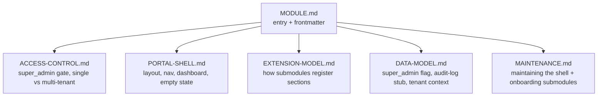

# Super Admin Module

## A: Plan Overview

Author a new Shipper module named **Super Admin** and add it to this repository's top-level [modules/](/Users/matt/Documents/shipper/modules/) folder (module id `super-admin`). Like every Shipper module, this is a set of stack-neutral markdown spec files — it describes *what* to build, not *how* to wire a specific stack. No application code, CLI code, or web code is written in this plan; the deliverable is the module content itself. Because the site auto-discovers modules from the `modules/` folder at build time, adding this folder automatically produces `/modules/super-admin` on shipper.is with no code changes (confirmed by the "Completion Notes" of the [modules-marketplace plan](/Users/matt/Documents/shipper/.shipper/plans/done/modules-marketplace.md)).

What makes this module different from `customer-support`: it is a **foundation / skeleton**, not a self-contained feature. Per the user's direction, the Super Admin module delivers the *shell* of a super admin portal — an authorization gate, a portal layout with navigation, a landing dashboard, and (most importantly) an **extension contract** that future "super admin" submodules register into. It is intended to be a **prerequisite dependency** for those later submodules. The module deliberately does NOT ship concrete admin features (user management, impersonation, feature flags, etc.); those live in separate submodules that plug into this shell and define their own dangerous-action safeguards.

Decisions locked in from clarifying questions:

- **Scope:** portal skeleton only — a base to add future super-admin submodules onto. This module is a requirement other super-admin modules build against.
- **Access model:** a dedicated `super_admin` role/flag on the user, checked server-side on every portal route.
- **Product shape:** support both a single application and a multi-tenant SaaS platform operator, calling out the differences (notably cross-tenant access and tenant context switching) rather than picking one.
- **Safety posture:** dangerous-action safeguards (confirmations, reason capture, step-up auth, destructive deletes) are the responsibility of each specific submodule. This module only provides the shared plumbing (the gate and an audit-log write interface submodules can call).

Module structure to author (mirrors the `customer-support` module layout — `MODULE.md` plus UPPERCASE reference files):

Built from scratch as a new module: id `super-admin`, version `1`.

## B: Related Files

Files to create (all new, under [modules/super-admin/](/Users/matt/Documents/shipper/modules/)):

- `modules/super-admin/MODULE.md` — entry file with frontmatter, overview, "what you get", assumptions, reference-file links.
- `modules/super-admin/ACCESS-CONTROL.md` — the `super_admin` authorization primitive and single-app vs multi-tenant differences.
- `modules/super-admin/PORTAL-SHELL.md` — the portal layout, navigation, landing dashboard, header/context switcher, empty state, accessibility.
- `modules/super-admin/EXTENSION-MODEL.md` — the contract submodules follow to register sections, routes, permission keys, and audit hooks into the shell.
- `modules/super-admin/DATA-MODEL.md` — stack-neutral entities: the `super_admin` flag on users, an optional audit-log entry, and multi-tenant context.
- `modules/super-admin/MAINTENANCE.md` — how agents maintain the shell and how to onboard new submodules over time.

Reference files that define the format and the template to copy:

- [modules/README.md](/Users/matt/Documents/shipper/modules/README.md) — the authoritative module format spec (frontmatter keys, flat structure, body sections, authoring conventions). Follow it exactly.
- [modules/customer-support/MODULE.md](/Users/matt/Documents/shipper/modules/customer-support/MODULE.md) — the reference `MODULE.md` to mirror in tone, section order, and depth.
- [modules/customer-support/DATA-MODEL.md](/Users/matt/Documents/shipper/modules/customer-support/DATA-MODEL.md) — reference for stack-neutral entity tables, relationships, and lifecycle prose.
- [modules/customer-support/INBOX.md](/Users/matt/Documents/shipper/modules/customer-support/INBOX.md) — reference for an admin-facing surface spec (authorization, queue, actions, empty/error states).
- [modules/customer-support/MAINTENANCE.md](/Users/matt/Documents/shipper/modules/customer-support/MAINTENANCE.md) — reference for the MAINTENANCE.md shape (where things live, drift detection, safe extension patterns, regression checks).

Files that consume modules (read-only context — do NOT modify; listed so you understand why frontmatter must be valid):

- [web/lib/modules.ts](/Users/matt/Documents/shipper/web/lib/modules.ts) — build-time loader; `parseModuleFrontmatter` here rejects any `MODULE.md` whose frontmatter is missing a required key or whose `id` does not match the folder name.
- [src/core/modules.ts](/Users/matt/Documents/shipper/src/core/modules.ts) — CLI install/list logic with the same frontmatter validation.
- [web/app/modules/[id]/page.tsx](/Users/matt/Documents/shipper/web/app/modules/[id]/page.tsx) — renders the `MODULE.md` body and links reference files to GitHub.

## C: Existing Code to Utilize

- **The `customer-support` module is the structural template.** Copy its file set and section ordering, not its content. `MODULE.md` there follows the exact body order the format requires: `# Title`, `## Overview`, `## What you get`, `## Assumptions`, `## Reference files`. Match that.
- **`modules/README.md` frontmatter schema.** Reuse it verbatim: `type: module`, `id`, `name`, `description`, `category`, `version`, `replaces` (a YAML list). See the schema table in [modules/README.md](/Users/matt/Documents/shipper/modules/README.md) lines 32-40.
- **Reference-file linking convention.** `MODULE.md` links siblings with relative `./FILE.md` paths and a one-line description each (see [modules/customer-support/MODULE.md](/Users/matt/Documents/shipper/modules/customer-support/MODULE.md) lines 40-45). Cross-references between reference files also use `./FILE.md` (see [modules/customer-support/MAINTENANCE.md](/Users/matt/Documents/shipper/modules/customer-support/MAINTENANCE.md) line 53 linking `./DATA-MODEL.md`).
- **Data-model prose style.** [modules/customer-support/DATA-MODEL.md](/Users/matt/Documents/shipper/modules/customer-support/DATA-MODEL.md) uses `| Field | Type | Notes |` tables with `opaque id`, `reference`, `enum`, `timestamp`, `boolean` as stack-neutral type names, plus a fenced ASCII lifecycle diagram and an "Integrity and privacy" closing section. Reuse this exact style for `DATA-MODEL.md`.
- **Admin-surface authorization framing.** [modules/customer-support/INBOX.md](/Users/matt/Documents/shipper/modules/customer-support/INBOX.md) lines 3-8 model how to describe a staff-only surface ("verify the current principal is staff or admin", auditability). `ACCESS-CONTROL.md` and `PORTAL-SHELL.md` should echo this principal-check framing but escalate it to the stricter `super_admin` tier.

## D: Codebase Conventions to Follow

- **Markdown module files only.** No SQL, no JSX, no framework/ORM/database-specific APIs. Describe entities, relationships, flows, and UI behavior in stack-neutral language. State soft assumptions explicitly instead of hard-coding a stack (per [modules/README.md](/Users/matt/Documents/shipper/modules/README.md) lines 42-49).
- **Frontmatter at the very top**, between `---` delimiters, before the `#` title. `replaces` must be a YAML block list (one `- Item` per line), not inline brackets — matching [modules/customer-support/MODULE.md](/Users/matt/Documents/shipper/modules/customer-support/MODULE.md) lines 8-11 (a "Completion Note" in the marketplace plan explicitly calls this out).
- **Kebab-case id, UPPERCASE reference filenames.** Folder is `super-admin`; frontmatter `id: super-admin` must match the folder name exactly. Reference files are `ACCESS-CONTROL.md`, `PORTAL-SHELL.md`, `EXTENSION-MODEL.md`, `DATA-MODEL.md`, `MAINTENANCE.md`.
- **Flat structure.** All markdown files live directly in `modules/super-admin/` — no subfolders.
- **No emojis anywhere** in the module files (authoring convention in [modules/README.md](/Users/matt/Documents/shipper/modules/README.md) line 62 and the global plan rule).
- **One concern per reference file.** Keep each reference file focused (access, shell, extension contract, data, maintenance) rather than blending them.
- **Category and version.** `category: admin`; `version: 1`.

## E: Gotchas

- **This is a skeleton — resist scope creep.** Do NOT specify user management, impersonation, feature flags, data browsers, metrics widgets, or destructive-action flows in this module. Those are future submodules. If a section starts describing a concrete admin feature, move it to an "out of scope / provided by submodules" note instead. The user was explicit: safeguards for dangerous actions live in the specific submodules.
- **The extension contract is the core value.** `EXTENSION-MODEL.md` is the most important file. Because the whole point is to be the base other super-admin modules build on, the registration contract (what a submodule declares, how the shell discovers it, how nav/routes/permission keys are composed) must be concrete enough that a later submodule author knows exactly how to plug in — while still remaining stack-neutral.
- **Security must be server-side.** State plainly that the `super_admin` gate is enforced on the server for every portal route and API, and that hiding nav items client-side is not authorization. Regular app admins must not reach the portal by default — `super_admin` is a distinct, higher tier.
- **Multi-tenant is a variant, not a fork.** Describe the single-app case as the baseline, then add a clearly labeled "Multi-tenant considerations" subsection in the relevant files (`ACCESS-CONTROL.md`, `PORTAL-SHELL.md`, `DATA-MODEL.md`) covering: super admin as a platform-level operator distinct from per-tenant admins, cross-tenant read/act access, and a tenant context switcher in the shell header. Do not duplicate the whole spec twice.
- **Frontmatter validity blocks the site build.** A missing required key, an `id` that does not match the folder, or a malformed YAML list will cause `web/lib/modules.ts` to silently skip the module (`parseModuleFrontmatter` returns `null`) so the page never generates. Verify by running the web build (see Phase 2, Section 4).
- **Relative links must resolve.** Every `./FILE.md` referenced in `MODULE.md` must exist with the exact casing. The detail page links reference files by their real filenames.
- **Audit log is a stub here.** Provide only the shared write interface / entity shape so submodules have somewhere to record actions. Do not define per-action audit semantics, retention, or UI — that belongs to submodules or a later "audit log" submodule. Note this boundary explicitly.
- **Do not commit anything but the plan and module files.** This is a read-only planning task; the build step (`/shipper-build`) authors the module files.

---

## Plan

## Phase 1: Module entry and foundation surfaces

- Establish the module's identity and the two foundational specs: the authorization primitive and the portal shell that renders it.
- Outcomes: a valid `MODULE.md` that the site and CLI accept; a complete `ACCESS-CONTROL.md` defining the `super_admin` gate for both single-app and multi-tenant products; a complete `PORTAL-SHELL.md` defining the portal layout, navigation, dashboard, and empty state.

### Section 1: MODULE.md entry file

- Overview: create the module folder and its entry file, mirroring the `customer-support` template.
- [ ] Create `modules/super-admin/MODULE.md` with frontmatter: `type: module`, `id: super-admin`, `name: Super Admin`, a one-sentence `description` (e.g. "A gated super admin portal shell and extension contract that hidden, admin-only submodules plug into."), `category: admin`, `version: 1`, and a `replaces` YAML list of admin-panel tools it stands in for (e.g. `Retool`, `Forest Admin`, `Django Admin`).
- [ ] Write the `## Overview` section: explain that Super Admin is the skeleton of an internal, super-admin-only portal where hidden operational functionality lives; that it is a foundation other Shipper "super admin" submodules build on (a prerequisite), not a finished feature set; and the build-not-buy rationale (you own the code, the agent maintains it, admin data stays in your database).
- [ ] Write the `## What you get` bullet list scoped to the skeleton only: a server-enforced `super_admin` access gate; a portal layout with navigation and a landing dashboard mounted at a configurable base route; an extension contract so submodules register their own sections/routes/permissions; a shared audit-log write interface for submodules to record actions; single-app and multi-tenant support.
- [ ] Write the `## Assumptions` section: host app has authenticated users with a stable id; a user store where a `super_admin` boolean/role can be added; server-side routing/middleware capable of gating a route namespace; a web frontend to mount the portal; and (for multi-tenant) an existing tenant/organization concept.
- [ ] Write the `## Reference files` section linking each sibling with a relative `./FILE.md` path and a one-line description: `ACCESS-CONTROL.md`, `PORTAL-SHELL.md`, `EXTENSION-MODEL.md`, `DATA-MODEL.md`, `MAINTENANCE.md`.
- [ ] Add an explicit short note in the overview or "what you get" that concrete admin capabilities and their dangerous-action safeguards are delivered by separate super-admin submodules, not this module.

### Section 2: ACCESS-CONTROL.md

- Overview: define the `super_admin` authorization primitive that every portal route depends on, including the multi-tenant variant.
- [ ] Describe the `super_admin` tier: a dedicated role/flag on the user, distinct from and above regular app admins; regular admins do not get portal access by default.
- [ ] Specify server-side enforcement: every portal route, page, and API under the portal base route must verify the principal is `super_admin` on the server; client-side nav hiding is presentation only, never authorization. Unauthorized access returns not-found or forbidden per host conventions (recommend not-found to avoid revealing the portal exists).
- [ ] Describe how the gate is applied once at the portal namespace boundary (a shared middleware/guard) so submodules inherit it automatically and never re-implement the check — cross-reference `./EXTENSION-MODEL.md`.
- [ ] Add a "Granting and revoking" subsection: how the flag is set (seed/admin action, out of band), and that changes should be auditable via the shared audit-log interface in `./DATA-MODEL.md`.
- [ ] Add a "Multi-tenant considerations" subsection: super admin is a platform-level operator that transcends any single tenant (distinct from per-tenant admins); it may read and act across all tenants; introduce the notion of an active tenant context the operator can switch (detailed UI in `./PORTAL-SHELL.md`, data in `./DATA-MODEL.md`).
- [ ] Add an "Integrity and privacy" closing note (mirroring the customer-support data-model style): least-privilege default, no ambient access without the flag, and that step-up auth for specific dangerous actions is defined by the submodules that own those actions.

### Section 3: PORTAL-SHELL.md

- Overview: define the portal chrome that renders registered submodule sections.
- [ ] Describe the base route/namespace: a single configurable mount point (default suggestion e.g. `/super-admin` or `/admin`), with all submodule surfaces nested beneath it so they share the gate and layout.
- [ ] Describe the layout regions: a persistent navigation (sidebar or top nav) built dynamically from the section registry; a header showing the current operator identity, a sign-out/exit control, and (multi-tenant) a tenant context switcher; and a content outlet where the active section renders.
- [ ] Describe the landing dashboard: shown at the portal root, listing the registered sections as cards/links (label, description, icon) grouped per the registry ordering; this is what a submodule appears in once registered.
- [ ] Describe the navigation composition: nav items are derived from registered sections (see `./EXTENSION-MODEL.md`), support optional grouping and ordering, and reflect only sections the current operator is permitted to see.
- [ ] Describe the empty state: when no submodules are installed yet, the dashboard explains the portal is ready and that super-admin submodules will appear here once added. This is the expected initial state after building only this foundation module.
- [ ] Add a "Multi-tenant considerations" subsection: the tenant context switcher in the header sets an active tenant that scopes tenant-aware submodules; global (cross-tenant) sections ignore it. Describe how the current tenant context is surfaced to submodules.
- [ ] Add an "Accessibility" subsection consistent with the customer-support widget notes: keyboard-navigable nav, visible focus states, semantic landmarks, and section labels not conveyed by color alone.

## Phase 2: Extension contract, data model, maintenance, and verification

- Define the contract that makes this module a foundation, the minimal shared data, maintenance guidance, then verify the module is valid and discoverable.
- Outcomes: a concrete `EXTENSION-MODEL.md` a future submodule author can follow; a minimal `DATA-MODEL.md`; a `MAINTENANCE.md` covering shell upkeep and submodule onboarding; and a passing local web build that generates `/modules/super-admin`.

### Section 1: EXTENSION-MODEL.md

- Overview: the registration contract between the shell and its submodules — the core deliverable of this module.
- [ ] Define what a submodule registers with the shell as a "section": a stable `id`, a display `label`, an optional `description` and `icon`, a `route`/path segment mounted under the portal base, an optional nav `group` and `order`, and a `permission`/capability key.
- [ ] Describe registration mechanics stack-neutrally: submodules declare their section(s) to a central registry the shell reads when composing navigation and routes; state that the concrete mechanism (a registry array/module, a config file, a registration function called at startup) is a host-stack choice the planning agent maps, but the declared shape above is fixed.
- [ ] Specify inherited guarantees: every registered section is automatically behind the `super_admin` gate (cross-reference `./ACCESS-CONTROL.md`), renders inside the shell layout, and appears in navigation and the dashboard without the submodule building its own chrome.
- [ ] Specify the audit hook: the shell exposes a write interface (see the audit entity in `./DATA-MODEL.md`) that submodules call to record admin actions; the shell does not define which actions each submodule logs.
- [ ] Specify multi-tenant awareness for sections: a section declares whether it is tenant-scoped (receives the active tenant context) or global (cross-tenant); describe how the shell passes the active tenant to tenant-scoped sections.
- [ ] Add a "Submodule authoring checklist" subsection: register a section with a unique id and permission key; mount pages under the portal base; call the audit interface for state-changing actions; declare tenant scope; define your own dangerous-action safeguards (confirmations, reason capture, step-up). Note that submodules should declare a dependency on this `super-admin` module.
- [ ] Include a small worked example in prose (stack-neutral) of a hypothetical submodule (e.g. a "Feature Flags" section) registering, so the contract is concrete without prescribing a stack.

### Section 2: DATA-MODEL.md

- Overview: the minimal shared entities; keep it a stub that submodules extend.
- [ ] Document the `super_admin` capability on the user: describe as a boolean flag or role membership on the existing user entity (do not invent a parallel user table); note it is set out of band.
- [ ] Document an `AuditLogEntry` entity as a shared stub: fields such as `id`, `actor_id` (the super admin), `action` (string/verb), `target_type` + `target_id` (optional), `tenant_id` (optional, multi-tenant), `metadata` (opaque/JSON-like), `created_at`. State that submodules define their own `action` values and populate `metadata`; the shell owns only the write path and the entity shape.
- [ ] Document the tenant context (multi-tenant only): reference the host app's existing tenant/organization entity; describe the "active tenant context" as operator session/UI state, not necessarily a persisted entity; note super-admin access is not restricted by tenant membership.
- [ ] Add relationships and an "Integrity and privacy" section in the customer-support style: audit entries are append-only, actor must be `super_admin`, and audit data may itself be sensitive (restrict reads to the portal).
- [ ] Use `| Field | Type | Notes |` tables with stack-neutral type names (`opaque id`, `reference`, `enum`, `boolean`, `timestamp`, `text`).

### Section 3: MAINTENANCE.md

- Overview: how agents maintain the shell and onboard future submodules, mirroring the customer-support MAINTENANCE.md shape.
- [ ] Add a "Where things live" table: module spec at `.shipper/modules/super-admin/` (commit it), the implementation plan in `.shipper/`, and application code wherever the plan placed the portal shell, gate, and registry.
- [ ] Add a "Detecting spec drift" section: the plan should note `Built from module super-admin v1`; compare to the installed `MODULE.md` frontmatter version and re-plan against a newer version rather than patching ad hoc; include the `shipper modules add super-admin` refresh command.
- [ ] Add an "Onboarding a new submodule" section: the concrete steps to add a super-admin submodule against this shell (register its section, inherit the gate, mount routes, wire audit hooks, declare tenant scope) — cross-reference `./EXTENSION-MODEL.md`.
- [ ] Add "Safe extension patterns" for the shell itself: adding nav grouping, per-section permission keys beyond the base gate, and the tenant switcher — without breaking the registration contract.
- [ ] Add a "Regression checks" list: unauthorized (non-`super_admin`) users cannot reach any portal route server-side; nav and dashboard render only permitted sections; the gate is applied at the namespace boundary; audit writes require a `super_admin` actor; tenant context correctly scopes tenant-aware sections.
- [ ] Add a "Re-planning vs patching" note consistent with the customer-support guidance (small fixes via shipper-spike; version bumps / new surfaces via shipper-plan).

### Section 4: Review and verification

- Overview: confirm the module is well-formed and discoverable.
- [ ] Review all six files against [modules/README.md](/Users/matt/Documents/shipper/modules/README.md): valid frontmatter with all required keys, `id` matches the folder name, flat folder (no subfolders), UPPERCASE reference filenames, relative `./FILE.md` links resolve, no emojis, stack-neutral language throughout (no SQL/JSX/framework APIs).
- [ ] Confirm every `./FILE.md` link in `MODULE.md` points to a file that exists with exact casing, and that cross-references between reference files resolve.
- [ ] Verify scope discipline: no concrete admin features or dangerous-action flows crept in; the module stays a skeleton plus extension contract.
- [ ] Run the web build to confirm discovery: `bun install` then `bun run build` inside [web/](/Users/matt/Documents/shipper/web/), and confirm `/modules/super-admin` appears in the static generation output (this also proves the frontmatter parses). If it does not appear, the frontmatter is invalid — fix and rebuild.
